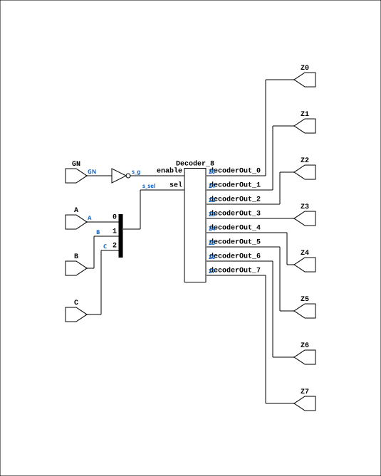

# ND38GHP

Source: `Verilog/Shared/ndlib/ND38GHP.v`

<!-- Generated by Verilog/tests/module_doc.py from the //! comments in the source. Do not edit by hand - edit the RTL comments and regenerate. -->

<!-- HIERARCHY-NAV:BEGIN - written by Verilog/tests/gen_hierarchy.py, do not edit -->

**Where it sits** (Simulation): [ND120_TOP](../../../doc/ND120_TOP.md) > [ND120_CORE](../../../doc/ND120_CORE.md) > [ND3202D](../../../CPU-BOARD-3202/circuit/doc/ND3202D.md) > [CPU_15](../../../CPU-BOARD-3202/circuit/doc/CPU_15.md) > [CPU_PROC_32](../../../CPU-BOARD-3202/circuit/doc/CPU_PROC_32.md) > [CPU_PROC_CGA_33](../../../CPU-BOARD-3202/circuit/doc/CPU_PROC_CGA_33.md) > [CGA](../../../DELILAH-CPU/CGA/circuit/doc/CGA.md) > [CGA_DCD](../../../DELILAH-CPU/CGA_DCD/circuit/doc/CGA_DCD.md) > **ND38GHP**
- instance path: `CORE.CPU_BOARD.CPU.PROC.CGA.DELILAH.DCD.C22`

**Used in:** [CGA_DCD](../../../DELILAH-CPU/CGA_DCD/circuit/doc/CGA_DCD.md) (all tops)

**Contains:** [Decoder_8](../../logisim/doc/Decoder_8.md)

[Module hierarchy](../../../HIERARCHY.md) - [All modules](../../../MODULES.md)

<!-- HIERARCHY-NAV:END -->


<!-- SCHEMATIC:BEGIN - written by Verilog/tests/gen_schematics.py, do not edit -->

## Schematic

Drawn from the Verilog: the yosys netlist of the Simulation (Verilator) build, instance `CORE.CPU_BOARD.CPU.PROC.CGA.DELILAH.DCD.C22`. Sub-modules are boxes (click the picture to open it full size; there every sub-module box links to its page, and every wire shows its Verilog name).

[](ND38GHP.svg)

<!-- SCHEMATIC:END -->

## Description

ND120
Component : ND38GHP  (3-to-8 decoder)
Last reviewed: 1-DEC-2024
Ronny Hansen

## Ports

| Direction | Width | Name | Description |
|---|---|---|---|
| input | `1` | `A` |  |
| input | `1` | `B` |  |
| input | `1` | `C` |  |
| input | `1` | `GN` |  |
| output | `1` | `Z0` |  |
| output | `1` | `Z1` |  |
| output | `1` | `Z2` |  |
| output | `1` | `Z3` |  |
| output | `1` | `Z4` |  |
| output | `1` | `Z5` |  |
| output | `1` | `Z6` |  |
| output | `1` | `Z7` |  |

## Verilog source

[`Verilog/Shared/ndlib/ND38GHP.v`](https://github.com/RetroCoreLabs/nd-120/blob/main/Verilog/Shared/ndlib/ND38GHP.v) on GitHub.

<details markdown="1">
<summary>Show the Verilog of ND38GHP (103 lines)</summary>

```verilog
/**************************************************************************
** ND120                                                                 **
**                                                                       **
** Component : ND38GHP  (3-to-8 decoder)                                 **
**                                                                       **
** Last reviewed: 1-DEC-2024                                             **
** Ronny Hansen                                                          **
***************************************************************************/


module ND38GHP (
    input A,
    input B,
    input C,
    input GN,

    output Z0,
    output Z1,
    output Z2,
    output Z3,
    output Z4,
    output Z5,
    output Z6,
    output Z7
);

  /*******************************************************************************
   ** The wires are defined here                                                 **
   *******************************************************************************/
  wire [2:0] s_sel;
  wire       s_g;
  wire       s_out0;
  wire       s_out1;
  wire       s_out2;
  wire       s_out3;
  wire       s_out4;
  wire       s_out5;
  wire       s_out6;
  wire       s_out7;
  wire       s_z0_out;
  wire       s_z1_out;
  wire       s_z2_out;
  wire       s_z3_out;
  wire       s_z4_out;
  wire       s_z5_out;
  wire       s_z6_out;
  wire       s_z7_out;

  /*******************************************************************************
   ** The module functionality is described here                                 **
   *******************************************************************************/

  /*******************************************************************************
   ** Here all input connections are defined                                     **
   *******************************************************************************/
  assign s_sel[0] = A;
  assign s_sel[1] = B;
  assign s_sel[2] = C;
  assign s_g    = ~GN;

  /*******************************************************************************
   ** Here all output connections are defined                                    **
   *******************************************************************************/
  assign Z0 = s_z0_out;
  assign Z1 = s_z1_out;
  assign Z2 = s_z2_out;
  assign Z3 = s_z3_out;
  assign Z4 = s_z4_out;
  assign Z5 = s_z5_out;
  assign Z6 = s_z6_out;
  assign Z7 = s_z7_out;

  /*******************************************************************************
   ** Here all in-lined components are defined                                   **
   *******************************************************************************/

  assign s_z0_out = s_out0;
  assign s_z1_out = s_out1;
  assign s_z2_out = s_out2;
  assign s_z3_out = s_out3;
  assign s_z4_out = s_out4;
  assign s_z5_out = s_out5;
  assign s_z6_out = s_out6;
  assign s_z7_out = s_out7;

  /*******************************************************************************
   ** Here all normal components are defined                                     **
   *******************************************************************************/
  Decoder_8 PLEXERS_1 (
      .decoderOut_0(s_out0),
      .decoderOut_1(s_out1),
      .decoderOut_2(s_out2),
      .decoderOut_3(s_out3),
      .decoderOut_4(s_out4),
      .decoderOut_5(s_out5),
      .decoderOut_6(s_out6),
      .decoderOut_7(s_out7),
      .enable(s_g),
      .sel(s_sel[2:0])
  );


endmodule
```

</details>
