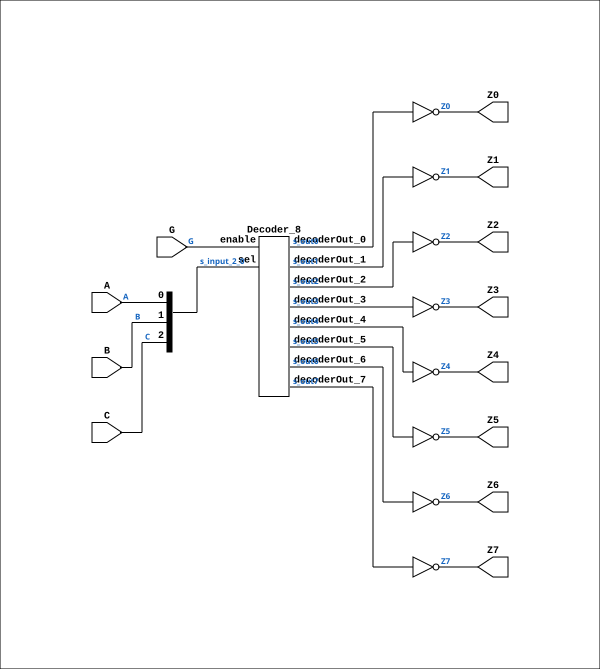

# ND38GLP

Source: `Verilog/Shared/ndlib/ND38GLP.v`

<!-- Generated by Verilog/tests/module_doc.py from the //! comments in the source. Do not edit by hand - edit the RTL comments and regenerate. -->

<!-- HIERARCHY-NAV:BEGIN - written by Verilog/tests/gen_hierarchy.py, do not edit -->

**Where it sits** (Simulation): [ND120_TOP](../../../doc/ND120_TOP.md) > [ND120_CORE](../../../doc/ND120_CORE.md) > [ND3202D](../../../CPU-BOARD-3202/circuit/doc/ND3202D.md) > [CPU_15](../../../CPU-BOARD-3202/circuit/doc/CPU_15.md) > [CPU_PROC_32](../../../CPU-BOARD-3202/circuit/doc/CPU_PROC_32.md) > [CPU_PROC_CGA_33](../../../CPU-BOARD-3202/circuit/doc/CPU_PROC_CGA_33.md) > [CGA](../../../DELILAH-CPU/CGA/circuit/doc/CGA.md) > [CGA_WRF](../../../DELILAH-CPU/CGA_WRF/circuit/doc/CGA_WRF.md) > **ND38GLP**
- instance path: `CORE.CPU_BOARD.CPU.PROC.CGA.DELILAH.WRF.LAA_LO`

**Used in:** [CGA_ALU_OUTMUX_IDBS](../../../DELILAH-CPU/CGA_ALU/circuit/doc/CGA_ALU_OUTMUX_IDBS.md) (all tops), [CGA_INTR_CNTLR_MDCD](../../../DELILAH-CPU/CGA_INTR/circuit/doc/CGA_INTR_CNTLR_MDCD.md) (all tops), [CGA_WRF](../../../DELILAH-CPU/CGA_WRF/circuit/doc/CGA_WRF.md) (all tops)

**Contains:** [Decoder_8](../../logisim/doc/Decoder_8.md)

[Module hierarchy](../../../HIERARCHY.md) - [All modules](../../../MODULES.md)

<!-- HIERARCHY-NAV:END -->


<!-- SCHEMATIC:BEGIN - written by Verilog/tests/gen_schematics.py, do not edit -->

## Schematic

Drawn from the Verilog: the yosys netlist of the Simulation (Verilator) build, instance `CORE.CPU_BOARD.CPU.PROC.CGA.DELILAH.WRF.LAA_LO`. Sub-modules are boxes (click the picture to open it full size; there every sub-module box links to its page, and every wire shows its Verilog name).

[](ND38GLP.svg)

<!-- SCHEMATIC:END -->

## Description

ND120
Component : ND38GLP   (3-to-8 decoder)
Last reviewed: 10-NOV-2024
Ronny Hansen

## Ports

| Direction | Width | Name | Description |
|---|---|---|---|
| input | `1` | `A` |  |
| input | `1` | `B` |  |
| input | `1` | `C` |  |
| input | `1` | `G` |  |
| output | `1` | `Z0` |  |
| output | `1` | `Z1` |  |
| output | `1` | `Z2` |  |
| output | `1` | `Z3` |  |
| output | `1` | `Z4` |  |
| output | `1` | `Z5` |  |
| output | `1` | `Z6` |  |
| output | `1` | `Z7` |  |

## Verilog source

[`Verilog/Shared/ndlib/ND38GLP.v`](https://github.com/RetroCoreLabs/nd-120/blob/main/Verilog/Shared/ndlib/ND38GLP.v) on GitHub.

<details markdown="1">
<summary>Show the Verilog of ND38GLP (80 lines)</summary>

```verilog
/**************************************************************************
** ND120                                                                 **
**                                                                       **
** Component : ND38GLP   (3-to-8 decoder)                                **
**                                                                       **
** Last reviewed: 10-NOV-2024                                            **
** Ronny Hansen                                                          **
***************************************************************************/


module ND38GLP (
    input A,
    input B,
    input C,
    input G,

    output Z0,
    output Z1,
    output Z2,
    output Z3,
    output Z4,
    output Z5,
    output Z6,
    output Z7
);

  /*******************************************************************************
   ** The wires are defined here                                                 **
   *******************************************************************************/
  wire [2:0] s_input_2_0;
  wire       s_g;
  wire       s_out0;
  wire       s_out1;
  wire       s_out2;
  wire       s_out3;
  wire       s_out4;
  wire       s_out5;
  wire       s_out6;
  wire       s_out7;

  /*******************************************************************************
   ** Here all input connections are defined                                     **
   *******************************************************************************/
  assign s_input_2_0[0] = A;
  assign s_input_2_0[1] = B;
  assign s_input_2_0[2] = C;
  assign s_g            = G;

  /*******************************************************************************
   ** Here all output connections are defined                                    **
   *******************************************************************************/
  assign Z0             = ~s_out0;
  assign Z1             = ~s_out1;
  assign Z2             = ~s_out2;
  assign Z3             = ~s_out3;
  assign Z4             = ~s_out4;
  assign Z5             = ~s_out5;
  assign Z6             = ~s_out6;
  assign Z7             = ~s_out7;


  /*******************************************************************************
   ** Here all normal components are defined                                     **
   *******************************************************************************/
  Decoder_8 PLEXERS_1 (
      .decoderOut_0(s_out0),
      .decoderOut_1(s_out1),
      .decoderOut_2(s_out2),
      .decoderOut_3(s_out3),
      .decoderOut_4(s_out4),
      .decoderOut_5(s_out5),
      .decoderOut_6(s_out6),
      .decoderOut_7(s_out7),
      .enable(s_g),
      .sel(s_input_2_0[2:0])
  );


endmodule
```

</details>
