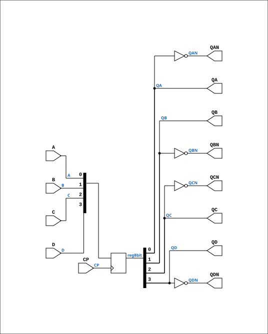

# R41P

Source: `Verilog/Shared/ndlib/R41P.v`

<!-- Generated by Verilog/tests/module_doc.py from the //! comments in the source. Do not edit by hand - edit the RTL comments and regenerate. -->

<!-- HIERARCHY-NAV:BEGIN - written by Verilog/tests/gen_hierarchy.py, do not edit -->

**Hierarchy:** not instantiated by any of the 9 build tops (elaborated by yosys).

[Module hierarchy](../../../HIERARCHY.md) - [All modules](../../../MODULES.md)

<!-- HIERARCHY-NAV:END -->


<!-- SCHEMATIC:BEGIN - written by Verilog/tests/gen_schematics.py, do not edit -->

## Schematic

Drawn from the Verilog: no build top uses this module, so it was elaborated from its own file with no defines and default parameters. Sub-modules are boxes (click the picture to open it full size; there every sub-module box links to its page, and every wire shows its Verilog name).

[](R41P.svg)

<!-- SCHEMATIC:END -->

## Description

ND120 Shared
Component : R41P
Last reviewed: 9-FEB-2025
Ronny Hansen

## Ports

| Direction | Width | Name | Description |
|---|---|---|---|
| input | `1` | `CP` |  |
| input | `1` | `A` |  |
| input | `1` | `B` |  |
| input | `1` | `C` |  |
| input | `1` | `D` |  |
| output | `1` | `QA` |  |
| output | `1` | `QAN` |  |
| output | `1` | `QB` |  |
| output | `1` | `QBN` |  |
| output | `1` | `QC` |  |
| output | `1` | `QCN` |  |
| output | `1` | `QD` |  |
| output | `1` | `QDN` |  |

## Verilog source

[`Verilog/Shared/ndlib/R41P.v`](https://github.com/RetroCoreLabs/nd-120/blob/main/Verilog/Shared/ndlib/R41P.v) on GitHub.

<details markdown="1">
<summary>Show the Verilog of R41P (52 lines)</summary>

```verilog
/**************************************************************************
** ND120 Shared                                                          **
**                                                                       **
** Component : R41P                                                      **
**                                                                       **
** Last reviewed: 9-FEB-2025                                             **
** Ronny Hansen                                                          **
***************************************************************************/

module R41P (
    input CP,

    input A,
    input B,
    input C,
    input D,

    output QA,
    output QAN,
    output QB,
    output QBN,
    output QC,
    output QCN,
    output QD,
    output QDN
);


reg [3:0] reg8bit;

assign QA   = reg8bit[0];
assign QAN  = ~reg8bit[0];

assign QB   = reg8bit[1];
assign QBN  = ~reg8bit[1];

assign QC   = reg8bit[2];
assign QCN  = ~reg8bit[2];

assign QD   = reg8bit[3];
assign QDN  = ~reg8bit[3];

always @(posedge CP) begin
    reg8bit[0] <= A;
    reg8bit[1] <= B;
    reg8bit[2] <= C;
    reg8bit[3] <= D;
end

endmodule
```

</details>
