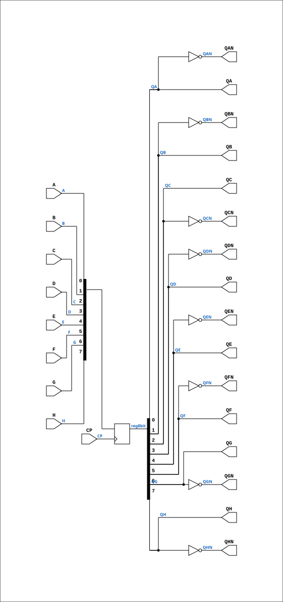

# R81

Source: `Verilog/Shared/ndlib/R81.v`

<!-- Generated by Verilog/tests/module_doc.py from the //! comments in the source. Do not edit by hand - edit the RTL comments and regenerate. -->

<!-- HIERARCHY-NAV:BEGIN - written by Verilog/tests/gen_hierarchy.py, do not edit -->

**Hierarchy:** not instantiated by any of the 9 build tops (elaborated by yosys).

[Module hierarchy](../../../HIERARCHY.md) - [All modules](../../../MODULES.md)

<!-- HIERARCHY-NAV:END -->


<!-- SCHEMATIC:BEGIN - written by Verilog/tests/gen_schematics.py, do not edit -->

## Schematic

Drawn from the Verilog: no build top uses this module, so it was elaborated from its own file with no defines and default parameters. Sub-modules are boxes (click the picture to open it full size; there every sub-module box links to its page, and every wire shows its Verilog name).

[](R81.svg)

<!-- SCHEMATIC:END -->

## Description

ND120 Shared
Component : R81 (8-bit register. Latched on RISING EDGE)
Last reviewed: 11-NOV-2024
Ronny Hansen

## Ports

| Direction | Width | Name | Description |
|---|---|---|---|
| input | `1` | `CP` |  |
| input | `1` | `A` |  |
| input | `1` | `B` |  |
| input | `1` | `C` |  |
| input | `1` | `D` |  |
| input | `1` | `E` |  |
| input | `1` | `F` |  |
| input | `1` | `G` |  |
| input | `1` | `H` |  |
| output | `1` | `QA` |  |
| output | `1` | `QAN` |  |
| output | `1` | `QB` |  |
| output | `1` | `QBN` |  |
| output | `1` | `QC` |  |
| output | `1` | `QCN` |  |
| output | `1` | `QD` |  |
| output | `1` | `QDN` |  |
| output | `1` | `QE` |  |
| output | `1` | `QEN` |  |
| output | `1` | `QF` |  |
| output | `1` | `QFN` |  |
| output | `1` | `QG` |  |
| output | `1` | `QGN` |  |
| output | `1` | `QH` |  |
| output | `1` | `QHN` |  |

## Verilog source

[`Verilog/Shared/ndlib/R81.v`](https://github.com/RetroCoreLabs/nd-120/blob/main/Verilog/Shared/ndlib/R81.v) on GitHub.

<details markdown="1">
<summary>Show the Verilog of R81 (79 lines)</summary>

```verilog
/**************************************************************************
** ND120 Shared                                                          **
**                                                                       **
** Component : R81 (8-bit register. Latched on RISING EDGE)              **
**                                                                       **
** Last reviewed: 11-NOV-2024                                            **
** Ronny Hansen                                                          **
***************************************************************************/

module R81 (
    input CP,

    input A,
    input B,
    input C,
    input D,
    input E,
    input F,
    input G,
    input H,

    output QA,
    output QAN,
    output QB,
    output QBN,
    output QC,
    output QCN,
    output QD,
    output QDN,
    output QE,
    output QEN,
    output QF,
    output QFN,
    output QG,
    output QGN,
    output QH,
    output QHN
);


reg [7:0] reg8bit;

assign QA   = reg8bit[0];
assign QAN  = ~reg8bit[0];

assign QB   = reg8bit[1];
assign QBN  = ~reg8bit[1];

assign QC   = reg8bit[2];
assign QCN  = ~reg8bit[2];

assign QD   = reg8bit[3];
assign QDN  = ~reg8bit[3];

assign QE   = reg8bit[4];
assign QEN  = ~reg8bit[4];

assign QF   = reg8bit[5];
assign QFN  = ~reg8bit[5];

assign QG   = reg8bit[6];
assign QGN  = ~reg8bit[6];

assign QH   = reg8bit[7];
assign QHN  = ~reg8bit[7];

always @(posedge CP) begin
    reg8bit[0] <= A;
    reg8bit[1] <= B;
    reg8bit[2] <= C;
    reg8bit[3] <= D;
    reg8bit[4] <= E;
    reg8bit[5] <= F;
    reg8bit[6] <= G;
    reg8bit[7] <= H;
end

endmodule
```

</details>
