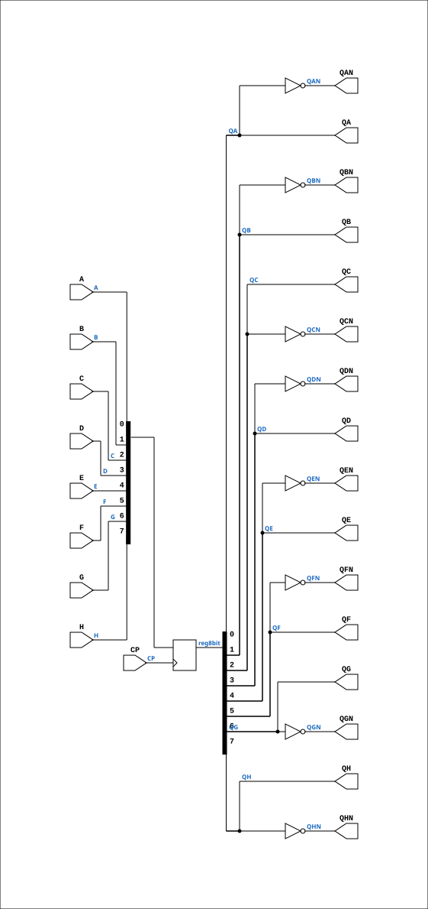

# R81P

Source: `Verilog/Shared/ndlib/R81P.v`

<!-- Generated by Verilog/tests/module_doc.py from the //! comments in the source. Do not edit by hand - edit the RTL comments and regenerate. -->

<!-- HIERARCHY-NAV:BEGIN - written by Verilog/tests/gen_hierarchy.py, do not edit -->

**Hierarchy:** not instantiated by any of the 9 build tops (elaborated by yosys).

[Module hierarchy](../../../HIERARCHY.md) - [All modules](../../../MODULES.md)

<!-- HIERARCHY-NAV:END -->


<!-- SCHEMATIC:BEGIN - written by Verilog/tests/gen_schematics.py, do not edit -->

## Schematic

Drawn from the Verilog: no build top uses this module, so it was elaborated from its own file with no defines and default parameters. Sub-modules are boxes (click the picture to open it full size; there every sub-module box links to its page, and every wire shows its Verilog name).

[](R81P.svg)

<!-- SCHEMATIC:END -->

## Description

ND120 Shared
Component : R81P (8 bit flip flop with Q and QN outputs. Latched on rising edge)
Last reviewed: 9-FEB-2025
Ronny Hansen

## Ports

| Direction | Width | Name | Description |
|---|---|---|---|
| input | `1` | `CP` |  |
| input | `1` | `A` |  |
| input | `1` | `B` |  |
| input | `1` | `C` |  |
| input | `1` | `D` |  |
| input | `1` | `E` |  |
| input | `1` | `F` |  |
| input | `1` | `G` |  |
| input | `1` | `H` |  |
| output | `1` | `QA` |  |
| output | `1` | `QAN` |  |
| output | `1` | `QB` |  |
| output | `1` | `QBN` |  |
| output | `1` | `QC` |  |
| output | `1` | `QCN` |  |
| output | `1` | `QD` |  |
| output | `1` | `QDN` |  |
| output | `1` | `QE` |  |
| output | `1` | `QEN` |  |
| output | `1` | `QF` |  |
| output | `1` | `QFN` |  |
| output | `1` | `QG` |  |
| output | `1` | `QGN` |  |
| output | `1` | `QH` |  |
| output | `1` | `QHN` |  |

## Verilog source

[`Verilog/Shared/ndlib/R81P.v`](https://github.com/RetroCoreLabs/nd-120/blob/main/Verilog/Shared/ndlib/R81P.v) on GitHub.

<details markdown="1">
<summary>Show the Verilog of R81P (194 lines)</summary>

```verilog
/***************************************************************************************
** ND120 Shared                                                                       **
**                                                                                    **
** Component : R81P (8 bit flip flop with Q and QN outputs. Latched on rising edge)   **
**                                                                                    **
** Last reviewed: 9-FEB-2025                                                          **
** Ronny Hansen                                                                       **
****************************************************************************************/


module R81P (
    input CP,

    input A,
    input B,
    input C,
    input D,
    input E,
    input F,
    input G,
    input H,

    output QA,
    output QAN,
    output QB,
    output QBN,
    output QC,
    output QCN,
    output QD,
    output QDN,
    output QE,
    output QEN,
    output QF,
    output QFN,
    output QG,
    output QGN,
    output QH,
    output QHN
);


reg [7:0] reg8bit;

assign QA   = reg8bit[0];
assign QAN  = ~reg8bit[0];

assign QB   = reg8bit[1];
assign QBN  = ~reg8bit[1];

assign QC   = reg8bit[2];
assign QCN  = ~reg8bit[2];

assign QD   = reg8bit[3];
assign QDN  = ~reg8bit[3];

assign QE   = reg8bit[4];
assign QEN  = ~reg8bit[4];

assign QF   = reg8bit[5];
assign QFN  = ~reg8bit[5];

assign QG   = reg8bit[6];
assign QGN  = ~reg8bit[6];

assign QH   = reg8bit[7];
assign QHN  = ~reg8bit[7];

always @(posedge CP) begin
    reg8bit[0] <= A;
    reg8bit[1] <= B;
    reg8bit[2] <= C;
    reg8bit[3] <= D;
    reg8bit[4] <= E;
    reg8bit[5] <= F;
    reg8bit[6] <= G;
    reg8bit[7] <= H;

end

/*

  wire s_cp;
  wire s_qe_n_out;
  wire s_qh_n_out;
  wire s_qa_out;
  wire s_qa_n_out;
  wire s_qb_out;
  wire s_qb_n_out;
  wire s_qc_out;
  wire s_qc_n_out;
  wire s_a;
  wire s_b;
  wire s_c;
  wire s_qd_out;
  wire s_d;
  wire s_e;
  wire s_f;
  wire s_g;
  wire s_h;
  wire s_qd_n_out;
  wire s_qe_out;
  wire s_qf_out;
  wire s_qf_n_out;
  wire s_qg_out;
  wire s_qg_n_out;
  wire s_qh_out;

  assign s_cp = CP;
  assign s_a  = A;
  assign s_b  = B;
  assign s_c  = C;
  assign s_d  = D;
  assign s_e  = E;
  assign s_f  = F;
  assign s_g  = G;
  assign s_h  = H;

  assign QA   = s_qa_out;
  assign QAN  = s_qa_n_out;
  assign QB   = s_qb_out;
  assign QBN  = s_qb_n_out;
  assign QC   = s_qc_out;
  assign QCN  = s_qc_n_out;
  assign QD   = s_qd_out;
  assign QDN  = s_qd_n_out;
  assign QE   = s_qe_out;
  assign QEN  = s_qe_n_out;
  assign QF   = s_qf_out;
  assign QFN  = s_qf_n_out;
  assign QG   = s_qg_out;
  assign QGN  = s_qg_n_out;
  assign QH   = s_qh_out;
  assign QHN  = s_qh_n_out;


   D_FLIPFLOP_SIMPLE MEMORY_1 (
      .clock(s_cp),
      .d(s_a),
      .q(s_qa_out),
      .qBar(s_qa_n_out)
  );

  D_FLIPFLOP_SIMPLE MEMORY_2 (
      .clock(s_cp),
      .d(s_b),
      .q(s_qb_out),
      .qBar(s_qb_n_out)
  );

  D_FLIPFLOP_SIMPLE  MEMORY_3 (
      .clock(s_cp),
      .d(s_c),
      .q(s_qc_out),
      .qBar(s_qc_n_out)
  );

  D_FLIPFLOP_SIMPLE MEMORY_4 (
      .clock(s_cp),
      .d(s_d),
      .q(s_qd_out),
      .qBar(s_qd_n_out)
  );

  D_FLIPFLOP_SIMPLE MEMORY_5 (
      .clock(s_cp),
      .d(s_e),
      .q(s_qe_out),
      .qBar(s_qe_n_out)
  );

  D_FLIPFLOP_SIMPLE MEMORY_6 (
      .clock(s_cp),
      .d(s_f),
      .q(s_qf_out),
      .qBar(s_qf_n_out)
  );

  D_FLIPFLOP_SIMPLE MEMORY_7 (
      .clock(s_cp),
      .d(s_g),
      .q(s_qg_out),
      .qBar(s_qg_n_out)
  );

  D_FLIPFLOP_SIMPLE MEMORY_8 (
      .clock(s_cp),
      .d(s_h),
      .q(s_qh_out),
      .qBar(s_qh_n_out)
  );

*/

endmodule
```

</details>
