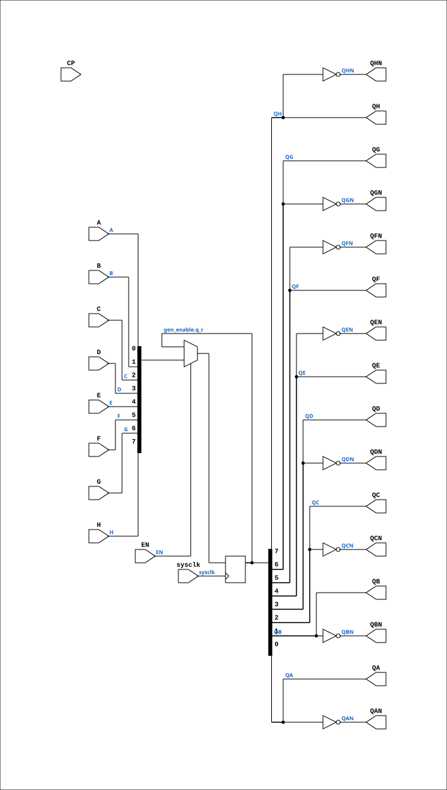

# R81_EN

Source: `Verilog/Shared/ndlib/R81_EN.v`

<!-- Generated by Verilog/tests/module_doc.py from the //! comments in the source. Do not edit by hand - edit the RTL comments and regenerate. -->

<!-- HIERARCHY-NAV:BEGIN - written by Verilog/tests/gen_hierarchy.py, do not edit -->

**Where it sits** (Simulation): [ND120_TOP](../../../doc/ND120_TOP.md) > [ND120_CORE](../../../doc/ND120_CORE.md) > [ND3202D](../../../CPU-BOARD-3202/circuit/doc/ND3202D.md) > [CPU_15](../../../CPU-BOARD-3202/circuit/doc/CPU_15.md) > [CPU_PROC_32](../../../CPU-BOARD-3202/circuit/doc/CPU_PROC_32.md) > [CPU_PROC_CGA_33](../../../CPU-BOARD-3202/circuit/doc/CPU_PROC_CGA_33.md) > [CGA](../../../DELILAH-CPU/CGA/circuit/doc/CGA.md) > [CGA_DCD](../../../DELILAH-CPU/CGA_DCD/circuit/doc/CGA_DCD.md) > **R81_EN**
- instance path: `CORE.CPU_BOARD.CPU.PROC.CGA.DELILAH.DCD.COMM_MIS_REG`

**Used in:** [CGA_ALU_OUTMUX_IDBS](../../../DELILAH-CPU/CGA_ALU/circuit/doc/CGA_ALU_OUTMUX_IDBS.md) (all tops), [CGA_ALU_QREG](../../../DELILAH-CPU/CGA_ALU/circuit/doc/CGA_ALU_QREG.md) (all tops), [CGA_ALU_SWAP](../../../DELILAH-CPU/CGA_ALU/circuit/doc/CGA_ALU_SWAP.md) (all tops), [CGA_CPU_ALU_CONTR](../../../DELILAH-CPU/CGA_ALU/circuit/doc/CGA_CPU_ALU_CONTR.md) (all tops), [CGA_DCD](../../../DELILAH-CPU/CGA_DCD/circuit/doc/CGA_DCD.md) (all tops), [CGA_MAC_APOS_CALCA](../../../DELILAH-CPU/CGA_MAC/circuit/doc/CGA_MAC_APOS_CALCA.md) (all tops), [CGA_MAC_LA1025](../../../DELILAH-CPU/CGA_MAC/circuit/doc/CGA_MAC_LA1025.md) (all tops), [CGA_WRF_RBLOCK_LR16](../../../DELILAH-CPU/CGA_WRF/circuit/doc/CGA_WRF_RBLOCK_LR16.md) (all tops), [CGA_WRF_RBLOCK_PREG](../../../DELILAH-CPU/CGA_WRF/circuit/doc/CGA_WRF_RBLOCK_PREG.md) (all tops)

**Contains:** no other modules.

[Module hierarchy](../../../HIERARCHY.md) - [All modules](../../../MODULES.md)

<!-- HIERARCHY-NAV:END -->


<!-- SCHEMATIC:BEGIN - written by Verilog/tests/gen_schematics.py, do not edit -->

## Schematic

Drawn from the Verilog: the yosys netlist of the Simulation (Verilator) build, instance `CORE.CPU_BOARD.CPU.PROC.CGA.DELILAH.DCD.COMM_MIS_REG`. Sub-modules are boxes (click the picture to open it full size; there every sub-module box links to its page, and every wire shows its Verilog name).

[](R81_EN.svg)

<!-- SCHEMATIC:END -->

## Description

ND120 Shared
R81_EN - R81 (8-bit register, true+complement outputs) with an
optional clock-enable mode.
USE_ENABLE=0 (default): wraps the original R81 - posedge CP,
original behaviour (latch mode).
USE_ENABLE=1: posedge sysclk, captures when EN is high (P2 clock-
domain conversion mode - see SCAN_FF_EN.v / the plan doc).
Last reviewed: 9-JUL-2026
Ronny Hansen

## Parameters

| Parameter | Default |
|---|---|
| `USE_ENABLE` | `0` |

## Ports

| Direction | Width | Name | Description |
|---|---|---|---|
| input | `1` | `sysclk` | FPGA system clock (used only when USE_ENABLE=1) |
| input | `1` | `EN` | Clock enable    (used only when USE_ENABLE=1) |
| input | `1` | `CP` | Clock (used only when USE_ENABLE=0) |
| input | `1` | `A` |  |
| input | `1` | `B` |  |
| input | `1` | `C` |  |
| input | `1` | `D` |  |
| input | `1` | `E` |  |
| input | `1` | `F` |  |
| input | `1` | `G` |  |
| input | `1` | `H` |  |
| output | `1` | `QA` |  |
| output | `1` | `QAN` |  |
| output | `1` | `QB` |  |
| output | `1` | `QBN` |  |
| output | `1` | `QC` |  |
| output | `1` | `QCN` |  |
| output | `1` | `QD` |  |
| output | `1` | `QDN` |  |
| output | `1` | `QE` |  |
| output | `1` | `QEN` |  |
| output | `1` | `QF` |  |
| output | `1` | `QFN` |  |
| output | `1` | `QG` |  |
| output | `1` | `QGN` |  |
| output | `1` | `QH` |  |
| output | `1` | `QHN` |  |

## Verilog source

[`Verilog/Shared/ndlib/R81_EN.v`](https://github.com/RetroCoreLabs/nd-120/blob/main/Verilog/Shared/ndlib/R81_EN.v) on GitHub.

<details markdown="1">
<summary>Show the Verilog of R81_EN (79 lines)</summary>

```verilog
/**************************************************************************
** ND120 Shared                                                          **
**                                                                       **
** R81_EN - R81 (8-bit register, true+complement outputs) with an        **
** optional clock-enable mode.                                           **
**                                                                       **
** USE_ENABLE=0 (default): wraps the original R81 - posedge CP,          **
**   original behaviour (latch mode).                                    **
** USE_ENABLE=1: posedge sysclk, captures when EN is high (P2 clock-     **
**   domain conversion mode - see SCAN_FF_EN.v / the plan doc).          **
**                                                                       **
** Last reviewed: 9-JUL-2026                                             **
** Ronny Hansen                                                          **
***************************************************************************/

module R81_EN #(
    parameter integer USE_ENABLE = 0
) (
    input sysclk,  //! FPGA system clock (used only when USE_ENABLE=1)
    input EN,      //! Clock enable    (used only when USE_ENABLE=1)

    input CP,      //! Clock (used only when USE_ENABLE=0)

    input A,
    input B,
    input C,
    input D,
    input E,
    input F,
    input G,
    input H,

    output QA,
    output QAN,
    output QB,
    output QBN,
    output QC,
    output QCN,
    output QD,
    output QDN,
    output QE,
    output QEN,
    output QF,
    output QFN,
    output QG,
    output QGN,
    output QH,
    output QHN
);

  generate
    if (USE_ENABLE == 1) begin : gen_enable
      /* verilator lint_off UNUSEDSIGNAL */
      wire unused_cp = CP;
      /* verilator lint_on UNUSEDSIGNAL */
      reg [7:0] q_r = 8'b0;
      always @(posedge sysclk) begin
        if (EN) q_r <= {H, G, F, E, D, C, B, A};
      end
      assign {QA, QB, QC, QD, QE, QF, QG, QH} =
             {q_r[0], q_r[1], q_r[2], q_r[3], q_r[4], q_r[5], q_r[6], q_r[7]};
      assign {QAN, QBN, QCN, QDN, QEN, QFN, QGN, QHN} =
             {~q_r[0], ~q_r[1], ~q_r[2], ~q_r[3], ~q_r[4], ~q_r[5], ~q_r[6], ~q_r[7]};
    end else begin : gen_orig
      /* verilator lint_off UNUSEDSIGNAL */
      wire unused_sys = sysclk & EN;
      /* verilator lint_on UNUSEDSIGNAL */
      R81 R (
          .CP(CP),
          .A(A), .B(B), .C(C), .D(D), .E(E), .F(F), .G(G), .H(H),
          .QA(QA), .QAN(QAN), .QB(QB), .QBN(QBN),
          .QC(QC), .QCN(QCN), .QD(QD), .QDN(QDN),
          .QE(QE), .QEN(QEN), .QF(QF), .QFN(QFN),
          .QG(QG), .QGN(QGN), .QH(QH), .QHN(QHN)
      );
    end
  endgenerate

endmodule
```

</details>
