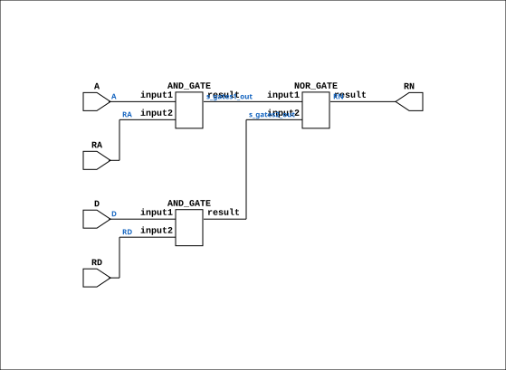

# RMUX_Gates

Source: `Verilog/Shared/ndlib/RMUX_Gates.v`

<!-- Generated by Verilog/tests/module_doc.py from the //! comments in the source. Do not edit by hand - edit the RTL comments and regenerate. -->

<!-- HIERARCHY-NAV:BEGIN - written by Verilog/tests/gen_hierarchy.py, do not edit -->

**Where it sits** (Simulation): [ND120_TOP](../../../doc/ND120_TOP.md) > [ND120_CORE](../../../doc/ND120_CORE.md) > [ND3202D](../../../CPU-BOARD-3202/circuit/doc/ND3202D.md) > [CPU_15](../../../CPU-BOARD-3202/circuit/doc/CPU_15.md) > [CPU_PROC_32](../../../CPU-BOARD-3202/circuit/doc/CPU_PROC_32.md) > [CPU_PROC_CGA_33](../../../CPU-BOARD-3202/circuit/doc/CPU_PROC_CGA_33.md) > [CGA](../../../DELILAH-CPU/CGA/circuit/doc/CGA.md) > [CGA_ALU](../../../DELILAH-CPU/CGA_ALU/circuit/doc/CGA_ALU.md) > [CGA_CPU_ALU_RMUX](../../../DELILAH-CPU/CGA_ALU/circuit/doc/CGA_CPU_ALU_RMUX.md) > **RMUX_Gates**
- instance path: `CORE.CPU_BOARD.CPU.PROC.CGA.DELILAH.ALU.ALU_RMUX.RN15`

**Used in:** [CGA_CPU_ALU_RMUX](../../../DELILAH-CPU/CGA_ALU/circuit/doc/CGA_CPU_ALU_RMUX.md) (all tops)

**Contains:** [AND_GATE](../../logisim/doc/AND_GATE.md) x2, [NOR_GATE](../../logisim/doc/NOR_GATE.md)

[Module hierarchy](../../../HIERARCHY.md) - [All modules](../../../MODULES.md)

<!-- HIERARCHY-NAV:END -->


<!-- SCHEMATIC:BEGIN - written by Verilog/tests/gen_schematics.py, do not edit -->

## Schematic

Drawn from the Verilog: the yosys netlist of the Simulation (Verilator) build, instance `CORE.CPU_BOARD.CPU.PROC.CGA.DELILAH.ALU.ALU_RMUX.RN15`. Sub-modules are boxes (click the picture to open it full size; there every sub-module box links to its page, and every wire shows its Verilog name).

[](RMUX_Gates.svg)

<!-- SCHEMATIC:END -->

## Description

ND120 Shared
Component : RMUX_Gates
Last reviewed: 11-NOV-2024
Ronny Hansen

## Ports

| Direction | Width | Name | Description |
|---|---|---|---|
| input | `1` | `A` |  |
| input | `1` | `D` |  |
| input | `1` | `RA` |  |
| input | `1` | `RD` |  |
| output | `1` | `RN` |  |

## Verilog source

[`Verilog/Shared/ndlib/RMUX_Gates.v`](https://github.com/RetroCoreLabs/nd-120/blob/main/Verilog/Shared/ndlib/RMUX_Gates.v) on GitHub.

<details markdown="1">
<summary>Show the Verilog of RMUX_Gates (76 lines)</summary>

```verilog
/**************************************************************************
** ND120 Shared                                                          **
**                                                                       **
** Component : RMUX_Gates                                                **
**                                                                       **
** Last reviewed: 11-NOV-2024                                            **
** Ronny Hansen                                                          **
***************************************************************************/


module RMUX_Gates (
    input A,
    input D,
    input RA,
    input RD,

    output RN
);

  /*******************************************************************************
   ** The wires are defined here                                                 **
   *******************************************************************************/
  wire s_gates1_out;
  wire s_gates2_out;
  wire s_rn_out;
  wire s_a;
  wire s_ra;
  wire s_d;
  wire s_rd;

  /*******************************************************************************
   ** The module functionality is described here                                 **
   *******************************************************************************/

  /*******************************************************************************
   ** Here all input connections are defined                                     **
   *******************************************************************************/
  assign s_a  = A;
  assign s_ra = RA;
  assign s_d  = D;
  assign s_rd = RD;

  /*******************************************************************************
   ** Here all output connections are defined                                    **
   *******************************************************************************/
  assign RN   = s_rn_out;

  /*******************************************************************************
   ** Here all normal components are defined                                     **
   *******************************************************************************/
  AND_GATE #(
      .BubblesMask(2'b00)
  ) GATES_1 (
      .input1(s_a),
      .input2(s_ra),
      .result(s_gates1_out)
  );

  AND_GATE #(
      .BubblesMask(2'b00)
  ) GATES_2 (
      .input1(s_d),
      .input2(s_rd),
      .result(s_gates2_out)
  );

  NOR_GATE #(
      .BubblesMask(2'b00)
  ) GATES_3 (
      .input1(s_gates1_out),
      .input2(s_gates2_out),
      .result(s_rn_out)
  );


endmodule
```

</details>
