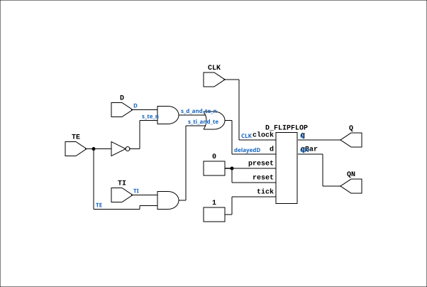

# SCAN_FF

Source: `Verilog/Shared/ndlib/SCAN_FF.v`

<!-- Generated by Verilog/tests/module_doc.py from the //! comments in the source. Do not edit by hand - edit the RTL comments and regenerate. -->

<!-- HIERARCHY-NAV:BEGIN - written by Verilog/tests/gen_hierarchy.py, do not edit -->

**Hierarchy:** not instantiated by any of the 9 build tops (elaborated by yosys).

[Module hierarchy](../../../HIERARCHY.md) - [All modules](../../../MODULES.md)

<!-- HIERARCHY-NAV:END -->


<!-- SCHEMATIC:BEGIN - written by Verilog/tests/gen_schematics.py, do not edit -->

## Schematic

Drawn from the Verilog: no build top uses this module, so it was elaborated from its own file with no defines and default parameters. Sub-modules are boxes (click the picture to open it full size; there every sub-module box links to its page, and every wire shows its Verilog name).

[](SCAN_FF.svg)

<!-- SCHEMATIC:END -->

## Description

ND120 Shared
SCAN FLIP-FLOP (Also known as FDIS in the DELILAH schematics)
Positive edge triggered D flip-flop with scan
Its a D flip-flop with a 2-input multiplexer on the D input
When TE (T enable) input is negated,
the circuit behaves like an ordinary D flip-flop.
When TE is asserted,
it takes its data from TI (T input) instead of from D.
Last reviewed: 1-DEC-2024
Ronny Hansen

## Ports

| Direction | Width | Name | Description |
|---|---|---|---|
| input | `1` | `CLK` | Clock (positive triggered) |
| input | `1` | `D` | D input |
| input | `1` | `TE` | T enable |
| input | `1` | `TI` | T Input |
| output | `1` | `Q` | Q output |
| output | `1` | `QN` | Q_n output |

## Verilog source

[`Verilog/Shared/ndlib/SCAN_FF.v`](https://github.com/RetroCoreLabs/nd-120/blob/main/Verilog/Shared/ndlib/SCAN_FF.v) on GitHub.

<details markdown="1">
<summary>Show the Verilog of SCAN_FF (103 lines)</summary>

```verilog
/**************************************************************************
** ND120 Shared                                                          **
**                                                                       **
** SCAN FLIP-FLOP (Also known as FDIS in the DELILAH schematics)         **
**                                                                       **
** Positive edge triggered D flip-flop with scan                         **
** Its a D flip-flop with a 2-input multiplexer on the D input           **
**                                                                       **
** When TE (T enable) input is negated,                                  **
** the circuit behaves like an ordinary D flip-flop.                     **
**                                                                       **
** When TE is asserted,                                                  **
** it takes its data from TI (T input) instead of from D.                **
**                                                                       **
** Last reviewed: 1-DEC-2024                                             **
** Ronny Hansen                                                          **
***************************************************************************/

module SCAN_FF (
    input CLK,  //! Clock (positive triggered)
    input D,    //! D input
    input TE,   //! T enable
    input TI,   //! T Input

    output Q,  //! Q output
    output QN  //! Q_n output
);

  /*******************************************************************************
   ** The wires are defined here                                                 **
   *******************************************************************************/
  wire s_clk;
  wire s_d_and_te_n;
  wire s_d;
  wire s_ff_d_input;
  wire s_q_out;
  wire s_qn_out;
  wire s_te_n;
  wire s_te;
  wire s_ti_and_te;
  wire s_ti;

  /*******************************************************************************
   ** Here all input connections are defined                                     **
   *******************************************************************************/
  assign s_clk = CLK;
  assign s_d = D;
  assign s_te = TE;
  assign s_ti = TI;

  /*******************************************************************************
   ** Here all output connections are defined                                    **
   *******************************************************************************/
  assign Q = s_q_out;
  assign QN = s_qn_out;

  /*******************************************************************************
   ** Here all in-lined components are defined                                   **
   *******************************************************************************/

  // NOT Gate
  assign s_te_n = ~s_te;

  /*******************************************************************************
   ** Here all normal components are defined                                     **
   *******************************************************************************/
  assign s_d_and_te_n = (s_d & s_te_n);
  assign s_ti_and_te = (s_ti & s_te);
  assign s_ff_d_input = s_d_and_te_n | s_ti_and_te;

    // TODO: Change to use fpga clock for triggering instead of latch
  reg delayedD;
  always@(s_ff_d_input)
  begin
    delayedD <= s_ff_d_input;
  end

  D_FLIPFLOP #(
      .InvertClockEnable(0)
  ) MEMORY_4 (
      .clock(s_clk),
      //.d(s_ff_d_input),
      .d(delayedD),
      .preset(1'b0),
      .q(s_q_out),
      .qBar(s_qn_out),
      .reset(1'b0),
      .tick(1'b1)
  );
/*
reg latchD;

assign s_q_out = latchD;
assign s_qn_out = ~s_q_out;

always @(posedge s_clk, s_ff_d_input) begin
    if (s_clk) begin
        latchD <= s_ff_d_input;
    end

end
*/
endmodule
```

</details>
