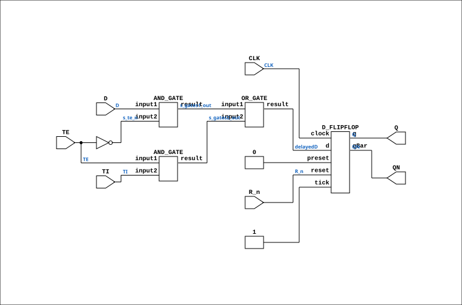

# SCAN_WITH_RESET_N

Source: `Verilog/Shared/ndlib/SCAN_WITH_RESET_N.v`

<!-- Generated by Verilog/tests/module_doc.py from the //! comments in the source. Do not edit by hand - edit the RTL comments and regenerate. -->

<!-- HIERARCHY-NAV:BEGIN - written by Verilog/tests/gen_hierarchy.py, do not edit -->

**Hierarchy:** not instantiated by any of the 9 build tops (elaborated by yosys).

[Module hierarchy](../../../HIERARCHY.md) - [All modules](../../../MODULES.md)

<!-- HIERARCHY-NAV:END -->


<!-- SCHEMATIC:BEGIN - written by Verilog/tests/gen_schematics.py, do not edit -->

## Schematic

Drawn from the Verilog: no build top uses this module, so it was elaborated from its own file with no defines and default parameters. Sub-modules are boxes (click the picture to open it full size; there every sub-module box links to its page, and every wire shows its Verilog name).

[](SCAN_WITH_RESET_N.svg)

<!-- SCHEMATIC:END -->

## Description

ND120 Shared
Component : SCAN_WITH_RESET_N
Last reviewed: 11-NOV-2024
Ronny Hansen

## Ports

| Direction | Width | Name | Description |
|---|---|---|---|
| input | `1` | `CLK` |  |
| input | `1` | `D` |  |
| input | `1` | `R_n` *(active low)* |  |
| input | `1` | `TE` |  |
| input | `1` | `TI` |  |
| output | `1` | `Q` |  |
| output | `1` | `QN` |  |

## Verilog source

[`Verilog/Shared/ndlib/SCAN_WITH_RESET_N.v`](https://github.com/RetroCoreLabs/nd-120/blob/main/Verilog/Shared/ndlib/SCAN_WITH_RESET_N.v) on GitHub.

<details markdown="1">
<summary>Show the Verilog of SCAN_WITH_RESET_N (110 lines)</summary>

```verilog

/**************************************************************************
** ND120 Shared                                                          **
**                                                                       **
** Component : SCAN_WITH_RESET_N                                         **
**                                                                       **
** Last reviewed: 11-NOV-2024                                            **
** Ronny Hansen                                                          **
***************************************************************************/


module SCAN_WITH_RESET_N (
    input CLK,
    input D,
    input R_n,
    input TE,
    input TI,

    output Q,
    output QN
);

  /*******************************************************************************
   ** The wires are defined here                                                 **
   *******************************************************************************/
  wire s_clk;
  wire s_d;
  wire s_gates1_out;
  wire s_gates2_out;
  wire s_ff_d_input;
  wire s_q_out;
  wire s_qn_out;
  wire s_r_n;
  wire s_r;
  wire s_te_n;
  wire s_te;
  wire s_ti;

  /*******************************************************************************
   ** Here all input connections are defined                                     **
   *******************************************************************************/
  assign s_clk = CLK;
  assign s_d = D;
  assign s_r = R_n;
  assign s_te = TE;
  assign s_ti = TI;

  /*******************************************************************************
   ** Here all output connections are defined                                    **
   *******************************************************************************/
  assign Q = s_q_out;
  assign QN = s_qn_out;

  /*******************************************************************************
   ** Here all in-lined components are defined                                   **
   *******************************************************************************/

  // NOT Gate
  assign s_te_n = ~s_te;
  assign s_r_n = ~s_r;

  /*******************************************************************************
   ** Here all normal components are defined                                     **
   *******************************************************************************/
  AND_GATE #(
      .BubblesMask(2'b00)
  ) GATES_1 (
      .input1(s_d),
      .input2(s_te_n),
      .result(s_gates1_out)
  );

  AND_GATE #(
      .BubblesMask(2'b00)
  ) GATES_2 (
      .input1(s_te),
      .input2(s_ti),
      .result(s_gates2_out)
  );

  OR_GATE #(
      .BubblesMask(2'b00)
  ) GATES_3 (
      .input1(s_gates1_out),
      .input2(s_gates2_out),
      .result(s_ff_d_input)
  );

  // TODO: Change to use fpga clock for triggering instead of latch
  reg delayedD;
  always@(s_ff_d_input)
  begin
    delayedD <= s_ff_d_input;
  end

  D_FLIPFLOP #(
      .InvertClockEnable(0)
  ) MEMORY_4 (
      .clock(s_clk),
      //.d(s_gates3_out),
      .d(delayedD),
      .preset(1'b0),
      .q(s_q_out),
      .qBar(s_qn_out),
      .reset(s_r),
      .tick(1'b1)
  );


endmodule
```

</details>
