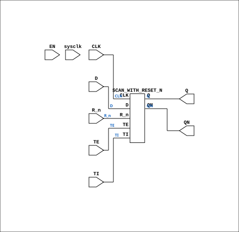

# SCAN_WITH_RESET_N_EN

Source: `Verilog/Shared/ndlib/SCAN_WITH_RESET_N_EN.v`

<!-- Generated by Verilog/tests/module_doc.py from the //! comments in the source. Do not edit by hand - edit the RTL comments and regenerate. -->

<!-- HIERARCHY-NAV:BEGIN - written by Verilog/tests/gen_hierarchy.py, do not edit -->

**Hierarchy:** not instantiated by any of the 9 build tops (elaborated by yosys).

[Module hierarchy](../../../HIERARCHY.md) - [All modules](../../../MODULES.md)

<!-- HIERARCHY-NAV:END -->


<!-- SCHEMATIC:BEGIN - written by Verilog/tests/gen_schematics.py, do not edit -->

## Schematic

Drawn from the Verilog: no build top uses this module, so it was elaborated from its own file with no defines and default parameters. Sub-modules are boxes (click the picture to open it full size; there every sub-module box links to its page, and every wire shows its Verilog name).

[](SCAN_WITH_RESET_N_EN.svg)

<!-- SCHEMATIC:END -->

## Description

ND120 Shared
SCAN_WITH_RESET_N_EN - SCAN_WITH_RESET_N with an optional
clock-enable mode.
USE_ENABLE=0 (default): wraps the original SCAN_WITH_RESET_N -
posedge CLK, original behaviour.
USE_ENABLE=1: posedge sysclk, captures when EN is high (P2 clock-
domain conversion mode - see SCAN_FF_EN.v / the plan doc). The
CLK pin is unused in this mode.
IMPORTANT - R_n finding (verified 10-JUL-2026 against the current
sources):
The original wires MEMORY_4 as a plain D_FLIPFLOP with the
default ACTIVE_ASYNC=0, and D_FLIPFLOP's gen_sync branch IGNORES
its preset/reset pins entirely (always @(posedge clk) q <= d;).
So in the original module, R_n has NO EFFECT on the flop today.
(Additionally the .reset pin is wired to R_n directly - not
inverted - so even the intended polarity would be active-HIGH on
an *_n-named input; the sibling SCAN_WITH_SET_N inverts S_n.)
Mode 1 replicates the ACTUAL current behaviour exactly: R_n is
ignored (lint-waived) and q simply captures TE ? TI : D under EN.
Last reviewed: 10-JUL-2026
Ronny Hansen

## Parameters

| Parameter | Default |
|---|---|
| `USE_ENABLE` | `0` |

## Ports

| Direction | Width | Name | Description |
|---|---|---|---|
| input | `1` | `sysclk` | FPGA system clock (used only when USE_ENABLE=1) |
| input | `1` | `EN` | Clock enable    (used only when USE_ENABLE=1) |
| input | `1` | `CLK` | Clock (used only when USE_ENABLE=0) |
| input | `1` | `D` | D input |
| input | `1` | `R_n` *(active low)* | Reset input - see header: no effect in the original |
| input | `1` | `TE` | T enable |
| input | `1` | `TI` | T input |
| output | `1` | `Q` | Q output |
| output | `1` | `QN` | Q_n output |

## Verilog source

[`Verilog/Shared/ndlib/SCAN_WITH_RESET_N_EN.v`](https://github.com/RetroCoreLabs/nd-120/blob/main/Verilog/Shared/ndlib/SCAN_WITH_RESET_N_EN.v) on GitHub.

<details markdown="1">
<summary>Show the Verilog of SCAN_WITH_RESET_N_EN (73 lines)</summary>

```verilog
/**************************************************************************
** ND120 Shared                                                          **
**                                                                       **
** SCAN_WITH_RESET_N_EN - SCAN_WITH_RESET_N with an optional             **
** clock-enable mode.                                                    **
**                                                                       **
** USE_ENABLE=0 (default): wraps the original SCAN_WITH_RESET_N -        **
**   posedge CLK, original behaviour.                                    **
** USE_ENABLE=1: posedge sysclk, captures when EN is high (P2 clock-     **
**   domain conversion mode - see SCAN_FF_EN.v / the plan doc). The      **
**   CLK pin is unused in this mode.                                     **
**                                                                       **
** IMPORTANT - R_n finding (verified 10-JUL-2026 against the current     **
** sources):                                                             **
**   The original wires MEMORY_4 as a plain D_FLIPFLOP with the          **
**   default ACTIVE_ASYNC=0, and D_FLIPFLOP's gen_sync branch IGNORES    **
**   its preset/reset pins entirely (always @(posedge clk) q <= d;).     **
**   So in the original module, R_n has NO EFFECT on the flop today.     **
**   (Additionally the .reset pin is wired to R_n directly - not         **
**   inverted - so even the intended polarity would be active-HIGH on    **
**   an *_n-named input; the sibling SCAN_WITH_SET_N inverts S_n.)       **
**   Mode 1 replicates the ACTUAL current behaviour exactly: R_n is      **
**   ignored (lint-waived) and q simply captures TE ? TI : D under EN.   **
**                                                                       **
** Last reviewed: 10-JUL-2026                                            **
** Ronny Hansen                                                          **
***************************************************************************/

module SCAN_WITH_RESET_N_EN #(
    parameter integer USE_ENABLE = 0
) (
    input sysclk,  //! FPGA system clock (used only when USE_ENABLE=1)
    input EN,      //! Clock enable    (used only when USE_ENABLE=1)

    input CLK,  //! Clock (used only when USE_ENABLE=0)
    input D,    //! D input
    input R_n,  //! Reset input - see header: no effect in the original,
                //! so no effect here either (kept for port compatibility)
    input TE,   //! T enable
    input TI,   //! T input

    output Q,  //! Q output
    output QN  //! Q_n output
);

  generate
    if (USE_ENABLE == 1) begin : gen_enable
      /* verilator lint_off UNUSEDSIGNAL */
      wire unused_clk = CLK & R_n;
      /* verilator lint_on UNUSEDSIGNAL */
      reg q_r = 1'b0;
      always @(posedge sysclk) begin
        if (EN) q_r <= TE ? TI : D;
      end
      assign Q  = q_r;
      assign QN = ~q_r;
    end else begin : gen_orig
      /* verilator lint_off UNUSEDSIGNAL */
      wire unused_sys = sysclk & EN;
      /* verilator lint_on UNUSEDSIGNAL */
      SCAN_WITH_RESET_N FF (
          .CLK(CLK),
          .D  (D),
          .R_n(R_n),
          .TE (TE),
          .TI (TI),
          .Q  (Q),
          .QN (QN)
      );
    end
  endgenerate

endmodule
```

</details>
