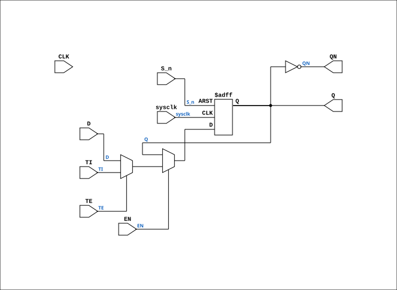

# SCAN_WITH_SET_N_EN

Source: `Verilog/Shared/ndlib/SCAN_WITH_SET_N_EN.v`

<!-- Generated by Verilog/tests/module_doc.py from the //! comments in the source. Do not edit by hand - edit the RTL comments and regenerate. -->

<!-- HIERARCHY-NAV:BEGIN - written by Verilog/tests/gen_hierarchy.py, do not edit -->

**Where it sits** (Simulation): [ND120_TOP](../../../doc/ND120_TOP.md) > [ND120_CORE](../../../doc/ND120_CORE.md) > [ND3202D](../../../CPU-BOARD-3202/circuit/doc/ND3202D.md) > [CPU_15](../../../CPU-BOARD-3202/circuit/doc/CPU_15.md) > [CPU_PROC_32](../../../CPU-BOARD-3202/circuit/doc/CPU_PROC_32.md) > [CPU_PROC_CGA_33](../../../CPU-BOARD-3202/circuit/doc/CPU_PROC_CGA_33.md) > [CGA](../../../DELILAH-CPU/CGA/circuit/doc/CGA.md) > [CGA_MIC](../../../DELILAH-CPU/CGA_MIC/circuit/doc/CGA_MIC.md) > **SCAN_WITH_SET_N_EN**
- instance path: `CORE.CPU_BOARD.CPU.PROC.CGA.DELILAH.MIC.OOD_FF`

**Used in:** [CGA_MIC](../../../DELILAH-CPU/CGA_MIC/circuit/doc/CGA_MIC.md) (all tops)

**Contains:** no other modules.

[Module hierarchy](../../../HIERARCHY.md) - [All modules](../../../MODULES.md)

<!-- HIERARCHY-NAV:END -->


<!-- SCHEMATIC:BEGIN - written by Verilog/tests/gen_schematics.py, do not edit -->

## Schematic

Drawn from the Verilog: the yosys netlist of the Simulation (Verilator) build, instance `CORE.CPU_BOARD.CPU.PROC.CGA.DELILAH.MIC.OOD_FF`. Sub-modules are boxes (click the picture to open it full size; there every sub-module box links to its page, and every wire shows its Verilog name).

[](SCAN_WITH_SET_N_EN.svg)

<!-- SCHEMATIC:END -->

## Description

ND120 Shared
SCAN_WITH_SET_N_EN - SCAN_WITH_SET_N with an optional clock-enable
mode.
USE_ENABLE=0 (default): wraps the original SCAN_WITH_SET_N -
posedge CLK, original behaviour (async active-low set via S_n on
a D_FLIPFLOP with ACTIVE_ASYNC=1, d = TE ? TI : D).
USE_ENABLE=1: posedge sysclk, captures when EN is high (P2 clock-
domain conversion mode - see SCAN_FF_EN.v / the plan doc). The
CLK pin is unused in this mode. S_n stays an ASYNC active-low
set, exactly like the original's async preset (~S_n), and while
S_n is low it also overrides capture on the clock edge.
Last reviewed: 10-JUL-2026
Ronny Hansen

## Parameters

| Parameter | Default |
|---|---|
| `USE_ENABLE` | `0` |

## Ports

| Direction | Width | Name | Description |
|---|---|---|---|
| input | `1` | `sysclk` | FPGA system clock (used only when USE_ENABLE=1) |
| input | `1` | `EN` | Clock enable    (used only when USE_ENABLE=1) |
| input | `1` | `CLK` | Clock (used only when USE_ENABLE=0) |
| input | `1` | `D` | D input |
| input | `1` | `S_n` *(active low)* | Async active-low set |
| input | `1` | `TE` | T enable |
| input | `1` | `TI` | T input |
| output | `1` | `Q` | Q output |
| output | `1` | `QN` | Q_n output |

## Verilog source

[`Verilog/Shared/ndlib/SCAN_WITH_SET_N_EN.v`](https://github.com/RetroCoreLabs/nd-120/blob/main/Verilog/Shared/ndlib/SCAN_WITH_SET_N_EN.v) on GitHub.

<details markdown="1">
<summary>Show the Verilog of SCAN_WITH_SET_N_EN (79 lines)</summary>

```verilog
/**************************************************************************
** ND120 Shared                                                          **
**                                                                       **
** SCAN_WITH_SET_N_EN - SCAN_WITH_SET_N with an optional clock-enable    **
** mode.                                                                 **
**                                                                       **
** USE_ENABLE=0 (default): wraps the original SCAN_WITH_SET_N -          **
**   posedge CLK, original behaviour (async active-low set via S_n on    **
**   a D_FLIPFLOP with ACTIVE_ASYNC=1, d = TE ? TI : D).                 **
** USE_ENABLE=1: posedge sysclk, captures when EN is high (P2 clock-     **
**   domain conversion mode - see SCAN_FF_EN.v / the plan doc). The      **
**   CLK pin is unused in this mode. S_n stays an ASYNC active-low       **
**   set, exactly like the original's async preset (~S_n), and while     **
**   S_n is low it also overrides capture on the clock edge.             **
**                                                                       **
** Last reviewed: 10-JUL-2026                                            **
** Ronny Hansen                                                          **
***************************************************************************/

module SCAN_WITH_SET_N_EN #(
    parameter integer USE_ENABLE = 0
) (
    input sysclk,  //! FPGA system clock (used only when USE_ENABLE=1)
    input EN,      //! Clock enable    (used only when USE_ENABLE=1)

    input CLK,  //! Clock (used only when USE_ENABLE=0)
    input D,    //! D input
    input S_n,  //! Async active-low set
    input TE,   //! T enable
    input TI,   //! T input

    output Q,  //! Q output
    output QN  //! Q_n output
);

  generate
    if (USE_ENABLE == 1) begin : gen_enable
      /* verilator lint_off UNUSEDSIGNAL */
      wire unused_clk = CLK;
      /* verilator lint_on UNUSEDSIGNAL */
      // yosys/Gowin: a GW2A FF's power-up value must EQUAL its async-set
      // value (dfflegalize hard-errors on init 0 + async preset 1; Xilinx
      // allows them to differ, so Vivado never minded). Init 1 is also what
      // the silicon does: S_n is asserted through POR, so the FF leaves
      // reset at 1 regardless of the declared init. Verilator/iverilog/
      // Vivado keep the original init 0 (golden traces unchanged).
`ifdef YOSYS
      reg q_r = 1'b1;
`else
      reg q_r = 1'b0;
`endif
      // Active-high async set (posedge ~S_n), matching the original's
      // D_FLIPFLOP ACTIVE_ASYNC preset trigger: at time 0 with S_n low the
      // 0->1 preset transition fires the block, which a `negedge S_n`
      // sensitivity would miss (S_n starts low - no edge).
      wire s_preset = ~S_n;
      always @(posedge sysclk or posedge s_preset) begin
        if (s_preset) q_r <= 1'b1;
        else if (EN) q_r <= TE ? TI : D;
      end
      assign Q  = q_r;
      assign QN = ~q_r;
    end else begin : gen_orig
      /* verilator lint_off UNUSEDSIGNAL */
      wire unused_sys = sysclk & EN;
      /* verilator lint_on UNUSEDSIGNAL */
      SCAN_WITH_SET_N FF (
          .CLK(CLK),
          .D  (D),
          .S_n(S_n),
          .TE (TE),
          .TI (TI),
          .Q  (Q),
          .QN (QN)
      );
    end
  endgenerate

endmodule
```

</details>
