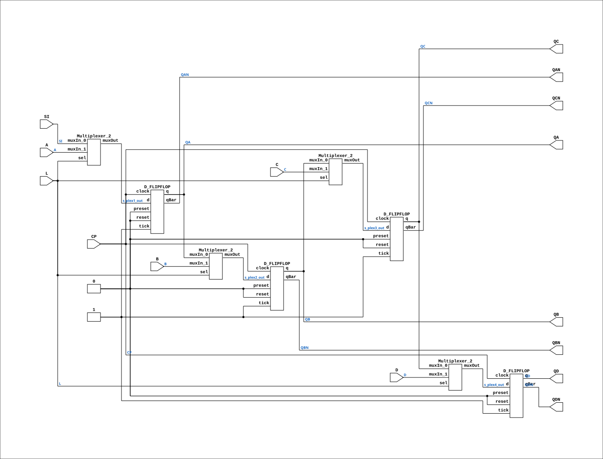

# SR44

Source: `Verilog/Shared/ndlib/SR44.v`

<!-- Generated by Verilog/tests/module_doc.py from the //! comments in the source. Do not edit by hand - edit the RTL comments and regenerate. -->

<!-- HIERARCHY-NAV:BEGIN - written by Verilog/tests/gen_hierarchy.py, do not edit -->

**Hierarchy:** not instantiated by any of the 9 build tops (elaborated by yosys).

[Module hierarchy](../../../HIERARCHY.md) - [All modules](../../../MODULES.md)

<!-- HIERARCHY-NAV:END -->


<!-- SCHEMATIC:BEGIN - written by Verilog/tests/gen_schematics.py, do not edit -->

## Schematic

Drawn from the Verilog: no build top uses this module, so it was elaborated from its own file with no defines and default parameters. Sub-modules are boxes (click the picture to open it full size; there every sub-module box links to its page, and every wire shows its Verilog name).

[](SR44.svg)

<!-- SCHEMATIC:END -->

## Description

ND120 Shared
Component SR44
Last reviewed: 11-NOV-2024
Ronny Hansen

## Ports

| Direction | Width | Name | Description |
|---|---|---|---|
| input | `1` | `A` |  |
| input | `1` | `B` |  |
| input | `1` | `C` |  |
| input | `1` | `CP` |  |
| input | `1` | `D` |  |
| input | `1` | `L` |  |
| input | `1` | `SI` |  |
| output | `1` | `QA` |  |
| output | `1` | `QAN` |  |
| output | `1` | `QB` |  |
| output | `1` | `QBN` |  |
| output | `1` | `QC` |  |
| output | `1` | `QCN` |  |
| output | `1` | `QD` |  |
| output | `1` | `QDN` |  |

## Verilog source

[`Verilog/Shared/ndlib/SR44.v`](https://github.com/RetroCoreLabs/nd-120/blob/main/Verilog/Shared/ndlib/SR44.v) on GitHub.

<details markdown="1">
<summary>Show the Verilog of SR44 (154 lines)</summary>

```verilog

/**************************************************************************
** ND120 Shared                                                          **
**                                                                       **
** Component SR44                                                        **
**                                                                       **
** Last reviewed: 11-NOV-2024                                            **
** Ronny Hansen                                                          **
***************************************************************************/

module SR44 (
    input A,
    input B,
    input C,
    input CP,
    input D,
    input L,
    input SI,


    output QA,
    output QAN,
    output QB,
    output QBN,
    output QC,
    output QCN,
    output QD,
    output QDN
);

  wire s_qa_out;
  wire s_qc_out;
  wire s_qb_n_out;
  wire s_qd_out;
  wire s_qd_n_out;
  wire s_plex2_out;
  wire s_plex4_out;
  wire s_b;
  wire s_d;
  wire s_qa_n_out;
  wire s_qc_n_out;
  wire s_cp;
  wire s_qb_out;
  wire s_si;
  wire s_l;
  wire s_plex1_out;
  wire s_plex3_out;
  wire s_c;
  wire s_a;

  /*******************************************************************************
   ** Here all input connections are defined                                     **
   *******************************************************************************/
  assign s_a  = A;
  assign s_b  = B;
  assign s_c  = C;
  assign s_cp = CP;
  assign s_d  = D;
  assign s_l  = L;
  assign s_si = SI;

  /*******************************************************************************
   ** Here all output connections are defined                                    **
   *******************************************************************************/
  assign QA   = s_qa_out;
  assign QAN  = s_qa_n_out;
  assign QB   = s_qb_out;
  assign QBN  = s_qb_n_out;
  assign QC   = s_qc_out;
  assign QCN  = s_qc_n_out;
  assign QD   = s_qd_out;
  assign QDN  = s_qd_n_out;

  /*******************************************************************************
   ** Here all normal components are defined                                     **
   *******************************************************************************/
  Multiplexer_2 PLEXERS_1 (
      .muxIn_0(s_si),
      .muxIn_1(s_a),
      .muxOut(s_plex1_out),
      .sel(s_l)
  );

  Multiplexer_2 PLEXERS_2 (
      .muxIn_0(s_qa_out),
      .muxIn_1(s_b),
      .muxOut(s_plex2_out),
      .sel(s_l)
  );

  Multiplexer_2 PLEXERS_3 (
      .muxIn_0(s_qb_out),
      .muxIn_1(s_c),
      .muxOut(s_plex3_out),
      .sel(s_l)
  );

  Multiplexer_2 PLEXERS_4 (
      .muxIn_0(s_qc_out),
      .muxIn_1(s_d),
      .muxOut(s_plex4_out),
      .sel(s_l)
  );

  D_FLIPFLOP #(
      .InvertClockEnable(0)
  ) MEMORY_5 (
      .clock(s_cp),
      .d(s_plex1_out),
      .preset(1'b0),
      .q(s_qa_out),
      .qBar(s_qa_n_out),
      .reset(1'b0),
      .tick(1'b1)
  );

  D_FLIPFLOP #(
      .InvertClockEnable(0)
  ) MEMORY_6 (
      .clock(s_cp),
      .d(s_plex2_out),
      .preset(1'b0),
      .q(s_qb_out),
      .qBar(s_qb_n_out),
      .reset(1'b0),
      .tick(1'b1)
  );

  D_FLIPFLOP #(
      .InvertClockEnable(0)
  ) MEMORY_7 (
      .clock(s_cp),
      .d(s_plex3_out),
      .preset(1'b0),
      .q(s_qc_out),
      .qBar(s_qc_n_out),
      .reset(1'b0),
      .tick(1'b1)
  );

  D_FLIPFLOP #(
      .InvertClockEnable(0)
  ) MEMORY_8 (
      .clock(s_cp),
      .d(s_plex4_out),
      .preset(1'b0),
      .q(s_qd_out),
      .qBar(s_qd_n_out),
      .reset(1'b0),
      .tick(1'b1)
  );


endmodule
```

</details>
