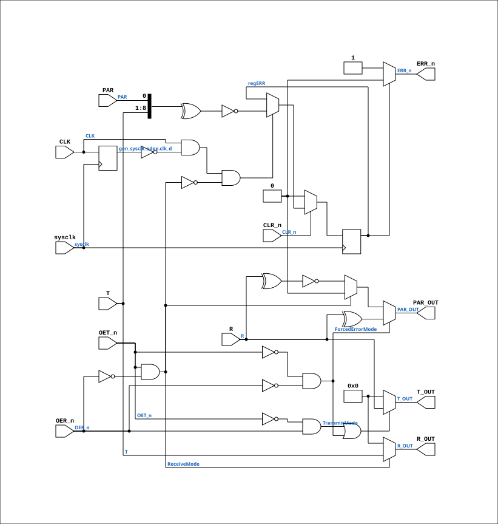

# AM29833A

Source: `Verilog/Shared/support/AM29833A.v`

<!-- Generated by Verilog/tests/module_doc.py from the //! comments in the source. Do not edit by hand - edit the RTL comments and regenerate. -->

<!-- HIERARCHY-NAV:BEGIN - written by Verilog/tests/gen_hierarchy.py, do not edit -->

**Where it sits** (Simulation): [ND120_TOP](../../../doc/ND120_TOP.md) > [ND120_CORE](../../../doc/ND120_CORE.md) > [ND3202D](../../../CPU-BOARD-3202/circuit/doc/ND3202D.md) > [MEM_43](../../../CPU-BOARD-3202/circuit/doc/MEM_43.md) > [MEM_DATA_46](../../../CPU-BOARD-3202/circuit/doc/MEM_DATA_46.md) > **AM29833A**
- instance path: `CORE.CPU_BOARD.MEM.DATA.CHIP_1H`

**Used in:** [MEM_DATA_46](../../../CPU-BOARD-3202/circuit/doc/MEM_DATA_46.md) (all tops)

**Contains:** no other modules.

[Module hierarchy](../../../HIERARCHY.md) - [All modules](../../../MODULES.md)

<!-- HIERARCHY-NAV:END -->


<!-- SCHEMATIC:BEGIN - written by Verilog/tests/gen_schematics.py, do not edit -->

## Schematic

Drawn from the Verilog: the yosys netlist of the Simulation (Verilator) build, instance `CORE.CPU_BOARD.MEM.DATA.CHIP_1H`. Sub-modules are boxes (click the picture to open it full size; there every sub-module box links to its page, and every wire shows its Verilog name).

[](AM29833A.svg)

<!-- SCHEMATIC:END -->

## Description

ND120 Shared
Module AM29833A
PARITY BUS TRANSCEIVERS
Documentation:
https://pdf1.alldatasheet.com/datasheet-pdf/view/165880/AMD/AM29833A.html
Last reviewed: 22-MAR-2025
Ronny Hansen

## Ports

| Direction | Width | Name | Description |
|---|---|---|---|
| input | `1` | `sysclk` | FPGA system clock (used only when USE_SYSCLK=2) |
| input | `1` | `CLK` | Clock for parity error |
| input | `1` | `CLR_n` *(active low)* | Clear error |
| output | `1` | `ERR_n` *(active low)* | Parity Error |
| input | `1` | `OER_n` *(active low)* | Output enable (negated) R |
| input | `1` | `OET_n` *(active low)* | Output enable (negated) T |
| input | `1` | `PAR` | Parity bit (in) |
| output | `1` | `PAR_OUT` | Parity bit (0=ODD,1=EVEN) |
| input | `[7:0]` | `R` | R in |
| output | `[7:0]` | `R_OUT` | R out |
| input | `[7:0]` | `T` | T in |
| output | `[7:0]` | `T_OUT` | T out |

## Verilog source

[`Verilog/Shared/support/AM29833A.v`](https://github.com/RetroCoreLabs/nd-120/blob/main/Verilog/Shared/support/AM29833A.v) on GitHub.

<details markdown="1">
<summary>Show the Verilog of AM29833A (139 lines)</summary>

```verilog

/**********************************************************************************
** ND120 Shared                                                                  **
**                                                                               **
** Module AM29833A                                                               **
**                                                                               **
** PARITY BUS TRANSCEIVERS                                                       **
** Documentation:                                                                **
** https://pdf1.alldatasheet.com/datasheet-pdf/view/165880/AMD/AM29833A.html     **
**                                                                               **
**                                                                               **
** Last reviewed: 22-MAR-2025                                                    **
** Ronny Hansen                                                                  **
***********************************************************************************/


// Used on 3202D - Sheet 46 - MEM_DATA

/*
GENERAL DESCRIPTION 
The Am29833A and Am29853A are high-performance parity bus transceivers designed for two-way communications.
Each device can be used as an 8-bit transceiver, as well as a 9-bit parity checker/generator.

In the transmit mode, data is read at the R port and output at the T port with a parity bit.
In the receive mode, data and parity are read at the T port, and the data is output at the R port along with an /ERR flag showing the result of the parity test.

In the Am29833A, the error flag is clocked and stored in a register which is read at the open-collector ERR out-put.

The /CLR input is used to clear the error flag register.

In the Am29853A, a latch replaces this register, and the /EN and /CLR controls are used to pass, store, sample or clear the error flag output.
When both output enables are disabled in the Am29853A and Am29833A, the  parity logic defaults to the transmit mode, so that the ERR pin reflects the parity of the R port. 

The output enables, /OER and /OET, are used to force the port outputs to the high-impedance state so that other devices can drive bus lines directly.
In addition, the user can force a parity error by enabling both OER and OET simultaneously.

This transmission of inverted parity gives the designer more system diagnostic capability.
Each of these devices is produced with AMD's proprietary IMOX bipolar process, and features typical propagation delays of 6 ns, as well as high-capacitive drive capability.

*/


module AM29833A (
    input  wire       sysclk,   //! FPGA system clock (used only when USE_SYSCLK=2)
    input  wire       CLK,      //! Clock for parity error
    input  wire       CLR_n,    //! Clear error
    output wire       ERR_n,    //! Parity Error
    input  wire       OER_n,    //! Output enable (negated) R
    input  wire       OET_n,    //! Output enable (negated) T
    input  wire       PAR,      //! Parity bit (in)
    output wire       PAR_OUT,  //! Parity bit (0=ODD,1=EVEN)
    input  wire [7:0] R,        //! R in
    output wire [7:0] R_OUT,    //! R out
    input  wire [7:0] T,        //! T in
    output wire [7:0] T_OUT     //! T out
);

  // USE_SYSCLK=0 (default): original posedge CLK + async CLR_n - matches the
  //   real chip; correct for simulation / latch mode.
  // USE_SYSCLK=2: sysclk-sampled RISING-EDGE capture (same pattern as
  //   AM29C821 USE_SYSCLK=2) - the FPGA-safe replacement when CLK is a
  //   control strobe (here: RDATA), not a clock. Removes the routed-net-as-
  //   clock; CLR_n becomes a synchronous clear (it is a slow control signal,
  //   several sysclk cycles wide, so no clear event can be missed).
  parameter USE_SYSCLK = 0;

  reg regERR = 1'b0;

  // Transmit Mode: Transmits data from R port to T port. Generating parity. Receive path is disabled.
  wire TransmitMode;
  assign TransmitMode = !OET_n & OER_n;

  // Receive Mode: Transmits data from T port to R port with parity test resulting in error flag. Transmit path is disabled
  wire ReceiveMode;
  assign ReceiveMode = OET_n & !OER_n;

  // Both OET_n and OER_n low = FORCED-ERROR (diagnostic) mode, per the
  // datasheet text quoted above: "the user can force a parity error by
  // enabling both OER and OET simultaneously. This transmission of inverted
  // parity gives the designer more system diagnostic capability." The chip
  // TRANSMITS R -> T normally but with the parity bit INVERTED; the R port is
  // NOT driven. (The old model drove neither port in this mode, so the ND
  // memory-test mode - 45008B TST asserting OER during writes - wrote zeros
  // instead of data and crashed CONFIGURE's memory-type probe. 30-JUL-2026.)
  wire ForcedErrorMode;
  assign ForcedErrorMode = !OET_n & !OER_n;

  // Data path
  assign T_OUT = (TransmitMode | ForcedErrorMode) ? R : 8'b0;  // TRANSMIT (also in forced-error mode)
  assign R_OUT = (ReceiveMode) ? T : 8'b0;   // RECEIVE MODE

  // In receivemode PAR_OUT is high-impediance (we use 0 for that here)
  //
  // ^ (in Verilig) is XOR giving 0=if even, 1=if odd.
  // Invert this so that the PAR signal is according to Am29833A documentation: PAR=L on ODD and PAR=H on EVEN
  // Forced-error mode transmits the INVERTED parity bit (see datasheet note above).
  assign PAR_OUT = ForcedErrorMode ? (^R) :
                   (!ReceiveMode) ? ~(^R) : 1'b0;

  // ERR register logic (latched on CLK)
  generate
    if (USE_SYSCLK == 2) begin : gen_sysclk_edge
      // FPGA mode: capture on a DETECTED rising edge of CLK, clocked by
      // sysclk. One capture per CLK rise - same semantics as posedge CLK
      // (CLK is generated in the sysclk/OSC domain and is at least one
      // sysclk cycle wide, so no edge can be missed). CLR_n is checked
      // synchronously and dominates, mirroring the async-clear priority.
      reg clk_d = 1'b0;
      always @(posedge sysclk) begin
        clk_d <= CLK;
        if (!CLR_n) regERR <= 1'b0;
        else if (CLK && !clk_d && !ReceiveMode)
          regERR <= ~(^{T, PAR});  // 9-bit parity check on T+PAR: EVEN = error
      end
    end else begin : gen_posedge_clk
      // Original chip behavior (simulation / latch mode)
      always @(posedge CLK or negedge CLR_n) begin
        if (!CLR_n)
        begin
          // Clear error flag
          regERR <= 1'b0;
        end
        else if (!ReceiveMode) // Default to transmit mode if ReceiveMode is not active
        begin
          // Store error flag if even parity detected
          regERR <= ~(^{T, PAR}); // Parity check on T input + incoming PAR. If those 9 bits is EVEN we have an error
        end
      end
    end
  endgenerate

  // ERR output logic (open-collector style)
  assign ERR_n = regERR ? 1'b0 : 1'b1; //open collector is here resulting in an 1 when there is no error

endmodule
```

</details>
