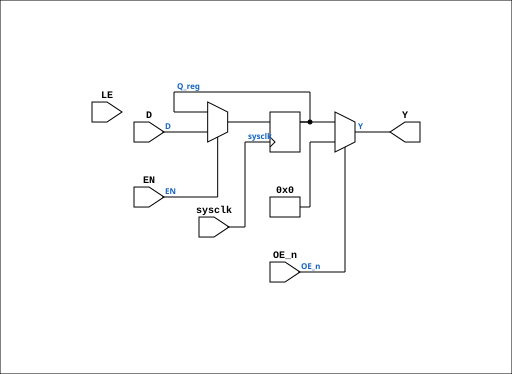

# AM29841

Source: `Verilog/Shared/support/AM29841.v`

<!-- Generated by Verilog/tests/module_doc.py from the //! comments in the source. Do not edit by hand - edit the RTL comments and regenerate. -->

<!-- HIERARCHY-NAV:BEGIN - written by Verilog/tests/gen_hierarchy.py, do not edit -->

**Where it sits** (Simulation): [ND120_TOP](../../../doc/ND120_TOP.md) > [ND120_CORE](../../../doc/ND120_CORE.md) > [ND3202D](../../../CPU-BOARD-3202/circuit/doc/ND3202D.md) > [CPU_15](../../../CPU-BOARD-3202/circuit/doc/CPU_15.md) > [CPU_PROC_32](../../../CPU-BOARD-3202/circuit/doc/CPU_PROC_32.md) > **AM29841**
- instance path: `CORE.CPU_BOARD.CPU.PROC.CHIP_25F`

**Used in:** [CPU_PROC_32](../../../CPU-BOARD-3202/circuit/doc/CPU_PROC_32.md) (all tops)

**Contains:** no other modules.

[Module hierarchy](../../../HIERARCHY.md) - [All modules](../../../MODULES.md)

<!-- HIERARCHY-NAV:END -->


<!-- SCHEMATIC:BEGIN - written by Verilog/tests/gen_schematics.py, do not edit -->

## Schematic

Drawn from the Verilog: the yosys netlist of the Simulation (Verilator) build, instance `CORE.CPU_BOARD.CPU.PROC.CHIP_25F`. Sub-modules are boxes (click the picture to open it full size; there every sub-module box links to its page, and every wire shows its Verilog name).

[](AM29841.svg)

<!-- SCHEMATIC:END -->

## Description

ND120 Shared
Component AM29841
Bus Driver 10 bit (D-Latch) with 3-state output
Documentation: https://www.alldatasheet.com/datasheet-pdf/pdf/107079/AMD/AM29841.html
Last reviewed: 1-DEC-2024
Ronny Hansen

## Ports

| Direction | Width | Name | Description |
|---|---|---|---|
| input | `1` | `sysclk` | FPGA system clock (used only when USE_ENABLE=1) |
| input | `1` | `EN` | Clock enable     (used only when USE_ENABLE=1) |
| input | `[9:0]` | `D` | 10 Bit Data inputs |
| input | `1` | `LE` | Latch Enable (when high in latch mode, rising edge in FF mode) |
| input | `1` | `OE_n` *(active low)* | Output Enable |
| output | `[9:0]` | `Y` | Outputs |

## Verilog source

[`Verilog/Shared/support/AM29841.v`](https://github.com/RetroCoreLabs/nd-120/blob/main/Verilog/Shared/support/AM29841.v) on GitHub.

<details markdown="1">
<summary>Show the Verilog of AM29841 (74 lines)</summary>

```verilog
/**********************************************************************************************************
** ND120 Shared                                                                                          **
**                                                                                                       **
** Component AM29841                                                                                     **
**                                                                                                       **
** Bus Driver 10 bit (D-Latch) with 3-state output                                                       **
** Documentation: https://www.alldatasheet.com/datasheet-pdf/pdf/107079/AMD/AM29841.html                 **
**                                                                                                       **
** Last reviewed: 1-DEC-2024                                                                             **
** Ronny Hansen                                                                                          **
***********************************************************************************************************/

module AM29841 (
    input wire sysclk,    // FPGA system clock (used only when USE_ENABLE=1)
    input wire EN,        // Clock enable     (used only when USE_ENABLE=1)
    input wire [9:0] D,   // 10 Bit Data inputs
    input wire LE,        // Latch Enable (when high in latch mode, rising edge in FF mode)
    input wire OE_n,      // Output Enable
    output wire [9:0] Y   // Outputs
);

    // FPGA_MODE: Set to 1 for edge-triggered operation (FPGA synthesis)
    //            Set to 0 for transparent latch operation (original behavior)
`ifdef USE_TRANSPARENT_LATCHES
    parameter FPGA_MODE = 0;  // Simulation: use transparent latch (original behavior)
`else
    parameter FPGA_MODE = 1;  // FPGA: use edge-triggered FF for synthesis
`endif

    // USE_ENABLE=1: capture on posedge sysclk when EN is high (rise-aligned
    // enable for the clock that drives LE) instead of clocking on the routed
    // LE net (P3, docs/plan-fix-unconstrained-clocks.md). Overrides FPGA_MODE.
    parameter USE_ENABLE = 0;

    reg [9:0] Q_reg = 10'b0;  // Internal register/latch with initial value for FPGA

    generate
        if (USE_ENABLE == 1) begin : gen_enable
            /* verilator lint_off UNUSEDSIGNAL */
            wire unused_le = LE;
            /* verilator lint_on UNUSEDSIGNAL */
            always @(posedge sysclk) begin
                if (EN) Q_reg <= D;
            end
        end else if (FPGA_MODE == 1) begin : gen_flipflop
            /* verilator lint_off UNUSEDSIGNAL */
            wire unused_sys = sysclk & EN;
            /* verilator lint_on UNUSEDSIGNAL */
            // Edge-triggered flip-flop mode (FPGA-friendly)
            always @(posedge LE) begin
                Q_reg <= D;  // Capture on rising edge
            end
        end else begin : gen_latch
            /* verilator lint_off UNUSEDSIGNAL */
            wire unused_sys = sysclk & EN;
            /* verilator lint_on UNUSEDSIGNAL */
            // Transparent latch mode (original behavior)
            /* verilator lint_off LATCH */
            always @(*) begin
                if (LE)
                    Q_reg = D; // Transparent mode: follows input when LE high
                else
                    Q_reg = Q_reg; // Hold previous value
            end
            /* verilator lint_on LATCH */
        end
    endgenerate

    // Output control
    // When OE_n is low (active), outputs reflect the registered data
    // When OE_n is high, outputs are in high-impedance state (zero for simulation)
    assign Y = OE_n ? 10'b0 : Q_reg;

endmodule
```

</details>
