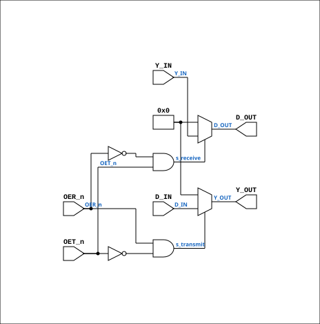

# AM29861A

Source: `Verilog/Shared/support/AM29861A.v`

<!-- Generated by Verilog/tests/module_doc.py from the //! comments in the source. Do not edit by hand - edit the RTL comments and regenerate. -->

<!-- HIERARCHY-NAV:BEGIN - written by Verilog/tests/gen_hierarchy.py, do not edit -->

**Where it sits** (Simulation): [ND120_TOP](../../../doc/ND120_TOP.md) > [ND120_CORE](../../../doc/ND120_CORE.md) > [ND3202D](../../../CPU-BOARD-3202/circuit/doc/ND3202D.md) > [MEM_43](../../../CPU-BOARD-3202/circuit/doc/MEM_43.md) > [MEM_ADDR_44](../../../CPU-BOARD-3202/circuit/doc/MEM_ADDR_44.md) > **AM29861A**
- instance path: `CORE.CPU_BOARD.MEM.ADDR.CHIP_5H`

**Used in:** [MEM_ADDR_44](../../../CPU-BOARD-3202/circuit/doc/MEM_ADDR_44.md) (all tops)

**Contains:** no other modules.

[Module hierarchy](../../../HIERARCHY.md) - [All modules](../../../MODULES.md)

<!-- HIERARCHY-NAV:END -->


<!-- SCHEMATIC:BEGIN - written by Verilog/tests/gen_schematics.py, do not edit -->

## Schematic

Drawn from the Verilog: the yosys netlist of the Simulation (Verilator) build, instance `CORE.CPU_BOARD.MEM.ADDR.CHIP_5H`. Sub-modules are boxes (click the picture to open it full size; there every sub-module box links to its page, and every wire shows its Verilog name).

[](AM29861A.svg)

<!-- SCHEMATIC:END -->

## Description

ND120 CPU
AM29861A
10 Bit Bus Tranceivers
Documentation:
https://datasheetspdf.com/datasheet/AM29861.html
Last reviewed: 11-NOV-2024
Ronny Hansen

## Ports

| Direction | Width | Name | Description |
|---|---|---|---|
| input | `1` | `OER_n` *(active low)* | Output Enable Receiver, active low |
| input | `1` | `OET_n` *(active low)* | Output Enable Transmitter, active low |
| input | `[9:0]` | `D_IN` | Receiver Data Bus - input (read left, write right) |
| input | `[9:0]` | `Y_IN` | Transmitter Data Bus - input (read right, write left) |
| output | `[9:0]` | `D_OUT` | Receiver Data Bus - output |
| output | `[9:0]` | `Y_OUT` | Transmitter Data Bus - output |

## Verilog source

[`Verilog/Shared/support/AM29861A.v`](https://github.com/RetroCoreLabs/nd-120/blob/main/Verilog/Shared/support/AM29861A.v) on GitHub.

<details markdown="1">
<summary>Show the Verilog of AM29861A (43 lines)</summary>

```verilog
/**************************************************************************************************
** ND120 CPU                                                                                     **
**                                                                                               **
** AM29861A                                                                                      **
**                                                                                               **
** 10 Bit Bus Tranceivers                                                                        **
**                                                                                               **
** Documentation:                                                                                **
** https://datasheetspdf.com/datasheet/AM29861.html                                              **
**                                                                                               **
** Last reviewed: 11-NOV-2024                                                                    **
** Ronny Hansen                                                                                  **
***************************************************************************************************/

module AM29861A (
    input OER_n,  //! Output Enable Receiver, active low
    input OET_n,  //! Output Enable Transmitter, active low

    input [9:0] D_IN,  //! Receiver Data Bus - input (read left, write right)
    input [9:0] Y_IN,  //! Transmitter Data Bus - input (read right, write left)

    output [9:0] D_OUT,  //! Receiver Data Bus - output
    output [9:0] Y_OUT   //! Transmitter Data Bus - output
);

  /*******************************************************************************
   ** The wires are defined here                                                 **
   *******************************************************************************/
  wire s_receive;
  wire s_transmit;

   /*******************************************************************************
   ** Here all in-lined components are defined                                   **
   *******************************************************************************/

  assign s_receive = !OER_n & OET_n;
  assign s_transmit = OER_n & !OET_n;

  // Logic to drive the internal bus signals
  assign Y_OUT = s_transmit ? D_IN : 10'b0;
  assign D_OUT = s_receive ? Y_IN : 10'b0;

endmodule
```

</details>
