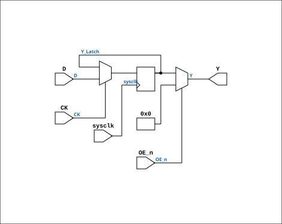

# AM29C821

Source: `Verilog/Shared/support/AM29C821.v`

<!-- Generated by Verilog/tests/module_doc.py from the //! comments in the source. Do not edit by hand - edit the RTL comments and regenerate. -->

<!-- HIERARCHY-NAV:BEGIN - written by Verilog/tests/gen_hierarchy.py, do not edit -->

**Where it sits** (Simulation): [ND120_TOP](../../../doc/ND120_TOP.md) > [ND120_CORE](../../../doc/ND120_CORE.md) > [ND3202D](../../../CPU-BOARD-3202/circuit/doc/ND3202D.md) > [MEM_43](../../../CPU-BOARD-3202/circuit/doc/MEM_43.md) > [MEM_ADDR_44](../../../CPU-BOARD-3202/circuit/doc/MEM_ADDR_44.md) > **AM29C821**
- instance path: `CORE.CPU_BOARD.MEM.ADDR.CHIP_3H_ROW_ADDRESS`

**Used in:** [BIF_BCTL_SYNC_8](../../../CPU-BOARD-3202/circuit/doc/BIF_BCTL_SYNC_8.md) (all tops), [IO_UART_42](../../../CPU-BOARD-3202/circuit/doc/IO_UART_42.md) (all tops), [MEM_ADDR_44](../../../CPU-BOARD-3202/circuit/doc/MEM_ADDR_44.md) (all tops), [MEM_LBDIF_48](../../../CPU-BOARD-3202/circuit/doc/MEM_LBDIF_48.md) (all tops)

**Contains:** no other modules.

[Module hierarchy](../../../HIERARCHY.md) - [All modules](../../../MODULES.md)

<!-- HIERARCHY-NAV:END -->


<!-- SCHEMATIC:BEGIN - written by Verilog/tests/gen_schematics.py, do not edit -->

## Schematic

Drawn from the Verilog: the yosys netlist of the Simulation (Verilator) build, instance `CORE.CPU_BOARD.IO.UART.CHIP_33G`. Sub-modules are boxes (click the picture to open it full size; there every sub-module box links to its page, and every wire shows its Verilog name).

[](AM29C821.svg)

<!-- SCHEMATIC:END -->

## Description

ND120 CPU
AM29C821
Bus Driver 10 bits.
Positive edge-triggered registers with D-type flip-flops and 3-state
Documentation:
https://www.digikey.com/en/products/detail/rochester-electronics-llc/AM29C821-BLA/12095382
Last reviewed: 11-NOV-2024
Ronny Hansen

## Ports

| Direction | Width | Name | Description |
|---|---|---|---|
| input | `1` | `sysclk` | FPGA system clock (used only when USE_SYSCLK=1) |
| input | `1` | `CK` | Clock input (original: posedge latch) |
| input | `1` | `OE_n` *(active low)* | Output Enable (active low) |
| input | `[9:0]` | `D` | 10 Bit Data Inputs |
| output | `[9:0]` | `Y` | 10 Bit Data Outputs |

## Verilog source

[`Verilog/Shared/support/AM29C821.v`](https://github.com/RetroCoreLabs/nd-120/blob/main/Verilog/Shared/support/AM29C821.v) on GitHub.

<details markdown="1">
<summary>Show the Verilog of AM29C821 (62 lines)</summary>

```verilog
/**************************************************************************************************
** ND120 CPU                                                                                     **
**                                                                                               **
** AM29C821                                                                                      **
**                                                                                               **
** Bus Driver 10 bits.                                                                           **
** Positive edge-triggered registers with D-type flip-flops and 3-state                          **
**                                                                                               **
** Documentation:                                                                                **
** https://www.digikey.com/en/products/detail/rochester-electronics-llc/AM29C821-BLA/12095382    **
**                                                                                               **
** Last reviewed: 11-NOV-2024                                                                    **
** Ronny Hansen                                                                                  **
***************************************************************************************************/

module AM29C821 (
    input  wire       sysclk, //! FPGA system clock (used only when USE_SYSCLK=1)
    input  wire       CK,     //! Clock input (original: posedge latch)
    input  wire       OE_n,   //! Output Enable (active low)
    input  wire [9:0] D,      //! 10 Bit Data Inputs
    output wire [9:0] Y       //! 10 Bit Data Outputs
);

  // USE_SYSCLK=0 (default): original posedge CK — correct for real clock
  //   signals like s_osc.
  // USE_SYSCLK=1: level-sensitive sysclk capture — ONLY correct when CK is a
  //   1-sysclk-wide pulse (e.g., s_clk = ~TERM_n). With a multi-cycle CK the
  //   register keeps re-capturing D every sysclk while CK is high — NOT
  //   edge-triggered semantics. (This is what broke the memory write path
  //   when used for the BCGNT50 address latches: LBD had moved on from the
  //   address to the write data by the end of the grant window.)
  // USE_SYSCLK=2: sysclk-sampled RISING-EDGE capture — the FPGA-safe
  //   replacement for posedge-CK when CK is a multi-cycle control signal
  //   (e.g., BCGNT50): captures D exactly once per CK rise, no clock net.
  parameter USE_SYSCLK = 0;

  reg [9:0] Y_Latch = 10'b0;

  generate
    if (USE_SYSCLK == 1) begin : gen_sysclk
      always @(posedge sysclk) begin
        if (CK) Y_Latch <= D;
      end
    end else if (USE_SYSCLK == 2) begin : gen_sysclk_edge
      reg ck_d = 1'b0;
      always @(posedge sysclk) begin
        ck_d <= CK;
        if (CK && !ck_d) Y_Latch <= D;
      end
    end else begin : gen_posedge_ck
      always @(posedge CK) begin
        Y_Latch <= D;
      end
    end
  endgenerate

  // Output control
  // When OE_n is low (active), outputs reflect the registered data
  // When OE_n is high, outputs are zero (tri-state equivalent)
  assign Y = (OE_n == 1'b0) ? Y_Latch : 10'b0;

endmodule
```

</details>
