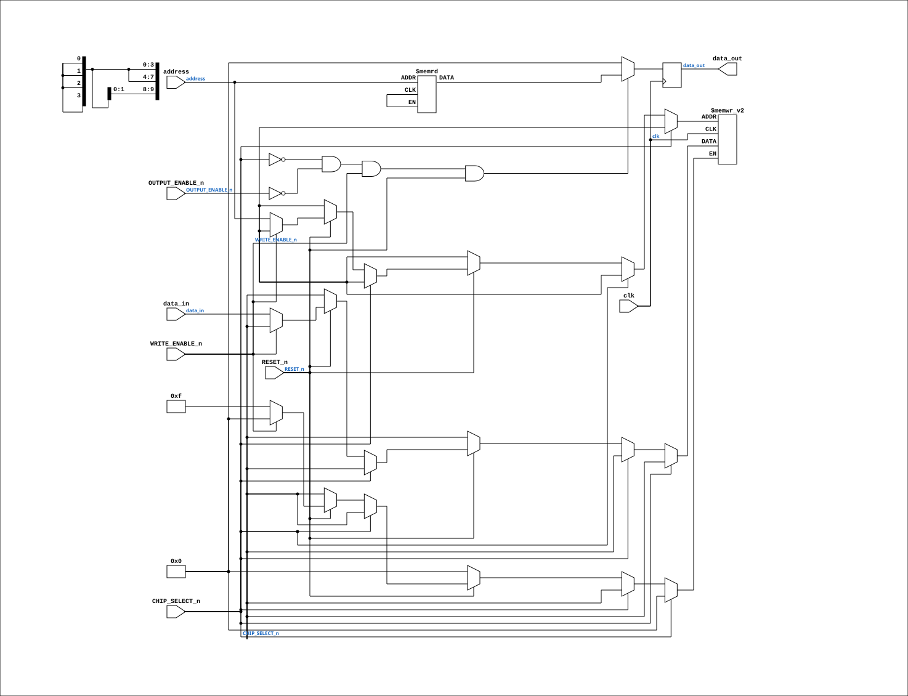

# Am9150_w_clock

Source: `Verilog/Shared/support/Am9150_with_clk.v`

<!-- Generated by Verilog/tests/module_doc.py from the //! comments in the source. Do not edit by hand - edit the RTL comments and regenerate. -->

<!-- HIERARCHY-NAV:BEGIN - written by Verilog/tests/gen_hierarchy.py, do not edit -->

**Hierarchy:** not instantiated by any of the 9 build tops (elaborated by yosys).

[Module hierarchy](../../../HIERARCHY.md) - [All modules](../../../MODULES.md)

<!-- HIERARCHY-NAV:END -->


<!-- SCHEMATIC:BEGIN - written by Verilog/tests/gen_schematics.py, do not edit -->

## Schematic

Drawn from the Verilog: no build top uses this module, so it was elaborated from its own file with no defines and default parameters. Sub-modules are boxes (click the picture to open it full size; there every sub-module box links to its page, and every wire shows its Verilog name).

[](Am9150_w_clock.svg)

<!-- SCHEMATIC:END -->

## Description

Am9150 1024x4 High-Speed Static R/W RAM
DISTINCTIVE CHARACTERISTICS
• 1024 x 4 organization
• High speed - 20 ns Max. access time
• Separate data inputs and outputs
• Memory reset function
• High density SLIM 24-pin 300-MIL package
• Three-state output buffers
• Single + 5 V power supply ± 10%
• Low-power version
GENERAL DESCRIPTION
The Am9150 is a high-performance, static, n-channel, read/write, random-access memory organized as 1024 x 4.
It features single 5 V supply operation, TTL-compatible input and output levels, and separate input and output pins for improved system performance and ease of use.
The Am9150 also incorporates a reset feature which will reset the entire contents of the memory to logical LOW in two cycle times by controlling /R (RESET) and /S (CS).
The Am9150 has four control signals /R, /S, /W and /G.
The /S input controls read, write and reset operations of the device and provides for easy selection of an individual device when the outputs are tied together.
The /W (/WE) input controls the normal read and write operations, and the /G (/OE) controls the state of the outputs.
http://www.sintran.com/library/libother/extern/AM9150.pdf

## Ports

| Direction | Width | Name | Description |
|---|---|---|---|
| input | `1` | `clk` | Clock input (not part of the original Am9150, but useful for simulation) |
| input | `[9:0]` | `address` | 10-bit address for 1024 locations |
| input | `[3:0]` | `data_in` | 4-bit data input (D0-D3) |
| output | `[3:0]` | `data_out` | 4-bit data output (Q0-Q3) |
| input | `1` | `WRITE_ENABLE_n` *(active low)* | Write Enable (active low) |
| input | `1` | `CHIP_SELECT_n` *(active low)* | Chip Select (active low) |
| input | `1` | `OUTPUT_ENABLE_n` *(active low)* | Output Enable (active low) |
| input | `1` | `RESET_n` *(active low)* | Reset (active low) |

## Verilog source

[`Verilog/Shared/support/Am9150_with_clk.v`](https://github.com/RetroCoreLabs/nd-120/blob/main/Verilog/Shared/support/Am9150_with_clk.v) on GitHub.

<details markdown="1">
<summary>Show the Verilog of Am9150_w_clock (71 lines)</summary>

```verilog
/*
Am9150 1024x4 High-Speed Static R/W RAM 

DISTINCTIVE CHARACTERISTICS
• 1024 x 4 organization 
• High speed - 20 ns Max. access time 
• Separate data inputs and outputs 
• Memory reset function 
• High density SLIM 24-pin 300-MIL package 
• Three-state output buffers 
• Single + 5 V power supply ± 10% 
• Low-power version 

GENERAL DESCRIPTION

The Am9150 is a high-performance, static, n-channel, read/write, random-access memory organized as 1024 x 4. 
It features single 5 V supply operation, TTL-compatible input and output levels, and separate input and output pins for improved system performance and ease of use. 

The Am9150 also incorporates a reset feature which will reset the entire contents of the memory to logical LOW in two cycle times by controlling /R (RESET) and /S (CS). 
The Am9150 has four control signals /R, /S, /W and /G. 
The /S input controls read, write and reset operations of the device and provides for easy selection of an individual device when the outputs are tied together. 
The /W (/WE) input controls the normal read and write operations, and the /G (/OE) controls the state of the outputs. 

http://www.sintran.com/library/libother/extern/AM9150.pdf

*/
module Am9150_w_clock (
    input wire clk,                 // Clock input (not part of the original Am9150, but useful for simulation)
    input wire [9:0] address,       // 10-bit address for 1024 locations
    input wire [3:0] data_in,       // 4-bit data input (D0-D3)
    output reg [3:0] data_out,      // 4-bit data output (Q0-Q3)
    input wire WRITE_ENABLE_n,      // Write Enable (active low)
    input wire CHIP_SELECT_n,       // Chip Select (active low)
    input wire OUTPUT_ENABLE_n,     // Output Enable (active low)
    input wire RESET_n              // Reset (active low)
);
    //integer i;

    // Memory array
    (* ROM_STYLE="BLOCK" *)
    reg [3:0] amc_memory_array [1023:0];

    // Read, write and reset operations
    always @(posedge clk) begin

        if (!CHIP_SELECT_n) begin
            if (!RESET_n) begin
                // Reset operation: set all memory locations to 0                
                // Doesnt work with block-ram.. 
                // TODO: Need to find a way to reset the block-ram
                //for (i = 0; i < 1024; i = i + 1) begin
                //    memory_array[i] <= 4'b0000;
                //end
            end else if (!WRITE_ENABLE_n) begin
                // Write operation: active when chip is selected and write enable is low
                amc_memory_array[address] <= data_in;
            end
        end
    end

    // Output data
    always @(posedge clk) begin
        if (!CHIP_SELECT_n && !OUTPUT_ENABLE_n && WRITE_ENABLE_n && RESET_n) begin
            // Read operation: active when chip is selected and output enable is low
            data_out <= amc_memory_array[address];
        end else begin
            data_out <= 4'b0; // High-impedance state when not reading
        end
    end

endmodule
```

</details>
