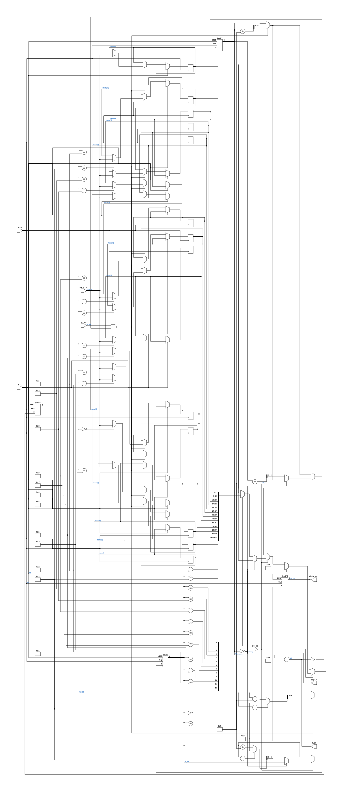

# FIFO_8BIT

Source: `Verilog/Shared/support/FIFO_8BIT.v`

<!-- Generated by Verilog/tests/module_doc.py from the //! comments in the source. Do not edit by hand - edit the RTL comments and regenerate. -->

<!-- HIERARCHY-NAV:BEGIN - written by Verilog/tests/gen_hierarchy.py, do not edit -->

**Where it sits** (Simulation): [ND120_TOP](../../../doc/ND120_TOP.md) > [ND120_CORE](../../../doc/ND120_CORE.md) > [ND3202D](../../../CPU-BOARD-3202/circuit/doc/ND3202D.md) > [IO_37](../../../CPU-BOARD-3202/circuit/doc/IO_37.md) > [IO_DCD_38](../../../CPU-BOARD-3202/circuit/doc/IO_DCD_38.md) > [DECODE_DGA](../../../DECODE-GateArray/DGA/circuit/doc/DECODE_DGA.md) > **FIFO_8BIT**
- instance path: `CORE.CPU_BOARD.IO.DCD.DGA.fifo_inst`

**Used in:** [DECODE_DGA](../../../DECODE-GateArray/DGA/circuit/doc/DECODE_DGA.md) (all tops)

**Contains:** no other modules.

[Module hierarchy](../../../HIERARCHY.md) - [All modules](../../../MODULES.md)

<!-- HIERARCHY-NAV:END -->


<!-- SCHEMATIC:BEGIN - written by Verilog/tests/gen_schematics.py, do not edit -->

## Schematic

Drawn from the Verilog: the yosys netlist of the Simulation (Verilator) build, instance `CORE.CPU_BOARD.IO.DCD.DGA.fifo_inst`. Sub-modules are boxes (click the picture to open it full size; there every sub-module box links to its page, and every wire shows its Verilog name).

[](FIFO_8BIT.svg)

<!-- SCHEMATIC:END -->

## Description

FIFO 8 bit
Last reviewed: 11-NOV-2024
Ronny Hansen

## Parameters

| Parameter | Default |
|---|---|
| `DEPTH` | `13  // Depth of the FIFO (maximum 16` |

## Ports

| Direction | Width | Name | Description |
|---|---|---|---|
| input | `1` | `clk` | Clock |
| input | `1` | `rst` | Asynchronous reset |
| input | `1` | `wr_en` | Write enable |
| input | `1` | `rd_en` | Read enable |
| input | `[7:0]` | `data_in` | Data input |
| output | `[7:0]` | `data_out` | Data output |
| output | `1` | `full` | FIFO full flag |
| output | `1` | `empty` | FIFO empty flag |

## Verilog source

[`Verilog/Shared/support/FIFO_8BIT.v`](https://github.com/RetroCoreLabs/nd-120/blob/main/Verilog/Shared/support/FIFO_8BIT.v) on GitHub.

<details markdown="1">
<summary>Show the Verilog of FIFO_8BIT (69 lines)</summary>

```verilog
/**************************************************************************
** FIFO 8 bit                                                            **
**                                                                       **
**                                                                       **
** Last reviewed: 11-NOV-2024                                            **
** Ronny Hansen                                                          **
***************************************************************************/

// Turn of warning/error for mixed block and none-blocking assignments as its valid verilog
// verilator lint_off BLKANDNBLK
// https://verilator.org/guide/latest/warnings.html#cmdoption-arg-BLKANDNBLK

module FIFO_8BIT #(
    parameter integer DEPTH = 13  // Depth of the FIFO (maximum 16, default 13)
) (
    input            clk,       // Clock
    input            rst,       // Asynchronous reset
    input            wr_en,     // Write enable
    input            rd_en,     // Read enable
    input      [7:0] data_in,   // Data input
    output reg [7:0] data_out,  // Data output
    output           full,      // FIFO full flag
    output           empty      // FIFO empty flag
);

  /* verilator lint_off LATCH */
  /* verilator lint_off BLKSEQ */
  /* verilator lint_off UNOPTFLAT */

  // Calculate address width based on depth
  localparam integer AddressWidth = $clog2(DEPTH + 1);

  reg [7:0] mem[DEPTH-1:0];  // Memory array
  reg [AddressWidth-1:0] wr_ptr;  // Write pointer
  reg [AddressWidth-1:0] rd_ptr;  // Read pointer
  reg [AddressWidth:0] fifo_count;  // Counter for number of elements in the FIFO

  always @(posedge clk or posedge rst) begin
    //always @(posedge rd_en or posedge wr_en or posedge rst) begin
    if (rst) begin
      wr_ptr <= 0;
      rd_ptr <= 0;
      data_out <= 8'b0;
      fifo_count <= 0;
    end else begin

      if (wr_en && !full) begin
        mem[wr_ptr] <= data_in;
        wr_ptr <= (wr_ptr == (DEPTH - 1)) ? 0 : wr_ptr + 1;
        fifo_count <= fifo_count + 1;
      end

      if (rd_en) begin
        if (!empty) begin
          data_out <= mem[rd_ptr];
          rd_ptr <= (rd_ptr == (DEPTH - 1)) ? 0 : rd_ptr + 1;
          fifo_count <= fifo_count - 1;
        end else begin
          data_out <= 8'b0;
        end
      end

    end
  end

  assign full  = (fifo_count == DEPTH);
  assign empty = (fifo_count == 0);

endmodule
```

</details>
