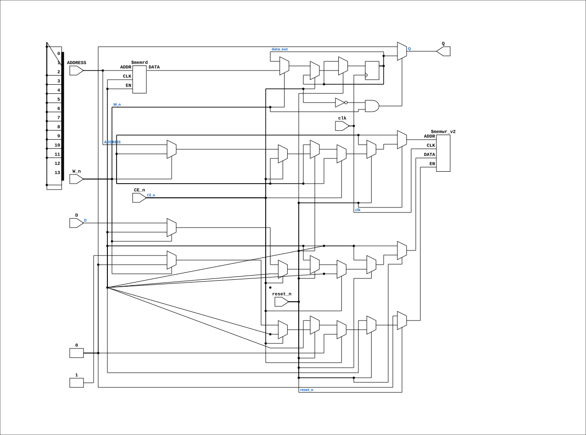

# IMS1403_25

Source: `Verilog/Shared/support/IMS1403_25.v`

<!-- Generated by Verilog/tests/module_doc.py from the //! comments in the source. Do not edit by hand - edit the RTL comments and regenerate. -->

<!-- HIERARCHY-NAV:BEGIN - written by Verilog/tests/gen_hierarchy.py, do not edit -->

**Where it sits** (Simulation): [ND120_TOP](../../../doc/ND120_TOP.md) > [ND120_CORE](../../../doc/ND120_CORE.md) > [ND3202D](../../../CPU-BOARD-3202/circuit/doc/ND3202D.md) > [CPU_15](../../../CPU-BOARD-3202/circuit/doc/CPU_15.md) > [CPU_MMU_24](../../../CPU-BOARD-3202/circuit/doc/CPU_MMU_24.md) > [CPU_MMU_PT_29](../../../CPU-BOARD-3202/circuit/doc/CPU_MMU_PT_29.md) > **IMS1403_25**
- instance path: `CORE.CPU_BOARD.CPU.MMU.PT.CHIP_20G`

**Used in:** [CPU_MMU_PT_29](../../../CPU-BOARD-3202/circuit/doc/CPU_MMU_PT_29.md) (all tops)

**Contains:** no other modules.

[Module hierarchy](../../../HIERARCHY.md) - [All modules](../../../MODULES.md)

<!-- HIERARCHY-NAV:END -->


<!-- SCHEMATIC:BEGIN - written by Verilog/tests/gen_schematics.py, do not edit -->

## Schematic

Drawn from the Verilog: the yosys netlist of the Simulation (Verilator) build, instance `CORE.CPU_BOARD.CPU.MMU.PT.CHIP_20G`. Sub-modules are boxes (click the picture to open it full size; there every sub-module box links to its page, and every wire shows its Verilog name).

[](IMS1403_25.svg)

<!-- SCHEMATIC:END -->

## Description

ND120 Shared
Component : IMS1403_25
16K x 1 Static RAM
Last reviewed: 9-FEB-2025
Ronny Hansen

## Ports

| Direction | Width | Name | Description |
|---|---|---|---|
| input | `1` | `clk` | Clock input (needed for BLOCK RAM) |
| input | `1` | `reset_n` *(active low)* | FPGA Reset input (active low) |
| input | `[13:0]` | `ADDRESS` | 14 bits address |
| input | `1` | `CE_n` *(active low)* |  |
| input | `1` | `D` |  |
| input | `1` | `W_n` *(active low)* |  |
| output | `1` | `Q` |  |

## Verilog source

[`Verilog/Shared/support/IMS1403_25.v`](https://github.com/RetroCoreLabs/nd-120/blob/main/Verilog/Shared/support/IMS1403_25.v) on GitHub.

<details markdown="1">
<summary>Show the Verilog of IMS1403_25 (70 lines)</summary>

```verilog

/**************************************************************************
** ND120 Shared                                                          **
**                                                                       **
** Component : IMS1403_25                                                **
** 16K x 1 Static RAM                                                    **
**                                                                       **
** Last reviewed: 9-FEB-2025                                             **
** Ronny Hansen                                                          **
***************************************************************************/

module IMS1403_25 (
    input wire    clk, // Clock input (needed for BLOCK RAM)
    input wire    reset_n, // FPGA Reset input (active low)

    input  [13:0] ADDRESS,  // 14 bits address
    input         CE_n,
    input         D,
    input         W_n,
    output        Q
);


  //integer i;

  /*******************************************************************************
   ** Signals                                                                    **
   *******************************************************************************/
  reg  data_out;    // Output data register
  wire data_in;     // Input data from the bus

  assign data_in = D;  // Connect input data

  assign Q  = (!CE_n && W_n) ? data_out : 1'b0;  //Q is high impedance when W_n (write) is active and when chip is not selected


  // Define the memory array


  /*******************************************************************************
   ** Memory array using block RAM                                               **
   *******************************************************************************/
  (* ram_style = "block" *) reg ims_memory_array[0:16383];


  always @(posedge clk) begin

    if (!reset_n) begin
      /* verilator lint_off BLKANDNBLK */
      /* verilator lint_off BLKSEQ */

      //TODO: Find a reset method that VIVADO likes
      // Reset operation: set all memory locations to 0
      //for (i = 0; i < 16383; i = i + 1) begin
      ///  memory_array[i] = 1'b0; // none delayed initialisation
      //end
      /* verilator lint_on BLKSEQ */
    end else begin
      if (!CE_n) begin
        if (!W_n) begin
          ims_memory_array[ADDRESS] <= data_in;  // Write operation
        end else begin
          data_out <= ims_memory_array[ADDRESS];  // Read operation
        end
      end
    end
  end

endmodule
```

</details>
