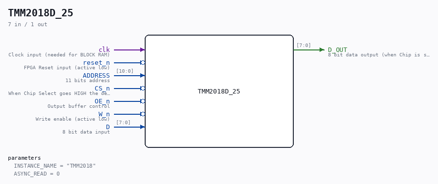
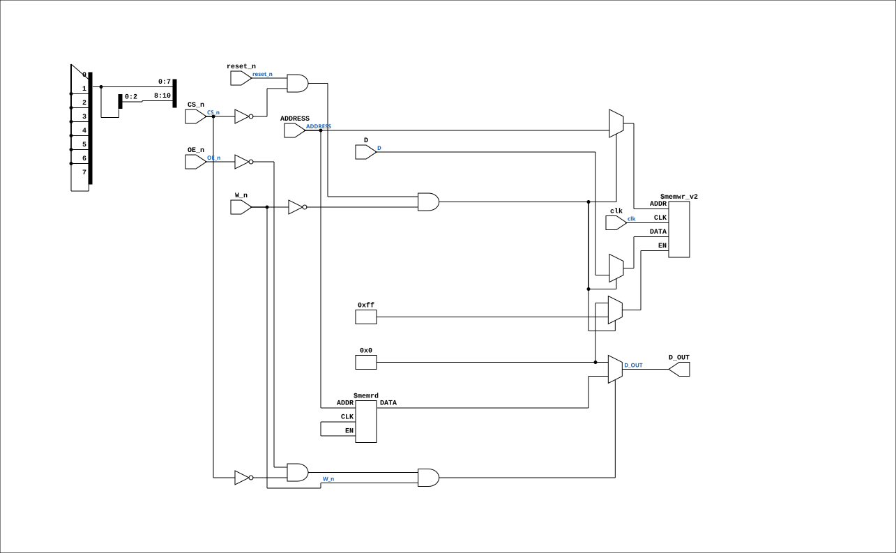

# TMM2018D_25

Source: `Verilog/Shared/support/TMM2018D_25.v`

<!-- Generated by Verilog/tests/module_doc.py from the //! comments in the source. Do not edit by hand - edit the RTL comments and regenerate. -->

<!-- HIERARCHY-NAV:BEGIN - written by Verilog/tests/gen_hierarchy.py, do not edit -->

**Where it sits** (Simulation): [ND120_TOP](../../../doc/ND120_TOP.md) > [ND120_CORE](../../../doc/ND120_CORE.md) > [ND3202D](../../../CPU-BOARD-3202/circuit/doc/ND3202D.md) > [CPU_15](../../../CPU-BOARD-3202/circuit/doc/CPU_15.md) > [CPU_MMU_24](../../../CPU-BOARD-3202/circuit/doc/CPU_MMU_24.md) > [CPU_MMU_PT_29](../../../CPU-BOARD-3202/circuit/doc/CPU_MMU_PT_29.md) > **TMM2018D_25**
- instance path: `CORE.CPU_BOARD.CPU.MMU.PT.CHIP_23G`

**Used in:** [CPU_MMU_CACHE_25](../../../CPU-BOARD-3202/circuit/doc/CPU_MMU_CACHE_25.md) (Simulation, Nexys, MEGA65 R6, MEGA65 R3, QMTECH, Basys3, Cmod), [CPU_MMU_PT_29](../../../CPU-BOARD-3202/circuit/doc/CPU_MMU_PT_29.md) (all tops)

**Contains:** no other modules.

[Module hierarchy](../../../HIERARCHY.md) - [All modules](../../../MODULES.md)

<!-- HIERARCHY-NAV:END -->



<!-- SCHEMATIC:BEGIN - written by Verilog/tests/gen_schematics.py, do not edit -->

## Schematic

Drawn from the Verilog: the yosys netlist of the Simulation (Verilator) build, instance `CORE.CPU_BOARD.CPU.MMU.CACHE.CHIP_23F`. Sub-modules are boxes (click the picture to open it full size; there every sub-module box links to its page, and every wire shows its Verilog name).

[](TMM2018D_25.svg)

<!-- SCHEMATIC:END -->

## Description

ND120 Shared
TMM2018D_25 | 16K bit Static RAM (Used by Cache and Page Tables)
PDF doc: https://www.alldatasheet.com/datasheet-pdf/view/113475/TOSHIBA/TMM2018AP.html
Last reviewed: 26-JANUARY-2025
Ronny Hansen

## Parameters

| Parameter | Default |
|---|---|
| `INSTANCE_NAME` | `"TMM2018"` |
| `ASYNC_READ` | `0` |

## Ports

| Direction | Width | Name | Description |
|---|---|---|---|
| input | `1` | `clk` | Clock input (needed for BLOCK RAM) |
| input | `1` | `reset_n` *(active low)* | FPGA Reset input (active low) |
| input | `[10:0]` | `ADDRESS` | 11 bits address |
| input | `1` | `CS_n` *(active low)* | When Chip Select goes HIGH the device is deselected is placed in low-power mode |
| input | `1` | `OE_n` *(active low)* | Output buffer control |
| input | `1` | `W_n` *(active low)* | Write enable (active low) |
| input | `[7:0]` | `D` | 8 bit data input |
| output | `[7:0]` | `D_OUT` | 8 bit data output (when Chip is selected, no write, and output is enabled) |

## Verilog source

[`Verilog/Shared/support/TMM2018D_25.v`](https://github.com/RetroCoreLabs/nd-120/blob/main/Verilog/Shared/support/TMM2018D_25.v) on GitHub.

<details markdown="1">
<summary>Show the Verilog of TMM2018D_25 (104 lines)</summary>

```verilog
/********************************************************************************************
** ND120 Shared                                                                            **
**                                                                                         **
**                                                                                         **
**  TMM2018D_25 | 16K bit Static RAM (Used by Cache and Page Tables)                       **
**                                                                                         **
** PDF doc: https://www.alldatasheet.com/datasheet-pdf/view/113475/TOSHIBA/TMM2018AP.html  **
**                                                                                         **
** Last reviewed: 26-JANUARY-2025                                                          **
** Ronny Hansen                                                                            **
*********************************************************************************************/


module TMM2018D_25 #(
    parameter INSTANCE_NAME = "TMM2018",
    //! 1 = read the array COMBINATIONALLY, as the real 25 ns SRAM does. The
    //! FPGA then builds it from distributed (LUT) RAM instead of block RAM:
    //! 2K x 8 = 16 kbit per chip. Set on the four CACHE chips (sheet 25)
    //! since 29-AUG-2026: with the block-RAM read the tag came out one sysclk
    //! after CA changed, so HIT was decided a cycle-controller state too late
    //! - late for the 75/100 ns hit-terminate terms of PAL 44601 but in time
    //! to cancel the memory request at state d - and CACHE-1X0-A00 test 2
    //! ended in an illegal-instruction trap (docs/CACHE-STATUS.md). With the
    //! async read that trap is gone, in Verilator. The page-table chips on
    //! sheet 29 keep the block-RAM read (0). The old global -DTMM_ASYNC_READ
    //! still forces async on every instance, for the testbenches that use it.
    parameter integer ASYNC_READ = 0
) (
    // Input signals
    input wire    clk, // Clock input (needed for BLOCK RAM)
    input wire    reset_n, // FPGA Reset input (active low)

    input wire [10:0] ADDRESS,  // 11 bits address
    input  wire        CS_n,     // When Chip Select goes HIGH the device is deselected is placed in low-power mode
    input wire OE_n,  // Output buffer control
    input wire W_n,  // Write enable (active low)
    input wire [7:0] D,  // 8 bit data input

    // Output signal
    output wire [ 7:0] D_OUT    // 8 bit data output (when Chip is selected, no write, and output is enabled)
);

  /*******************************************************************************
   ** Memory array                                                               **
   *******************************************************************************/
`ifdef TMM_ASYNC_READ
  localparam integer USE_ASYNC = 1;
`else
  localparam integer USE_ASYNC = ASYNC_READ;
`endif

  // Two self-contained implementations. Block RAM cannot be read
  // asynchronously, so the ASYNC_READ one is distributed (LUT) RAM; the
  // block-RAM one keeps the registered read the FPGA has always used.
  // No reset of the contents: block RAM does not support it, and the real
  // chip powers up random.
  generate
    if (USE_ASYNC) begin : g_async
      // ASYNC (parameter ASYNC_READ=1, or the global -DTMM_ASYNC_READ): the
      // real TMM2018D is a 25 ns SRAM - data follows the address
      // combinationally. The sync-read model serves data one clock stale when
      // the address changes just before the consuming edge (PT translation /
      // trap-handler PT read-modify-write - Issue D, PAGING test 3; and the
      // cache HIT, see the parameter comment).
      //! TWO attributes on purpose. `ram_style` is VIVADO's spelling;
      //! `ramstyle` is QUARTUS's, and Quartus does not recognise the Vivado
      //! one - it says so out loud ("Warning (10335): Unrecognized synthesis
      //! attribute ram_style"), then falls back to building the array out of
      //! FLIP-FLOPS. Measured on MiSTer 31-AUG-2026: with the four cache
      //! chips built that way the design wanted 44,114 ALMs against the
      //! device's 41,910 and the cache had to be compiled out. 4 x 2048 x 8 =
      //! 65,536 bits as registers is the whole overflow on its own. Each tool
      //! ignores the attribute it does not know, so both can be stated.
      (* ram_style = "distributed", ramstyle = "MLAB" *)
      reg [7:0] tmm_memory_array[0:2047];
      always @(posedge clk) begin
        if (reset_n && !CS_n && !W_n) begin
          tmm_memory_array[ADDRESS] <= D;   // write: chip selected, write enable low
        end
      end
      assign D_OUT = (!OE_n & !CS_n & W_n) ? tmm_memory_array[ADDRESS] : 8'b0; // <== ASYNC read
    end else begin : g_sync
      // Vivado spelling + Quartus spelling, see the async branch above.
      (* ram_style = "block", ramstyle = "M10K" *)
      reg [7:0] tmm_memory_array[0:2047];  // 2^11 addresses, each 8-bit wide = 2KB (or 16Kbit)
      reg [7:0] data_out_reg;
      always @(posedge clk) begin
        if (reset_n && !CS_n) begin
          if (!W_n) begin
            tmm_memory_array[ADDRESS] <= D;   // write: chip selected, write enable low
            //$display("%s WRITE Address %04h Value %2h", INSTANCE_NAME, ADDRESS, D);
          end else begin
            data_out_reg <= tmm_memory_array[ADDRESS];  // synchronous read, one clock late
          end
        end
      end
      // Output is enabled when OE_n and CS_n, but not during write
      assign D_OUT = (!OE_n & !CS_n & W_n) ? data_out_reg : 8'b0; //<== SYNC read
    end
  endgenerate

endmodule
```

</details>
