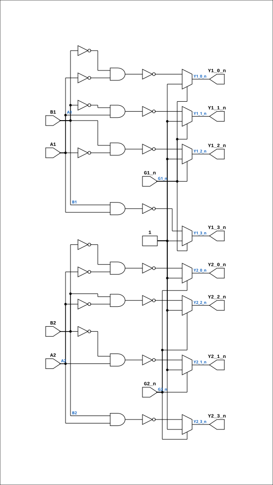

# TTL_74139

Source: `Verilog/Shared/support/TTL_74139.v`

<!-- Generated by Verilog/tests/module_doc.py from the //! comments in the source. Do not edit by hand - edit the RTL comments and regenerate. -->

<!-- HIERARCHY-NAV:BEGIN - written by Verilog/tests/gen_hierarchy.py, do not edit -->

**Where it sits** (Simulation): [ND120_TOP](../../../doc/ND120_TOP.md) > [ND120_CORE](../../../doc/ND120_CORE.md) > [ND3202D](../../../CPU-BOARD-3202/circuit/doc/ND3202D.md) > [CPU_15](../../../CPU-BOARD-3202/circuit/doc/CPU_15.md) > [CPU_CS_16](../../../CPU-BOARD-3202/circuit/doc/CPU_CS_16.md) > [CPU_CS_CTL_18](../../../CPU-BOARD-3202/circuit/doc/CPU_CS_CTL_18.md) > **TTL_74139**
- instance path: `CORE.CPU_BOARD.CPU.CS.CTL.CHIP_30B`

**Used in:** [CPU_CS_CTL_18](../../../CPU-BOARD-3202/circuit/doc/CPU_CS_CTL_18.md) (all tops)

**Contains:** no other modules.

[Module hierarchy](../../../HIERARCHY.md) - [All modules](../../../MODULES.md)

<!-- HIERARCHY-NAV:END -->


<!-- SCHEMATIC:BEGIN - written by Verilog/tests/gen_schematics.py, do not edit -->

## Schematic

Drawn from the Verilog: the yosys netlist of the Simulation (Verilator) build, instance `CORE.CPU_BOARD.CPU.CS.CTL.CHIP_30B`. Sub-modules are boxes (click the picture to open it full size; there every sub-module box links to its page, and every wire shows its Verilog name).

[](TTL_74139.svg)

<!-- SCHEMATIC:END -->

## Description

TTL 74139
DUAL 2-LINE to 4-LINE DECODERS/DEMULTIPLEXERS
https://www.ti.com/lit/ds/symlink/sn54ls139a-sp.pdf?ts=1702906423213

## Ports

| Direction | Width | Name | Description |
|---|---|---|---|
| input | `1` | `A1` | Decoder 1 inputs |
| input | `1` | `G1_n` *(active low)* | Decoder 1 enable, active low |
| output | `1` | `Y1_0_n` *(active low)* | Decoder 1 outputs, active low |
| output | `1` | `Y1_1_n` *(active low)* |  |
| output | `1` | `Y1_2_n` *(active low)* |  |
| output | `1` | `Y1_3_n` *(active low)* |  |
| input | `1` | `A2` | Decoder 2 inputs |
| input | `1` | `G2_n` *(active low)* | Decoder 2 enable, active low |
| output | `1` | `Y2_0_n` *(active low)* | Decoder 2 outputs, active low |
| output | `1` | `Y2_1_n` *(active low)* |  |
| output | `1` | `Y2_2_n` *(active low)* |  |
| output | `1` | `Y2_3_n` *(active low)* |  |

## Verilog source

[`Verilog/Shared/support/TTL_74139.v`](https://github.com/RetroCoreLabs/nd-120/blob/main/Verilog/Shared/support/TTL_74139.v) on GitHub.

<details markdown="1">
<summary>Show the Verilog of TTL_74139 (44 lines)</summary>

```verilog
/******************************************************************************
 ** TTL 74139                                                                **
 **                                                                          **
 ** DUAL 2-LINE to 4-LINE DECODERS/DEMULTIPLEXERS                            **
 ** https://www.ti.com/lit/ds/symlink/sn54ls139a-sp.pdf?ts=1702906423213     **
 **                                                                          **
 *****************************************************************************/

module TTL_74139(
    input A1, B1,     // Decoder 1 inputs
    input G1_n,       // Decoder 1 enable, active low
    output Y1_0_n,    // Decoder 1 outputs, active low
    output Y1_1_n,
    output Y1_2_n,
    output Y1_3_n,
    input A2, B2,     // Decoder 2 inputs
    input G2_n,       // Decoder 2 enable, active low
    output Y2_0_n,    // Decoder 2 outputs, active low
    output Y2_1_n,
    output Y2_2_n,
    output Y2_3_n
);
   // DECODER 1

    // Check the enable signal and set outputs
    // When G_n is low, one output goes low based on the combination of B and A
    // When G_n is high, all outputs are high
    assign Y1_0_n = G1_n ? 1'b1 : ~((~B1) & (~A1));  // Y[0] is low when B=0, A=0
    assign Y1_1_n = G1_n ? 1'b1 : ~((~B1) & A1);     // Y[1] is low when B=0, A=1
    assign Y1_2_n = G1_n ? 1'b1 : ~(B1 & (~A1));     // Y[2] is low when B=1, A=0
    assign Y1_3_n = G1_n ? 1'b1 : ~(B1 & A1);        // Y[3] is low when B=1, A=1

   // DECODER 2   

    // Check the enable signal and set outputs
    // When G_n is low, one output goes low based on the combination of B and A
    // When G_n is high, all outputs are high
    assign Y2_0_n = G2_n ? 1'b1 : ~((~B2) & (~A2));  // Y[0] is low when B=0, A=0
    assign Y2_1_n = G2_n ? 1'b1 : ~((~B2) & A2);     // Y[1] is low when B=0, A=1
    assign Y2_2_n = G2_n ? 1'b1 : ~(B2 & (~A2));     // Y[2] is low when B=1, A=0
    assign Y2_3_n = G2_n ? 1'b1 : ~(B2 & A2);        // Y[3] is low when B=1, A=1


endmodule
```

</details>
