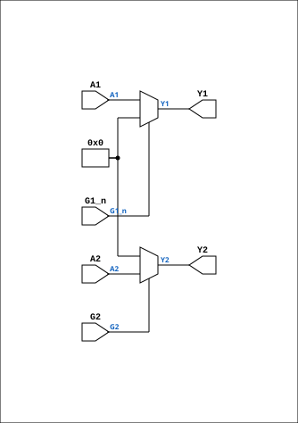

# TTL_74241

Source: `Verilog/Shared/support/TTL_74241.v`

<!-- Generated by Verilog/tests/module_doc.py from the //! comments in the source. Do not edit by hand - edit the RTL comments and regenerate. -->

<!-- HIERARCHY-NAV:BEGIN - written by Verilog/tests/gen_hierarchy.py, do not edit -->

**Hierarchy:** not instantiated by any of the 9 build tops (elaborated by yosys).

[Module hierarchy](../../../HIERARCHY.md) - [All modules](../../../MODULES.md)

<!-- HIERARCHY-NAV:END -->


<!-- SCHEMATIC:BEGIN - written by Verilog/tests/gen_schematics.py, do not edit -->

## Schematic

Drawn from the Verilog: no build top uses this module, so it was elaborated from its own file with no defines and default parameters. Sub-modules are boxes (click the picture to open it full size; there every sub-module box links to its page, and every wire shows its Verilog name).

[](TTL_74241.svg)

<!-- SCHEMATIC:END -->

## Description

Component : TTL_74241
buffers with TTL-compatible CMOS inputs and 3-state outputs
https://www.ti.com/product/SN74ABT241A

## Ports

| Direction | Width | Name | Description |
|---|---|---|---|
| input | `[3:0]` | `A1` |  |
| output | `[3:0]` | `Y1` |  |
| input | `1` | `G1_n` *(active low)* |  |
| input | `[3:0]` | `A2` |  |
| output | `[3:0]` | `Y2` |  |
| input | `1` | `G2` |  |

## Verilog source

[`Verilog/Shared/support/TTL_74241.v`](https://github.com/RetroCoreLabs/nd-120/blob/main/Verilog/Shared/support/TTL_74241.v) on GitHub.

<details markdown="1">
<summary>Show the Verilog of TTL_74241 (22 lines)</summary>

```verilog
/******************************************************************************
 ** Component : TTL_74241                                                    **
 ** buffers with TTL-compatible CMOS inputs and 3-state outputs              **
 ** https://www.ti.com/product/SN74ABT241A                                   **
 *****************************************************************************/

module TTL_74241
(  
   input  [3:0] A1,
   output [3:0] Y1,
   input        G1_n,


   input  [3:0] A2,
   output [3:0] Y2,
   input        G2
);
 
   assign Y1[3:0] = G1_n ? 4'b0     : A1[3:0];
   assign Y2[3:0] = G2   ? A2[3:0]  : 4'b0;

endmodule
```

</details>
