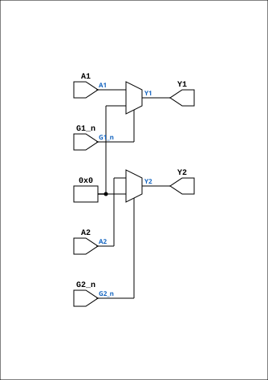

# TTL_74244

Source: `Verilog/Shared/support/TTL_74244.v`

<!-- Generated by Verilog/tests/module_doc.py from the //! comments in the source. Do not edit by hand - edit the RTL comments and regenerate. -->

<!-- HIERARCHY-NAV:BEGIN - written by Verilog/tests/gen_hierarchy.py, do not edit -->

**Where it sits** (Simulation): [ND120_TOP](../../../doc/ND120_TOP.md) > [ND120_CORE](../../../doc/ND120_CORE.md) > [ND3202D](../../../CPU-BOARD-3202/circuit/doc/ND3202D.md) > [IO_37](../../../CPU-BOARD-3202/circuit/doc/IO_37.md) > [IO_REG_41](../../../CPU-BOARD-3202/circuit/doc/IO_REG_41.md) > **TTL_74244**
- instance path: `CORE.CPU_BOARD.IO.REG_MODULE.CHIP_27A_STRAP`

**Used in:** [IO_PANCAL_40](../../../CPU-BOARD-3202/circuit/doc/IO_PANCAL_40.md) (all tops), [IO_REG_41](../../../CPU-BOARD-3202/circuit/doc/IO_REG_41.md) (all tops)

**Contains:** no other modules.

[Module hierarchy](../../../HIERARCHY.md) - [All modules](../../../MODULES.md)

<!-- HIERARCHY-NAV:END -->


<!-- SCHEMATIC:BEGIN - written by Verilog/tests/gen_schematics.py, do not edit -->

## Schematic

Drawn from the Verilog: the yosys netlist of the Simulation (Verilator) build, instance `CORE.CPU_BOARD.IO.REG_MODULE.CHIP_27A_STRAP`. Sub-modules are boxes (click the picture to open it full size; there every sub-module box links to its page, and every wire shows its Verilog name).

[](TTL_74244.svg)

<!-- SCHEMATIC:END -->

## Ports

| Direction | Width | Name | Description |
|---|---|---|---|
| input | `[3:0]` | `A1` | Data inputs (1A1-1A4) |
| input | `1` | `G1_n` *(active low)* | Output Enable for A1->Y1 (active low) |
| output | `[3:0]` | `Y1` | Data outputs (1Y1-1Y4) <= (1A1-1A4) |
| input | `[3:0]` | `A2` | Data inputs (2A1-2A4) |
| input | `1` | `G2_n` *(active low)* | Output Enable (active low) |
| output | `[3:0]` | `Y2` | Data inputs  (2Y1-2Y4) <= (2A1-2A4) |

## Verilog source

[`Verilog/Shared/support/TTL_74244.v`](https://github.com/RetroCoreLabs/nd-120/blob/main/Verilog/Shared/support/TTL_74244.v) on GitHub.

<details markdown="1">
<summary>Show the Verilog of TTL_74244 (28 lines)</summary>

```verilog
// 74LS244 (NONE negated outputs)
// Octal Buffers and Line Drivers With 3-State Outputs
// Documentation: https://www.ti.com/lit/ds/symlink/sn74ls244.pdf
//                https://pdf1.alldatasheet.com/datasheet-pdf/view/51057/FAIRCHILD/74244.html

/*
This device is organized as two 4-bit buffers and drivers with separate output-enable (G) inputs. 
* When G is low, the device passes data from the A inputs to the Y outputs.
* When G is high, the outputs are in the high impedance state.
*/

module TTL_74244( 
               input wire [3:0] A1,   // Data inputs (1A1-1A4)  
               input wire G1_n,       // Output Enable for A1->Y1 (active low)
               output wire [3:0] Y1,  // Data outputs (1Y1-1Y4) <= (1A1-1A4)


               input wire [3:0] A2,   // Data inputs (2A1-2A4)
               input wire G2_n,       // Output Enable (active low)               
               output wire [3:0] Y2   // Data inputs  (2Y1-2Y4) <= (2A1-2A4)
);

assign Y1 = G1_n ? 4'b0 : A1; // If G1_n is high, output is high-impedance
assign Y2 = G2_n ? 4'b0 : A2; // If G2_n is high, output is high-impedance 


endmodule
```

</details>
