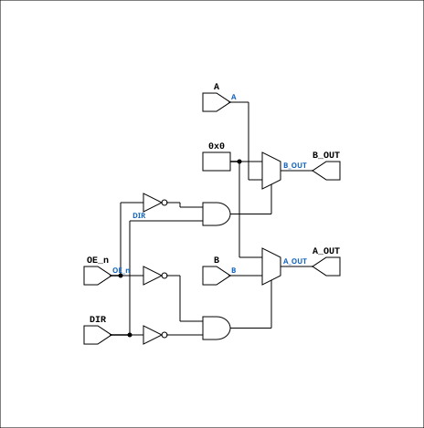

# TTL_74245

Source: `Verilog/Shared/support/TTL_74245.v`

<!-- Generated by Verilog/tests/module_doc.py from the //! comments in the source. Do not edit by hand - edit the RTL comments and regenerate. -->

<!-- HIERARCHY-NAV:BEGIN - written by Verilog/tests/gen_hierarchy.py, do not edit -->

**Where it sits** (Simulation): [ND120_TOP](../../../doc/ND120_TOP.md) > [ND120_CORE](../../../doc/ND120_CORE.md) > [ND3202D](../../../CPU-BOARD-3202/circuit/doc/ND3202D.md) > [CPU_15](../../../CPU-BOARD-3202/circuit/doc/CPU_15.md) > [CPU_PROC_32](../../../CPU-BOARD-3202/circuit/doc/CPU_PROC_32.md) > **TTL_74245**
- instance path: `CORE.CPU_BOARD.CPU.PROC.CHIP_32F`

**Used in:** [CPU_PROC_32](../../../CPU-BOARD-3202/circuit/doc/CPU_PROC_32.md) (all tops)

**Contains:** no other modules.

[Module hierarchy](../../../HIERARCHY.md) - [All modules](../../../MODULES.md)

<!-- HIERARCHY-NAV:END -->


<!-- SCHEMATIC:BEGIN - written by Verilog/tests/gen_schematics.py, do not edit -->

## Schematic

Drawn from the Verilog: the yosys netlist of the Simulation (Verilator) build, instance `CORE.CPU_BOARD.CPU.PROC.CHIP_32F`. Sub-modules are boxes (click the picture to open it full size; there every sub-module box links to its page, and every wire shows its Verilog name).

[](TTL_74245.svg)

<!-- SCHEMATIC:END -->

## Description

Component : TTL_74245
Ronny Hansen 14.01.2024

## Ports

| Direction | Width | Name | Description |
|---|---|---|---|
| input | `[7:0]` | `A` | A-side 8-bit port |
| output | `[7:0]` | `A_OUT` | A-side 8-bit port |
| input | `[7:0]` | `B` | B-side 8-bit bidirectional port/bus |
| output | `[7:0]` | `B_OUT` | B-side 8-bit bidirectional port/bus |
| input | `1` | `DIR` | Direction control |
| input | `1` | `OE_n` *(active low)* | Output enable |

## Verilog source

[`Verilog/Shared/support/TTL_74245.v`](https://github.com/RetroCoreLabs/nd-120/blob/main/Verilog/Shared/support/TTL_74245.v) on GitHub.

<details markdown="1">
<summary>Show the Verilog of TTL_74245 (49 lines)</summary>

```verilog
/******************************************************************************
 **                                                                          **
 ** Component : TTL_74245                                                    **
 **                                                                          **
 ** Ronny Hansen 14.01.2024
 *****************************************************************************/

module TTL_74245( 
    input  [7:0] A,        // A-side 8-bit port
    output [7:0] A_OUT,    // A-side 8-bit port

    input  [7:0] B,        // B-side 8-bit bidirectional port/bus
    output [7:0] B_OUT,    // B-side 8-bit bidirectional port/bus

    input DIR,           // Direction control
    input OE_n           // Output enable
);

    // NO SHARED HELPER WIRE HERE - this is deliberate, see below.
    //
    // The obvious way to write this part is
    //     wire [7:0] internalBus = DIR ? A : B;
    //     assign B_OUT = (!OE_n && DIR)  ? internalBus : 8'b0;
    //     assign A_OUT = (!OE_n && !DIR) ? internalBus : 8'b0;
    // which is FUNCTIONALLY correct - when DIR is 1 the helper is A, so B can
    // never reach B_OUT - but it creates the STRUCTURAL edge
    //     B -> internalBus -> B_OUT
    // and synthesis cannot know that DIR gates it. On a bidirectional bus
    // where the far end feeds back (FIDB: CGA_IDBCTL -> ALU_OUTMUX -> FIDBO ->
    // BusDriver16 -> here -> board IDB glue -> back to CGA_IDBCTL) that edge
    // closes a combinational LOOP.
    //
    // MEASURED 20-AUG-2026, Vivado 2025.2.1 on xc7a100t: 59 "[Synth 8-295]
    // found timing loop" warnings, each broken by an arbitrary inferred
    // set_disable_timing. The worst reported path then ran 181 logic levels /
    // 94.4 ns from an interrupt mask flip-flop to the WCS address input - but
    // 83.6 ns of that, 89%, was the tool walking ~14 LAPS around this loop,
    // one per bit position. It was never a real ND-120 signal path.
    //
    // Selecting the source directly per output is the same truth table with no
    // shared node, so the edge does not exist.
    assign B_OUT = (OE_n == 0 && DIR == 1) ? A : 8'b0;

    // Output to A when receiving from B with respect to OE (OE_n==1 means "isolated". Don't write to A or B)
    assign A_OUT = (OE_n == 0 && DIR == 0) ? B : 8'b0;

endmodule
```

</details>
