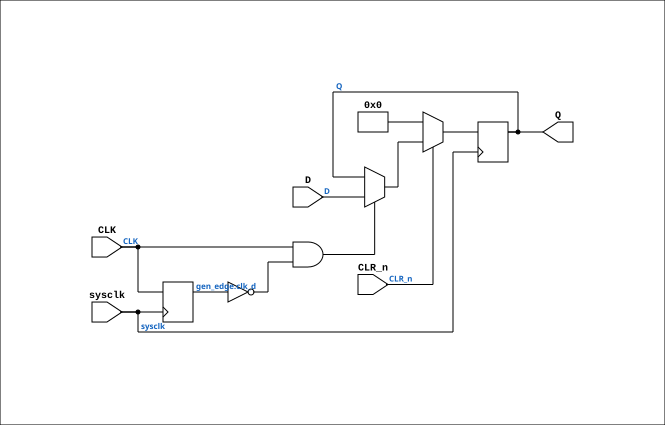

# TTL_74273

Source: `Verilog/Shared/support/TTL_74273.v`

<!-- Generated by Verilog/tests/module_doc.py from the //! comments in the source. Do not edit by hand - edit the RTL comments and regenerate. -->

<!-- HIERARCHY-NAV:BEGIN - written by Verilog/tests/gen_hierarchy.py, do not edit -->

**Where it sits** (Simulation): [ND120_TOP](../../../doc/ND120_TOP.md) > [ND120_CORE](../../../doc/ND120_CORE.md) > [ND3202D](../../../CPU-BOARD-3202/circuit/doc/ND3202D.md) > [IO_37](../../../CPU-BOARD-3202/circuit/doc/IO_37.md) > [IO_REG_41](../../../CPU-BOARD-3202/circuit/doc/IO_REG_41.md) > **TTL_74273**
- instance path: `CORE.CPU_BOARD.IO.REG_MODULE.CHIP_28A_IOC`

**Used in:** [IO_REG_41](../../../CPU-BOARD-3202/circuit/doc/IO_REG_41.md) (all tops)

**Contains:** no other modules.

[Module hierarchy](../../../HIERARCHY.md) - [All modules](../../../MODULES.md)

<!-- HIERARCHY-NAV:END -->


<!-- SCHEMATIC:BEGIN - written by Verilog/tests/gen_schematics.py, do not edit -->

## Schematic

Drawn from the Verilog: the yosys netlist of the Simulation (Verilator) build, instance `CORE.CPU_BOARD.IO.REG_MODULE.CHIP_28A_IOC`. Sub-modules are boxes (click the picture to open it full size; there every sub-module box links to its page, and every wire shows its Verilog name).

[](TTL_74273.svg)

<!-- SCHEMATIC:END -->

## Description

74273
OCTAL D-TYPE FLIP-FLOP WITH COMMON CLOCK AND ASYNCHRONOUS CLEAR
(NONE NEGATING)
Documentation:  https://www.ti.com/lit/ds/symlink/sn54ls273-sp.pdf
Last reviewed: 26-JAN-2025
Ronny Hansen

## Ports

| Direction | Width | Name | Description |
|---|---|---|---|
| input | `1` | `sysclk` | FPGA system clock (used only when USE_SYSCLK=2) |
| input | `1` | `CLK` | Clock input |
| input | `1` | `CLR_n` *(active low)* | Active low clear input |
| input | `[7:0]` | `D` | 8-bit data input |
| output | `[7:0]` | `Q` | 8-bit output |

## Verilog source

[`Verilog/Shared/support/TTL_74273.v`](https://github.com/RetroCoreLabs/nd-120/blob/main/Verilog/Shared/support/TTL_74273.v) on GitHub.

<details markdown="1">
<summary>Show the Verilog of TTL_74273 (54 lines)</summary>

```verilog
/**************************************************************************
** 74273                                                                 **
** OCTAL D-TYPE FLIP-FLOP WITH COMMON CLOCK AND ASYNCHRONOUS CLEAR       **
** (NONE NEGATING)                                                       **
**                                                                       **
** Documentation:  https://www.ti.com/lit/ds/symlink/sn54ls273-sp.pdf    **
**                                                                       **
** Last reviewed: 26-JAN-2025                                            **
** Ronny Hansen                                                          **
***************************************************************************/


module TTL_74273 (
    input wire sysclk,     // FPGA system clock (used only when USE_SYSCLK=2)
    input wire CLK,        // Clock input
    input wire CLR_n,      // Active low clear input
    input wire [7:0] D,    // 8-bit data input
    output reg [7:0] Q     // 8-bit output
);

    // USE_SYSCLK:
    //   0 (default): original posedge CLK - matches the real chip.
    //   2: sysclk-sampled RISING-EDGE capture (AM29C821 USE_SYSCLK=2
    //      pattern) - the FPGA-safe mode when CLK is driven by a control
    //      strobe (SIOC_n ...), not a clock. Clear stays synchronous,
    //      matching the original block below.
    parameter USE_SYSCLK = 0;

    generate
        if (USE_SYSCLK == 2) begin : gen_edge
            reg clk_d = 1'b0;
            always @(posedge sysclk)
            begin
                clk_d <= CLK;
                if (!CLR_n) begin
                    Q <= 8'b0;
                end else if (CLK && !clk_d) begin
                    Q <= D;
                end
            end
        end else begin : gen_posedge
            // Flip-flop logic
            always @(posedge CLK ) //or negedge CLR_n)
            begin
                if (!CLR_n) begin
                    Q <= 8'b0;     // Reset output to 0 when clr_n is low
                end else begin
                    Q <= D;        // Load data into flip-flops on rising edge of clk
                end
            end
        end
    endgenerate

endmodule
```

</details>
