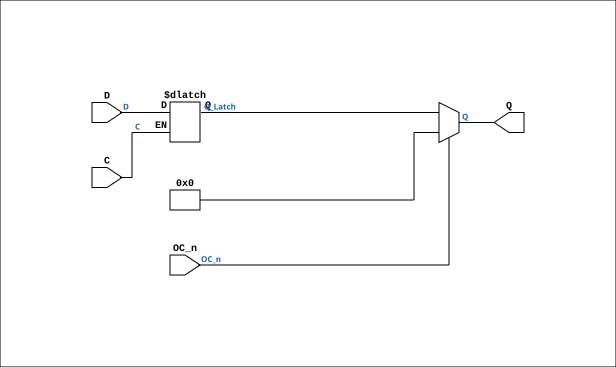

# TTL_74373

Source: `Verilog/Shared/support/TTL_74373.v`

<!-- Generated by Verilog/tests/module_doc.py from the //! comments in the source. Do not edit by hand - edit the RTL comments and regenerate. -->

<!-- HIERARCHY-NAV:BEGIN - written by Verilog/tests/gen_hierarchy.py, do not edit -->

**Hierarchy:** not instantiated by any of the 9 build tops (elaborated by yosys).

[Module hierarchy](../../../HIERARCHY.md) - [All modules](../../../MODULES.md)

<!-- HIERARCHY-NAV:END -->


<!-- SCHEMATIC:BEGIN - written by Verilog/tests/gen_schematics.py, do not edit -->

## Schematic

Drawn from the Verilog: no build top uses this module, so it was elaborated from its own file with no defines and default parameters. Sub-modules are boxes (click the picture to open it full size; there every sub-module box links to its page, and every wire shows its Verilog name).

[](TTL_74373.svg)

<!-- SCHEMATIC:END -->

## Description

ND120 Shared
Module 74PCT373
Octal D-TYPE Transparent Latch with 3-state outputs
Documentation: https://www.ti.com/lit/ds/symlink/sn54ls373-sp.pdf
Last reviewed: 1-DEC-2024
Ronny Hansen

## Ports

| Direction | Width | Name | Description |
|---|---|---|---|
| input | `[7:0]` | `D` | Data inputs |
| input | `1` | `C` | Control input (active high) |
| input | `1` | `OC_n` *(active low)* | Output Control (active low) |
| output | `[7:0]` | `Q` | Outputs |

## Verilog source

[`Verilog/Shared/support/TTL_74373.v`](https://github.com/RetroCoreLabs/nd-120/blob/main/Verilog/Shared/support/TTL_74373.v) on GitHub.

<details markdown="1">
<summary>Show the Verilog of TTL_74373 (40 lines)</summary>

```verilog
/**************************************************************************
** ND120 Shared                                                          **
**                                                                       **
** Module 74PCT373                                                       **
**                                                                       **
** Octal D-TYPE Transparent Latch with 3-state outputs                   **
** Documentation: https://www.ti.com/lit/ds/symlink/sn54ls373-sp.pdf     **
**                                                                       **
** Last reviewed: 1-DEC-2024                                             **
** Ronny Hansen                                                          **
***************************************************************************/


module TTL_74373 (
    input wire [7:0] D,   // Data inputs
    input wire C,         // Control input (active high)
    input wire OC_n,      // Output Control (active low)
    output wire [7:0] Q   // Outputs
);

    reg [7:0] Q_Latch;  // Internal latch


    // Latch operation: latch data whenever C is high
    //always @(posedge C or negedge C or posedge D or negedge D) begin
    always @(*) begin 
    //always_latch begin
        if (C) begin
            Q_Latch = D;  // Transparent mode: Internal latch follows input
        end else begin
            Q_Latch = Q_Latch; // Explicit latch in hope of synth keeping silent (nope.. no change.. dont know how to make Vivado happy)
        end
    end

    // Output control
    // When OC_n is low (active), outputs reflect the latched data
    // When OC_n is high, outputs are in high-impedance state
    assign Q = OC_n ? 8'b0 : Q_Latch;

endmodule
```

</details>
