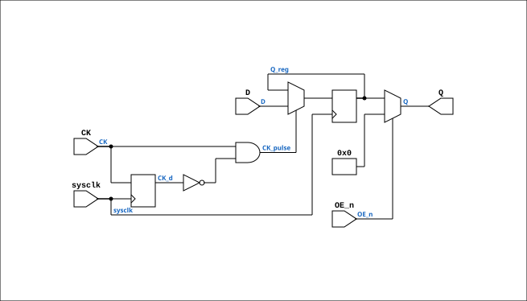

# TTL_74374

Source: `Verilog/Shared/support/TTL_74374.v`

<!-- Generated by Verilog/tests/module_doc.py from the //! comments in the source. Do not edit by hand - edit the RTL comments and regenerate. -->

<!-- HIERARCHY-NAV:BEGIN - written by Verilog/tests/gen_hierarchy.py, do not edit -->

**Where it sits** (Simulation): [ND120_TOP](../../../doc/ND120_TOP.md) > [ND120_CORE](../../../doc/ND120_CORE.md) > [ND3202D](../../../CPU-BOARD-3202/circuit/doc/ND3202D.md) > [IO_37](../../../CPU-BOARD-3202/circuit/doc/IO_37.md) > [IO_PANCAL_40](../../../CPU-BOARD-3202/circuit/doc/IO_PANCAL_40.md) > **TTL_74374**
- instance path: `CORE.CPU_BOARD.IO.PANCAL.CHIP_32B`

**Used in:** [CPU_PROC_CGA_33](../../../CPU-BOARD-3202/circuit/doc/CPU_PROC_CGA_33.md) (all tops), [IO_PANCAL_40](../../../CPU-BOARD-3202/circuit/doc/IO_PANCAL_40.md) (all tops), [MEM_ERROR_47](../../../CPU-BOARD-3202/circuit/doc/MEM_ERROR_47.md) (all tops)

**Contains:** no other modules.

[Module hierarchy](../../../HIERARCHY.md) - [All modules](../../../MODULES.md)

<!-- HIERARCHY-NAV:END -->


<!-- SCHEMATIC:BEGIN - written by Verilog/tests/gen_schematics.py, do not edit -->

## Schematic

Drawn from the Verilog: the yosys netlist of the Simulation (Verilator) build, instance `CORE.CPU_BOARD.IO.PANCAL.CHIP_32B`. Sub-modules are boxes (click the picture to open it full size; there every sub-module box links to its page, and every wire shows its Verilog name).

[](TTL_74374.svg)

<!-- SCHEMATIC:END -->

## Description

Component : 74LS374
Octal Transparent EDGE-TRIGGERED FLIP-FLOPS with 3-state outputs
Documentation: https://www.ti.com/lit/ds/symlink/sn54ls373-sp.pdf
Last reviewed: 14-DEC-2024
Ronny Hansen

## Ports

| Direction | Width | Name | Description |
|---|---|---|---|
| input | `1` | `sysclk` | FPGA system clock — used for CK edge detection |
| input | `[7:0]` | `D` | Data inputs |
| input | `1` | `CK` | Clock input (latches on rising edge of CK) |
| input | `1` | `OE_n` *(active low)* | Output Control (active low) |
| output | `[7:0]` | `Q` | Outputs |

## Verilog source

[`Verilog/Shared/support/TTL_74374.v`](https://github.com/RetroCoreLabs/nd-120/blob/main/Verilog/Shared/support/TTL_74374.v) on GitHub.

<details markdown="1">
<summary>Show the Verilog of TTL_74374 (36 lines)</summary>

```verilog
/******************************************************************************
 **                                                                          **
 ** Component : 74LS374                                                      **
 **                                                                          **
 ** Octal Transparent EDGE-TRIGGERED FLIP-FLOPS with 3-state outputs         **
 **                                                                          **
 ** Documentation: https://www.ti.com/lit/ds/symlink/sn54ls373-sp.pdf        **
 **                                                                          **
 ** Last reviewed: 14-DEC-2024                                               **
 ** Ronny Hansen                                                             **
 *****************************************************************************/

module TTL_74374 (
    input wire        sysclk, // FPGA system clock — used for CK edge detection
    input wire [7:0]  D,      // Data inputs
    input wire        CK,     // Clock input (latches on rising edge of CK)
    input wire        OE_n,   // Output Control (active low)
    output wire [7:0] Q       // Outputs
);
    reg [7:0] Q_reg = 8'b0;

    // Detect rising edge of CK relative to sysclk
    reg CK_d = 1'b0;
    always @(posedge sysclk)
        CK_d <= CK;

    wire CK_pulse = CK & ~CK_d;

    always @(posedge sysclk) begin
        if (CK_pulse)
            Q_reg <= D;
    end

    assign Q = OE_n ? 8'b0 : Q_reg;

endmodule
```

</details>
