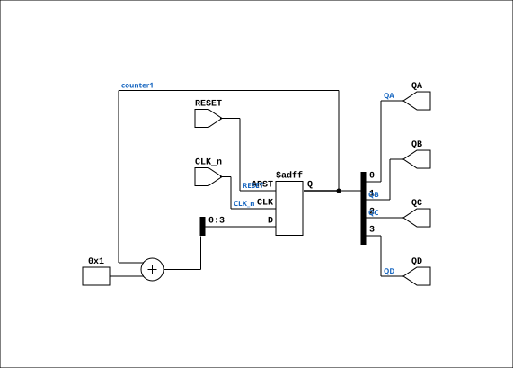

# TTL_74393

Source: `Verilog/Shared/support/TTL_74393.v`

<!-- Generated by Verilog/tests/module_doc.py from the //! comments in the source. Do not edit by hand - edit the RTL comments and regenerate. -->

<!-- HIERARCHY-NAV:BEGIN - written by Verilog/tests/gen_hierarchy.py, do not edit -->

**Hierarchy:** not instantiated by any of the 9 build tops (elaborated by yosys).

[Module hierarchy](../../../HIERARCHY.md) - [All modules](../../../MODULES.md)

<!-- HIERARCHY-NAV:END -->


<!-- SCHEMATIC:BEGIN - written by Verilog/tests/gen_schematics.py, do not edit -->

## Schematic

Drawn from the Verilog: no build top uses this module, so it was elaborated from its own file with no defines and default parameters. Sub-modules are boxes (click the picture to open it full size; there every sub-module box links to its page, and every wire shows its Verilog name).

[](TTL_74393.svg)

<!-- SCHEMATIC:END -->

## Ports

| Direction | Width | Name | Description |
|---|---|---|---|
| input | `1` | `CLK_n` *(active low)* | Clock input (Count on negative edge) |
| input | `1` | `RESET` | Asynchronous clear (active high) |
| output | `1` | `QA` |  |
| output | `1` | `QB` |  |
| output | `1` | `QC` |  |
| output | `1` | `QD` |  |

## Verilog source

[`Verilog/Shared/support/TTL_74393.v`](https://github.com/RetroCoreLabs/nd-120/blob/main/Verilog/Shared/support/TTL_74393.v) on GitHub.

<details markdown="1">
<summary>Show the Verilog of TTL_74393 (32 lines)</summary>

```verilog
// 74393
// Dual 4-Stage Binary Ripple Counter
// Implementing just one of the clocks. Instantiate two modules to get both
// Documentation: https://www.onsemi.com/pdf/datasheet/mc74hc393a-d.pdf

module TTL_74393 (
    input CLK_n,     // Clock input (Count on negative edge)
    input RESET,     // Asynchronous clear (active high) 

    output QA,
    output QB,
    output QC,
    output QD
);

reg [3:0] counter1 = 4'b0000;


// First 4-bit counter
always @(negedge CLK_n or posedge RESET) begin
    if (RESET)
        counter1 <= 4'b0000;
    else
        counter1 <= counter1 + 1;
end

assign QA = counter1[0];
assign QB = counter1[1];
assign QC = counter1[2];
assign QD = counter1[3];

endmodule
```

</details>
