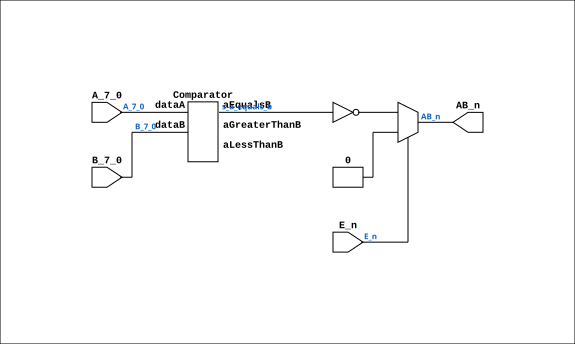

# TTL_74521

Source: `Verilog/Shared/support/TTL_74521.v`

<!-- Generated by Verilog/tests/module_doc.py from the //! comments in the source. Do not edit by hand - edit the RTL comments and regenerate. -->

<!-- HIERARCHY-NAV:BEGIN - written by Verilog/tests/gen_hierarchy.py, do not edit -->

**Hierarchy:** not instantiated by any of the 9 build tops (elaborated by yosys).

[Module hierarchy](../../../HIERARCHY.md) - [All modules](../../../MODULES.md)

<!-- HIERARCHY-NAV:END -->


<!-- SCHEMATIC:BEGIN - written by Verilog/tests/gen_schematics.py, do not edit -->

## Schematic

Drawn from the Verilog: no build top uses this module, so it was elaborated from its own file with no defines and default parameters. Sub-modules are boxes (click the picture to open it full size; there every sub-module box links to its page, and every wire shows its Verilog name).

[](TTL_74521.svg)

<!-- SCHEMATIC:END -->

## Description

ND120 Shared
Component: MUX81
Last reviewed: 9-NOV-2024
Ronny Hansen

## Ports

| Direction | Width | Name | Description |
|---|---|---|---|
| input | `[7:0]` | `A_7_0` |  |
| input | `[7:0]` | `B_7_0` |  |
| input | `1` | `E_n` *(active low)* |  |
| output | `1` | `AB_n` *(active low)* |  |

## Verilog source

[`Verilog/Shared/support/TTL_74521.v`](https://github.com/RetroCoreLabs/nd-120/blob/main/Verilog/Shared/support/TTL_74521.v) on GitHub.

<details markdown="1">
<summary>Show the Verilog of TTL_74521 (69 lines)</summary>

```verilog
/**************************************************************************
** ND120 Shared                                                          **
**                                                                       **
** Component: MUX81                                                      **
**                                                                       **
** Last reviewed: 9-NOV-2024                                             **
** Ronny Hansen                                                          **
***************************************************************************/

module TTL_74521 (
    input [7:0] A_7_0,
    input [7:0] B_7_0,
    input       E_n,

    output AB_n
);

  /*******************************************************************************
   ** The wires are defined here                                                 **
   *******************************************************************************/
  wire [7:0] s_a_7_0;
  wire [7:0] s_b_7_0;
  wire       s_ab_n_out;
  wire       s_e_n;
  wire       s_e;
  wire       s_a_equals_b;

  /*******************************************************************************
   ** The module functionality is described here                                 **
   *******************************************************************************/

  /*******************************************************************************
   ** Here all input connections are defined                                     **
   *******************************************************************************/
  assign s_a_7_0[7:0]  = A_7_0;
  assign s_b_7_0[7:0]  = B_7_0;
  assign s_e_n         = E_n;

  /*******************************************************************************
   ** Here all output connections are defined                                    **
   *******************************************************************************/
  assign AB_n          = s_ab_n_out;

  /*******************************************************************************
   ** Here all in-lined components are defined                                   **
   *******************************************************************************/

  // NOT Gate
  assign s_e = ~s_e_n;

  // Controlled Inverter
  assign s_ab_n_out = (s_e) ? ~s_a_equals_b : 1'b0;

  /*******************************************************************************
   ** Here all normal components are defined                                     **
   *******************************************************************************/
  Comparator #(
      .nrOfBits(8),
      .twosComplement(1)
  ) ARITH_1 (
      .aEqualsB(s_a_equals_b),
      .aGreaterThanB(),
      .aLessThanB(),
      .dataA(s_a_7_0[7:0]),
      .dataB(s_b_7_0[7:0])
  );


endmodule
```

</details>
