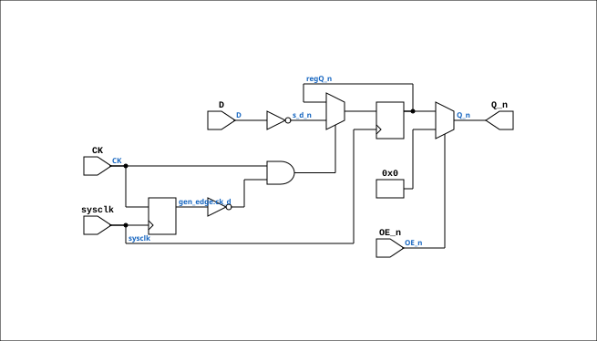

# TTL_74534

Source: `Verilog/Shared/support/TTL_74534.v`

<!-- Generated by Verilog/tests/module_doc.py from the //! comments in the source. Do not edit by hand - edit the RTL comments and regenerate. -->

<!-- HIERARCHY-NAV:BEGIN - written by Verilog/tests/gen_hierarchy.py, do not edit -->

**Where it sits** (Simulation): [ND120_TOP](../../../doc/ND120_TOP.md) > [ND120_CORE](../../../doc/ND120_CORE.md) > [ND3202D](../../../CPU-BOARD-3202/circuit/doc/ND3202D.md) > [BIF_5](../../../CPU-BOARD-3202/circuit/doc/BIF_5.md) > [BIF_DPATH_9](../../../CPU-BOARD-3202/circuit/doc/BIF_DPATH_9.md) > [BIF_DPATH_PESPEA_13](../../../CPU-BOARD-3202/circuit/doc/BIF_DPATH_PESPEA_13.md) > **TTL_74534**
- instance path: `CORE.CPU_BOARD.BIF.DPATH.PESPEA.CHIP_9A`

**Used in:** [BIF_DPATH_PESPEA_13](../../../CPU-BOARD-3202/circuit/doc/BIF_DPATH_PESPEA_13.md) (all tops)

**Contains:** no other modules.

[Module hierarchy](../../../HIERARCHY.md) - [All modules](../../../MODULES.md)

<!-- HIERARCHY-NAV:END -->


<!-- SCHEMATIC:BEGIN - written by Verilog/tests/gen_schematics.py, do not edit -->

## Schematic

Drawn from the Verilog: the yosys netlist of the Simulation (Verilator) build, instance `CORE.CPU_BOARD.BIF.DPATH.PESPEA.CHIP_9A`. Sub-modules are boxes (click the picture to open it full size; there every sub-module box links to its page, and every wire shows its Verilog name).

[](TTL_74534.svg)

<!-- SCHEMATIC:END -->

## Description

Component : TTL_74534
74HC534 Octal D-type Flip-Flop
(NEGATED OUTPUTS)

## Ports

| Direction | Width | Name | Description |
|---|---|---|---|
| input | `1` | `sysclk` | FPGA system clock (used only when USE_SYSCLK=2) |
| input | `1` | `CK` |  |
| input | `1` | `OE_n` *(active low)* |  |
| input | `[7:0]` | `D` |  |
| output | `[7:0]` | `Q_n` *(active low)* |  |

## Verilog source

[`Verilog/Shared/support/TTL_74534.v`](https://github.com/RetroCoreLabs/nd-120/blob/main/Verilog/Shared/support/TTL_74534.v) on GitHub.

<details markdown="1">
<summary>Show the Verilog of TTL_74534 (52 lines)</summary>

```verilog
/******************************************************************************
 ** Component : TTL_74534                                                    **
 **                                                                          **
 ** 74HC534 Octal D-type Flip-Flop                                           **
 ** (NEGATED OUTPUTS)                                                        **
 *****************************************************************************/

module TTL_74534(
   input sysclk, // FPGA system clock (used only when USE_SYSCLK=2)
   input CK,
   input OE_n,

   input [7:0] D,
   output [7:0] Q_n
);

   // USE_SYSCLK:
   //   0 (default): original posedge CK - matches the real chip.
   //   2: sysclk-sampled RISING-EDGE capture (AM29C821 USE_SYSCLK=2 pattern)
   //      - the FPGA-safe mode when CK is driven by a control strobe
   //      (SPEA, SPES ...), not a clock. One capture per detected rise,
   //      no fabric-routed clock net.
   parameter USE_SYSCLK = 0;

   wire s_ck;
   wire s_oe_n;
   wire [7:0] s_d_n;

   reg [7:0] regQ_n;


   assign s_ck = CK;
   assign s_oe_n = OE_n;
   assign s_d_n = ~D;

   generate
      if (USE_SYSCLK == 2) begin : gen_edge
         reg ck_d = 1'b0;
         always @(posedge sysclk) begin
            ck_d <= s_ck;
            if (s_ck && !ck_d) regQ_n <= s_d_n;
         end
      end else begin : gen_posedge
         always @(posedge s_ck )
         begin
            regQ_n <= s_d_n;
         end
      end
   endgenerate

   assign Q_n = s_oe_n ? 8'b0 : regQ_n;
endmodule
```

</details>
