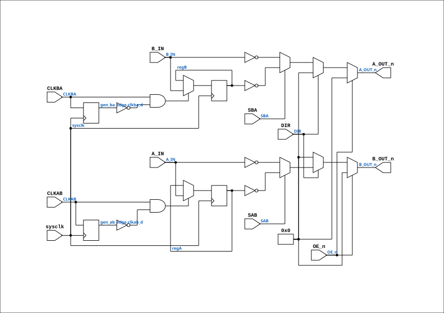

# TTL_74648

Source: `Verilog/Shared/support/TTL_74648.v`

<!-- Generated by Verilog/tests/module_doc.py from the //! comments in the source. Do not edit by hand - edit the RTL comments and regenerate. -->

<!-- HIERARCHY-NAV:BEGIN - written by Verilog/tests/gen_hierarchy.py, do not edit -->

**Where it sits** (Simulation): [ND120_TOP](../../../doc/ND120_TOP.md) > [ND120_CORE](../../../doc/ND120_CORE.md) > [ND3202D](../../../CPU-BOARD-3202/circuit/doc/ND3202D.md) > [BIF_5](../../../CPU-BOARD-3202/circuit/doc/BIF_5.md) > [BIF_DPATH_9](../../../CPU-BOARD-3202/circuit/doc/BIF_DPATH_9.md) > [BIF_DPATH_BDLBD_10](../../../CPU-BOARD-3202/circuit/doc/BIF_DPATH_BDLBD_10.md) > **TTL_74648**
- instance path: `CORE.CPU_BOARD.BIF.DPATH.BDLBD.CHIP_4A`

**Used in:** [BIF_DPATH_BDLBD_10](../../../CPU-BOARD-3202/circuit/doc/BIF_DPATH_BDLBD_10.md) (all tops)

**Contains:** no other modules.

[Module hierarchy](../../../HIERARCHY.md) - [All modules](../../../MODULES.md)

<!-- HIERARCHY-NAV:END -->


<!-- SCHEMATIC:BEGIN - written by Verilog/tests/gen_schematics.py, do not edit -->

## Schematic

Drawn from the Verilog: the yosys netlist of the Simulation (Verilator) build, instance `CORE.CPU_BOARD.BIF.DPATH.BDLBD.CHIP_4A`. Sub-modules are boxes (click the picture to open it full size; there every sub-module box links to its page, and every wire shows its Verilog name).

[](TTL_74648.svg)

<!-- SCHEMATIC:END -->

## Description

Component : TTL_74648
OCTAL BUS TRANSCEIVERS AND REGISTERS WITH 3-STATE OUTPUTS
(INVERTING)
DOC: https://www.ti.com/lit/ds/symlink/sn54as646.pdf
Last reviewed: 9-MAR-2025
Ronny Hansen

## Ports

| Direction | Width | Name | Description |
|---|---|---|---|
| input | `1` | `sysclk` | FPGA system clock (used only when USE_SYSCLK_AB/BA=2) |
| input | `[7:0]` | `A_IN` |  |
| input | `[7:0]` | `B_IN` |  |
| input | `1` | `CLKAB` |  |
| input | `1` | `CLKBA` |  |
| input | `1` | `DIR` | Direction (1=A to B, 0=B to A) |
| input | `1` | `OE_n` *(active low)* | Output Enable Negated |
| input | `1` | `SAB` | Select-Control AB - multiplex stored and real-time (transparent mode) registeres |
| input | `1` | `SBA` | Select-Control BA - multiplex stored and real-time (transparent mode) registeres. 0=REAL-TIME |
| output | `[7:0]` | `A_OUT_n` *(active low)* |  |
| output | `[7:0]` | `B_OUT_n` *(active low)* |  |

## Verilog source

[`Verilog/Shared/support/TTL_74648.v`](https://github.com/RetroCoreLabs/nd-120/blob/main/Verilog/Shared/support/TTL_74648.v) on GitHub.

<details markdown="1">
<summary>Show the Verilog of TTL_74648 (136 lines)</summary>

```verilog
/******************************************************************************
 **                                                                          **
 ** Component : TTL_74648                                                    **
 **                                                                          **
 ** OCTAL BUS TRANSCEIVERS AND REGISTERS WITH 3-STATE OUTPUTS                **
 ** (INVERTING)                                                              **
 **                                                                          **
 ** DOC: https://www.ti.com/lit/ds/symlink/sn54as646.pdf                     **
 **                                                                          **
 ** Last reviewed: 9-MAR-2025                                                **
 ** Ronny Hansen                                                             **
 ******************************************************************************/

module TTL_74648 (
    input sysclk,  // FPGA system clock (used only when USE_SYSCLK_AB/BA=2)
    input [7:0] A_IN,
    input [7:0] B_IN,
    input CLKAB,
    input CLKBA,
    input DIR,  // Direction (1=A to B, 0=B to A)
    input OE_n,  // Output Enable Negated
    input SAB,  // Select-Control AB - multiplex stored and real-time (transparent mode) registeres
    input SBA,   // Select-Control BA - multiplex stored and real-time (transparent mode) registeres. 0=REAL-TIME

    output [7:0] A_OUT_n,
    output [7:0] B_OUT_n
);

  // USE_SYSCLK_AB / USE_SYSCLK_BA: 0 (default) = original posedge CLKAB/CLKBA;
  // 2 = sysclk-sampled rising-edge capture (AM29C821 USE_SYSCLK=2 pattern) for
  // when the clock pin carries a control strobe (BGNT_n, CLKBD ...), not a
  // clock. See TTL_74646.v for the full rationale.
  parameter USE_SYSCLK_AB = 0;
  parameter USE_SYSCLK_BA = 0;


  /*******************************************************************************
   ** The wires are defined here                                                 **
   *******************************************************************************/
  wire s_sab;
  wire s_clkab;
  wire s_sba;
  wire s_clkba;
  wire s_dir;
  wire s_oe_n;

  wire [7:0] a_in_n;
  wire [7:0] b_in_n;


  /*******************************************************************************
   ** The module functionality is described here                                 **
   *******************************************************************************/

  /*******************************************************************************
   ** Here all input connections are defined                                     **
   *******************************************************************************/
  assign s_sab   = SAB;
  assign s_clkab = CLKAB;
  assign s_sba   = SBA;
  assign s_clkba = CLKBA;
  assign s_dir   = DIR;
  assign s_oe_n  = OE_n;

  assign a_in_n  = A_IN;
  assign b_in_n  = B_IN;


  /*******************************************************************************
   ** Here all in-lined components are defined                                   **
   *******************************************************************************/

  reg [7:0] regA;
  reg [7:0] regB;

  generate
    if (USE_SYSCLK_AB == 2) begin : gen_ab_edge
      reg clkab_d = 1'b0;
      always @(posedge sysclk) begin
        clkab_d <= s_clkab;
        if (s_clkab && !clkab_d) regA <= a_in_n;
      end
    end else begin : gen_ab_posedge
      always @(posedge s_clkab) begin
        regA <= a_in_n;
      end
    end

    if (USE_SYSCLK_BA == 2) begin : gen_ba_edge
      reg clkba_d = 1'b0;
      always @(posedge sysclk) begin
        clkba_d <= s_clkba;
        if (s_clkba && !clkba_d) regB <= b_in_n;
      end
    end else begin : gen_ba_posedge
      always @(posedge s_clkba) begin
        regB <= b_in_n;
      end
    end
  endgenerate


  /*
A_OUT:
   If OE_n is not active (low), the output is 0.

   If DIR is 0 (B to A direction):
      If SBA is 0, A_OUT gets real-time data from B_IN.
      If SBA is 1, A_OUT gets stored data from regB.

*/
  // sdir = 0 => B => A

  // s_sba = 0 => Real Time B to A
  // s_sba = 1 => Register  B to A
  assign A_OUT_n = s_oe_n ? 8'b0 : !s_dir ? ((!s_sba) ? ~b_in_n : ~regB) : 8'b0;


  /*
B_OUT:
      If OE_n is not active (low), the output is 0.

      If DIR is 1 (A to B direction):
         If SAB is 0, B_OUT gets real-time data from A_IN.
         If SAB is 1, B_OUT gets stored data from regA.
*/

  // sdir = 1 => A => B

  // s_sab = 0 => Real Time A to B
  // s_sab = 1 => Register  A to B
  assign B_OUT_n = s_oe_n ? 8'b0 : s_dir ? ((!s_sab) ? ~a_in_n : ~regA) : 8'b0;

endmodule
```

</details>
