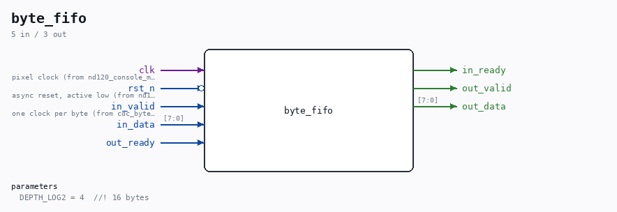
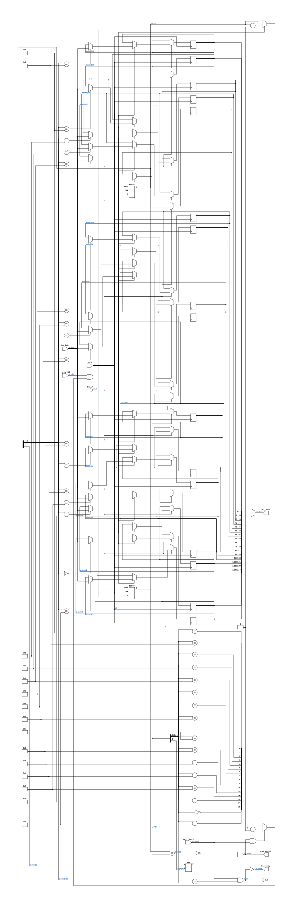

# byte_fifo

Source: `Verilog/Terminals/rtl/byte_fifo.v`

<!-- Generated by Verilog/tests/module_doc.py from the //! comments in the source. Do not edit by hand - edit the RTL comments and regenerate. -->

<!-- HIERARCHY-NAV:BEGIN - written by Verilog/tests/gen_hierarchy.py, do not edit -->

**Where it sits** (Nexys): [nd120_nexys4ddr_top](../../../fpga/nexys4ddr/doc/nd120_nexys4ddr_top.md) > [terminal_top](terminal_top.md) > **byte_fifo**
- instance path: `TERMINAL.FIFO`

**Used in:** [terminal_top](terminal_top.md) (Nexys, MiSTer, MEGA65 R6, MEGA65 R3)

**Contains:** no other modules.

[Module hierarchy](../../../HIERARCHY.md) - [All modules](../../../MODULES.md)

<!-- HIERARCHY-NAV:END -->



<!-- SCHEMATIC:BEGIN - written by Verilog/tests/gen_schematics.py, do not edit -->

## Schematic

Drawn from the Verilog: the yosys netlist of the Nexys 4 DDR build, instance `TERMINAL.FIFO`. Sub-modules are boxes (click the picture to open it full size; there every sub-module box links to its page, and every wire shows its Verilog name).

[](byte_fifo.svg)

<!-- SCHEMATIC:END -->

## Parameters

| Parameter | Default |
|---|---|
| `DEPTH_LOG2` | `4  //! 16 bytes` |

## Ports

| Direction | Width | Name | Description |
|---|---|---|---|
| input | `1` | `clk` | pixel clock (from nd120_console_mega65.clk and others) |
| input | `1` | `rst_n` *(active low)* | async reset, active low (from nd120_console_mega65.rst_n and others) |
| input | `1` | `in_valid` | one clock per byte (from cdc_byte.dst_valid) |
| input | `[7:0]` | `in_data` |  |
| output | `1` | `in_ready` |  |
| output | `1` | `out_valid` |  |
| output | `[7:0]` | `out_data` |  |
| input | `1` | `out_ready` |  |

## Verilog source

[`Verilog/Terminals/rtl/byte_fifo.v`](https://github.com/RetroCoreLabs/nd-120/blob/main/Verilog/Terminals/rtl/byte_fifo.v) on GitHub.

<details markdown="1">
<summary>Show the Verilog of byte_fifo (77 lines)</summary>

```verilog
//============================================================================
//! Byte FIFO - a small synchronous elastic buffer in front of terminal_ctrl
//!
//! Part of the board-independent terminal core (Verilog/Terminals/).
//!
//! WHY IT EXISTS - measured need, not tidiness. terminal_ctrl holds `ready`
//! low while a screen engine runs. The longest engine run is a VT100 scroll
//! inside a DECSTBM region: two clocks per cell, 160 per row, ~3.8k clocks
//! for a 23-row region - about 96 us at a 40 MHz pixel clock. One byte at
//! 115200 baud takes ~87 us, and the console UART receiver does not respect
//! ready - a byte that arrives while the engine runs would simply be lost.
//! (The old TDV controller already had this hole: its full-screen clear took
//! 50 us and won the race only because 50 < 87.) Sixteen bytes of slack
//! covers every engine this terminal has, with an order of magnitude spare.
//!
//! Synchronous, one clock domain (the pixel clock) - the clock CROSSING is
//! cdc_byte's job and stays upstream of this. Standard valid/ready on both
//! faces. `in_ready` falls only when genuinely full.
//!
//! Written 30-AUG-2026.
//============================================================================

`default_nettype none

module byte_fifo #(
    parameter integer DEPTH_LOG2 = 4  //! 16 bytes
) (
    input wire clk,  //! pixel clock (from nd120_console_mega65.clk and others)
    input wire rst_n,  //! async reset, active low (from nd120_console_mega65.rst_n and others)

    input  wire       in_valid,  //! one clock per byte (from cdc_byte.dst_valid)
    input  wire [7:0] in_data,
    output wire       in_ready,

    output wire       out_valid,
    output wire [7:0] out_data,
    input  wire       out_ready
);

  localparam integer DEPTH = 1 << DEPTH_LOG2;

  reg [7:0] s_mem[0:DEPTH-1];
  //! One extra bit so full (count == DEPTH) and empty (count == 0) are
  //! distinct without comparing pointers.
  reg [DEPTH_LOG2:0] s_wptr, s_rptr;

  wire s_empty = (s_wptr == s_rptr);
  wire s_full  = (s_wptr[DEPTH_LOG2] != s_rptr[DEPTH_LOG2]) &&
                 (s_wptr[DEPTH_LOG2-1:0] == s_rptr[DEPTH_LOG2-1:0]);

  assign in_ready  = !s_full;
  //! Gated with out_ready ON PURPOSE: terminal_ctrl treats every cycle of
  //! byte_valid as a new byte (that is its contract - "one clock per byte"),
  //! so this output must only be high on a cycle the byte is simultaneously
  //! popped. out_ready comes from a state register, never from out_valid, so
  //! this is not a combinational loop.
  assign out_valid = !s_empty && out_ready;
  assign out_data  = s_mem[s_rptr[DEPTH_LOG2-1:0]];

  always @(posedge clk or negedge rst_n) begin
    if (!rst_n) begin
      s_wptr <= {(DEPTH_LOG2 + 1) {1'b0}};
      s_rptr <= {(DEPTH_LOG2 + 1) {1'b0}};
    end else begin
      if (in_valid && !s_full) begin
        s_mem[s_wptr[DEPTH_LOG2-1:0]] <= in_data;
        s_wptr <= s_wptr + 1'b1;
      end
      if (out_valid && out_ready) begin
        s_rptr <= s_rptr + 1'b1;
      end
    end
  end

endmodule

`default_nettype wire
```

</details>
