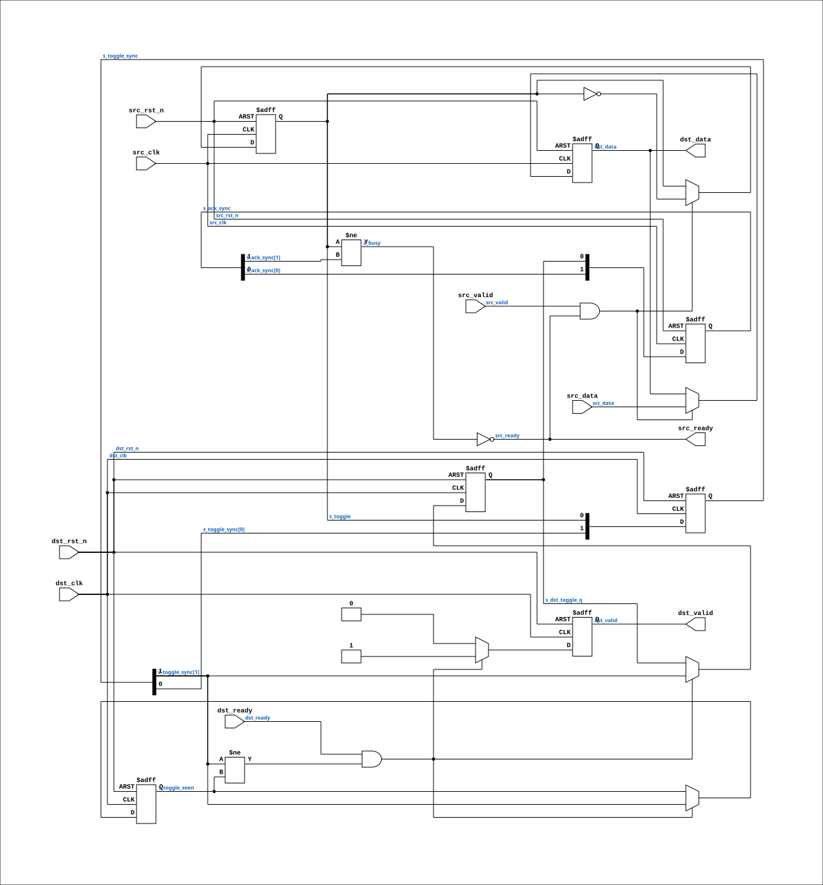

# cdc_byte

Source: `Verilog/Terminals/rtl/cdc_byte.v`

<!-- Generated by Verilog/tests/module_doc.py from the //! comments in the source. Do not edit by hand - edit the RTL comments and regenerate. -->

<!-- HIERARCHY-NAV:BEGIN - written by Verilog/tests/gen_hierarchy.py, do not edit -->

**Where it sits** (Nexys): [nd120_nexys4ddr_top](../../../fpga/nexys4ddr/doc/nd120_nexys4ddr_top.md) > [terminal_top](terminal_top.md) > **cdc_byte**
- instance path: `TERMINAL.CDC`

**Used in:** [terminal_top](terminal_top.md) (Nexys, MiSTer, MEGA65 R6, MEGA65 R3)

**Contains:** no other modules.

[Module hierarchy](../../../HIERARCHY.md) - [All modules](../../../MODULES.md)

<!-- HIERARCHY-NAV:END -->


<!-- SCHEMATIC:BEGIN - written by Verilog/tests/gen_schematics.py, do not edit -->

## Schematic

Drawn from the Verilog: the yosys netlist of the Nexys 4 DDR build, instance `TERMINAL.CDC`. Sub-modules are boxes (click the picture to open it full size; there every sub-module box links to its page, and every wire shows its Verilog name).

[](cdc_byte.svg)

<!-- SCHEMATIC:END -->

## Ports

| Direction | Width | Name | Description |
|---|---|---|---|
| input | `1` | `src_clk` |  |
| input | `1` | `src_rst_n` *(active low)* |  |
| input | `1` | `src_valid` | one clock; ignored unless src_ready |
| input | `[7:0]` | `src_data` |  |
| output | `1` | `src_ready` | low while the previous byte is in flight (to terminal_top.byte_ready) |
| input | `1` | `dst_clk` | pixel clock (from nd120_console_mega65.clk and others) |
| input | `1` | `dst_rst_n` *(active low)* | async reset, active low (from nd120_console_mega65.rst_n and others) |
| output | `1` | `dst_valid` | one clock per byte |
| output | `[7:0]` | `dst_data` |  |
| input | `1` | `dst_ready` |  |

## Verilog source

[`Verilog/Terminals/rtl/cdc_byte.v`](https://github.com/RetroCoreLabs/nd-120/blob/main/Verilog/Terminals/rtl/cdc_byte.v) on GitHub.

<details markdown="1">
<summary>Show the Verilog of cdc_byte (120 lines)</summary>

```verilog
//============================================================================
//! Single-byte clock-domain crossing, toggle handshake
//!
//! Part of the board-independent terminal core (Verilog/Terminals/).
//!
//! Carries one byte at a time from the source clock (the CPU/UART domain) to
//! the destination clock (the pixel domain). A toggle handshake, not a FIFO,
//! and deliberately so: the console byte rate is glacial next to the pixel
//! clock - 115200 baud is a byte roughly every 87 us, while a 40 MHz pixel
//! clock ticks every 25 ns - so a single-entry crossing can never be the
//! bottleneck, and it has none of the ways an asynchronous FIFO can be got
//! subtly wrong.
//!
//! How it works: the source flips `s_toggle` once per accepted byte and holds
//! the data steady. The destination synchronizes the toggle through two flops
//! and emits one `dst_valid` pulse on each edge. The data is sampled on the
//! destination side only after the toggle has arrived, by which time it has
//! been stable for at least two destination clocks - so the data bits need no
//! synchronizers of their own, which is the whole point of doing it this way.
//!
//! `src_ready` is low while a byte is still in flight. The caller must not
//! present a new byte until it is high again.
//!
//! Written 27-AUG-2026.
//============================================================================

`default_nettype none

module cdc_byte (
    // Source domain
    input  wire       src_clk,
    input  wire       src_rst_n,
    input  wire       src_valid,  //! one clock; ignored unless src_ready
    input  wire [7:0] src_data,
    output wire       src_ready,  //! low while the previous byte is in flight (to terminal_top.byte_ready)

    // Destination domain
    input  wire       dst_clk,    //! pixel clock (from nd120_console_mega65.clk and others)
    input  wire       dst_rst_n,  //! async reset, active low (from nd120_console_mega65.rst_n and others)
    output reg        dst_valid,  //! one clock per byte
    output wire [7:0] dst_data,
    //! High when the destination can take a byte THIS clock. The byte is held
    //! in the crossing until it is - which keeps src_ready low, so the source
    //! stalls too. Tie high if the destination is always able to accept.
    input  wire       dst_ready
);

  // All state declared up front - the two sides refer to each other's flops,
  // so declaring them where they are driven would mean using them first.
  reg       s_toggle;        //! source: flips once per accepted byte
  reg [7:0] s_data;          //! source: the byte in flight
  reg [1:0] s_ack_sync;      //! source: destination's toggle, synchronized back
  reg [1:0] s_toggle_sync;   //! destination: source's toggle, synchronized in
  reg       s_toggle_seen;   //! destination: previous value, for edge detect
  reg       s_dst_toggle_q;  //! destination: what the source watches for its ack

  //--------------------------------------------------------------------------
  // Source side
  //--------------------------------------------------------------------------

  wire s_busy = (s_toggle != s_ack_sync[1]);
  assign src_ready = !s_busy;

  always @(posedge src_clk or negedge src_rst_n) begin
    if (!src_rst_n) begin
      s_toggle   <= 1'b0;
      s_data     <= 8'h00;
      s_ack_sync <= 2'b00;
    end else begin
      s_ack_sync <= {s_ack_sync[0], s_dst_toggle_q};
      if (src_valid && src_ready) begin
        s_data   <= src_data;
        s_toggle <= ~s_toggle;
      end
    end
  end

  //--------------------------------------------------------------------------
  // Destination side
  //--------------------------------------------------------------------------

  assign dst_data = s_data;

  always @(posedge dst_clk or negedge dst_rst_n) begin
    if (!dst_rst_n) begin
      s_toggle_sync  <= 2'b00;
      s_toggle_seen  <= 1'b0;
      s_dst_toggle_q <= 1'b0;
      dst_valid      <= 1'b0;
    end else begin
      s_toggle_sync <= {s_toggle_sync[0], s_toggle};

      dst_valid <= 1'b0;

      // An edge on the synchronized toggle means one new byte has arrived -
      // but it is only DELIVERED when the destination can take it. Until then
      // the toggle is not consumed and not reflected back, so src_ready stays
      // low and the source waits. This is what makes the crossing a real
      // handshake rather than a fire-and-forget.
      //
      // It was fire-and-forget until 28-AUG-2026, on the argument that a
      // console byte arrives every ~87 us at 115200 baud while the longest
      // busy window is ~48 us, so nothing could ever be lost. The argument was
      // sound and the premise was wrong: term_banner.v feeds this thing as
      // fast as it will go - a byte every ~150 ns - and the power-on
      // clear-screen sweep quietly ate all 318 characters of the startup
      // message. "Cannot happen in practice" lasted exactly as long as the
      // only source was a UART.
      if (dst_ready && (s_toggle_sync[1] != s_toggle_seen)) begin
        dst_valid      <= 1'b1;
        s_toggle_seen  <= s_toggle_sync[1];
        // Reflect the toggle back so the source can free the slot.
        s_dst_toggle_q <= s_toggle_sync[1];
      end
    end
  end

endmodule

`default_nettype wire
```

</details>
