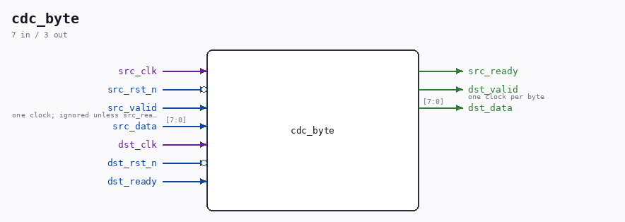

# cdc_byte

Source: `Verilog/Terminals/rtl/cdc_byte.v`

> Generated by `Verilog/tests/module_doc.py` from the `//!`
> comments in the source. Do not edit by hand - edit the RTL comments and regenerate.

## Ports

| Direction | Width | Name | Description |
|---|---|---|---|
| input | `1` | `src_clk` |  |
| input | `1` | `src_rst_n` *(active low)* |  |
| input | `1` | `src_valid` | one clock; ignored unless src_ready |
| input | `[7:0]` | `src_data` |  |
| output | `1` | `src_ready` |  |
| input | `1` | `dst_clk` |  |
| input | `1` | `dst_rst_n` *(active low)* |  |
| output | `1` | `dst_valid` | one clock per byte |
| output | `[7:0]` | `dst_data` |  |
| input | `1` | `dst_ready` |  |
