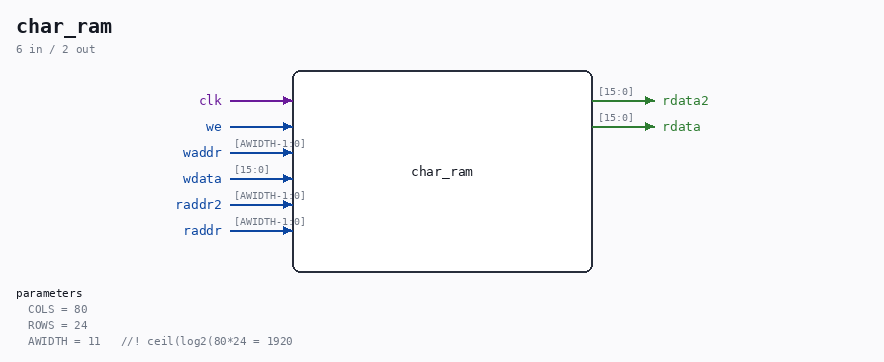

# char_ram

Source: `Verilog/Terminals/rtl/char_ram.v`

> Generated by `Verilog/tests/module_doc.py` from the `//!`
> comments in the source. Do not edit by hand - edit the RTL comments and regenerate.

<!-- HIERARCHY-NAV:BEGIN - written by Verilog/tests/gen_hierarchy.py, do not edit -->

**Where it sits** (Nexys): [nd120_nexys4ddr_top](../../../fpga/nexys4ddr/doc/nd120_nexys4ddr_top.md) > [terminal_top](terminal_top.md) > **char_ram**
- instance path: `TERMINAL.CHARRAM`

**Used in:** [terminal_top](terminal_top.md) (Nexys, MiSTer, MEGA65 R6, MEGA65 R3)

**Contains:** no other modules.

[Module hierarchy](../../../HIERARCHY.md) - [All modules](../../../MODULES.md)

<!-- HIERARCHY-NAV:END -->

## Parameters

| Parameter | Default |
|---|---|
| `COLS` | `80` |
| `ROWS` | `24` |
| `AWIDTH` | `11   //! ceil(log2(80*24 = 1920` |

## Ports

| Direction | Width | Name | Description |
|---|---|---|---|
| input | `1` | `clk` |  |
| input | `1` | `we` |  |
| input | `[AWIDTH-1:0]` | `waddr` |  |
| input | `[15:0]` | `wdata` |  |
| input | `[AWIDTH-1:0]` | `raddr2` |  |
| output | `[15:0]` | `rdata2` |  |
| input | `[AWIDTH-1:0]` | `raddr` |  |
| output | `[15:0]` | `rdata` |  |
