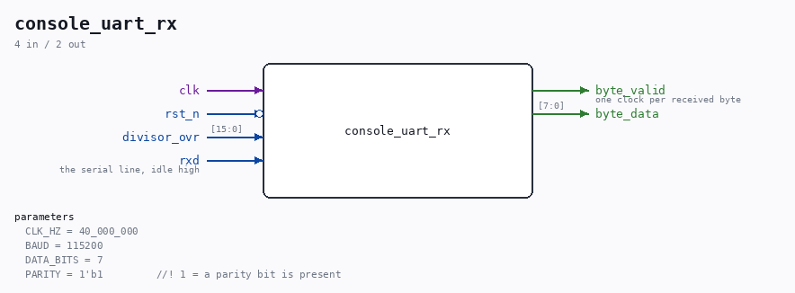

# console_uart_rx

Source: `Verilog/Terminals/rtl/console_uart_rx.v`

> Generated by `Verilog/tests/module_doc.py` from the `//!`
> comments in the source. Do not edit by hand - edit the RTL comments and regenerate.

<!-- HIERARCHY-NAV:BEGIN - written by Verilog/tests/gen_hierarchy.py, do not edit -->

**Where it sits** (Nexys): [nd120_nexys4ddr_top](../../../fpga/nexys4ddr/doc/nd120_nexys4ddr_top.md) > **console_uart_rx**
- instance path: `CONSOLE_RX`

**Used in:** [emu](../../../fpga/mister/doc/emu.md) (MiSTer), [nd120_mega65_machine](../../../fpga/mega65/rtl/doc/nd120_mega65_machine.md) (MEGA65 R6, MEGA65 R3), [nd120_nexys4ddr_top](../../../fpga/nexys4ddr/doc/nd120_nexys4ddr_top.md) (Nexys)

**Contains:** no other modules.

[Module hierarchy](../../../HIERARCHY.md) - [All modules](../../../MODULES.md)

<!-- HIERARCHY-NAV:END -->

## Parameters

| Parameter | Default |
|---|---|
| `CLK_HZ` | `40_000_000` |
| `BAUD` | `115200` |
| `DATA_BITS` | `7` |
| `PARITY` | `1'b1         //! 1 = a parity bit is present` |

## Ports

| Direction | Width | Name | Description |
|---|---|---|---|
| input | `1` | `clk` |  |
| input | `1` | `rst_n` *(active low)* |  |
| input | `[15:0]` | `divisor_ovr` |  |
| input | `1` | `rxd` | the serial line, idle high |
| output | `1` | `byte_valid` | one clock per received byte |
| output | `[7:0]` | `byte_data` |  |
