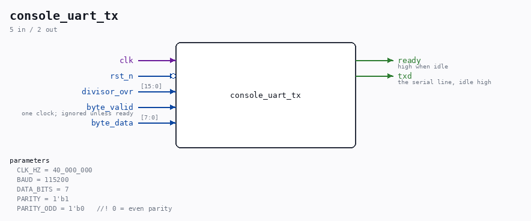

# console_uart_tx

Source: `Verilog/Terminals/rtl/console_uart_tx.v`

<!-- Generated by Verilog/tests/module_doc.py from the //! comments in the source. Do not edit by hand - edit the RTL comments and regenerate. -->

<!-- HIERARCHY-NAV:BEGIN - written by Verilog/tests/gen_hierarchy.py, do not edit -->

**Where it sits** (Nexys): [nd120_nexys4ddr_top](../../../fpga/nexys4ddr/doc/nd120_nexys4ddr_top.md) > **console_uart_tx**
- instance path: `CONSOLE_TX`

**Used in:** [emu](../../../fpga/mister/doc/emu.md) (MiSTer), [nd120_mega65_machine](../../../fpga/mega65/rtl/doc/nd120_mega65_machine.md) (MEGA65 R6, MEGA65 R3), [nd120_nexys4ddr_top](../../../fpga/nexys4ddr/doc/nd120_nexys4ddr_top.md) (Nexys)

**Contains:** no other modules.

[Module hierarchy](../../../HIERARCHY.md) - [All modules](../../../MODULES.md)

<!-- HIERARCHY-NAV:END -->

## Parameters

| Parameter | Default |
|---|---|
| `CLK_HZ` | `40_000_000` |
| `BAUD` | `115200` |
| `DATA_BITS` | `7` |
| `PARITY` | `1'b1` |
| `PARITY_ODD` | `1'b0   //! 0 = even parity` |

## Ports

| Direction | Width | Name | Description |
|---|---|---|---|
| input | `1` | `clk` |  |
| input | `1` | `rst_n` *(active low)* |  |
| input | `[15:0]` | `divisor_ovr` |  |
| input | `1` | `byte_valid` | one clock; ignored unless ready |
| input | `[7:0]` | `byte_data` |  |
| output | `1` | `ready` | high when idle |
| output | `1` | `txd` | the serial line, idle high |
