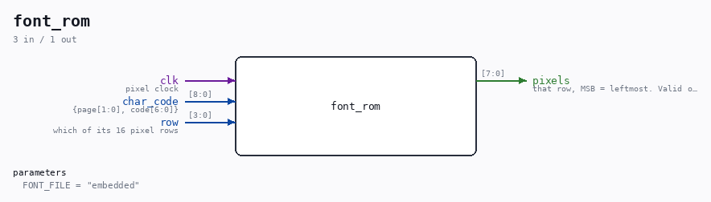

# font_rom

Source: `Verilog/Terminals/rtl/font_rom.v`

> Generated by `Verilog/tests/module_doc.py` from the `//!`
> comments in the source. Do not edit by hand - edit the RTL comments and regenerate.

<!-- HIERARCHY-NAV:BEGIN - written by Verilog/tests/gen_hierarchy.py, do not edit -->

**Where it sits** (Nexys): [nd120_nexys4ddr_top](../../../fpga/nexys4ddr/doc/nd120_nexys4ddr_top.md) > [terminal_top](terminal_top.md) > [text_screen](text_screen.md) > **font_rom**
- instance path: `TERMINAL.SCREEN.FONT`

**Used in:** [term_panel](term_panel.md) (Nexys, MiSTer, MEGA65 R6, MEGA65 R3), [text_screen](text_screen.md) (Nexys, MiSTer, MEGA65 R6, MEGA65 R3)

**Contains:** no other modules.

[Module hierarchy](../../../HIERARCHY.md) - [All modules](../../../MODULES.md)

<!-- HIERARCHY-NAV:END -->

## Parameters

| Parameter | Default |
|---|---|
| `FONT_FILE` | `"embedded"` |

## Ports

| Direction | Width | Name | Description |
|---|---|---|---|
| input | `1` | `clk` | pixel clock |
| input | `[8:0]` | `char_code` | {page[1:0], code[6:0]} |
| input | `[3:0]` | `row` | which of its 16 pixel rows |
| output | `[7:0]` | `pixels` | that row, MSB = leftmost. Valid one clock later |
