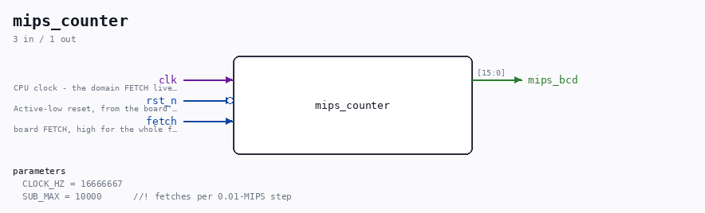
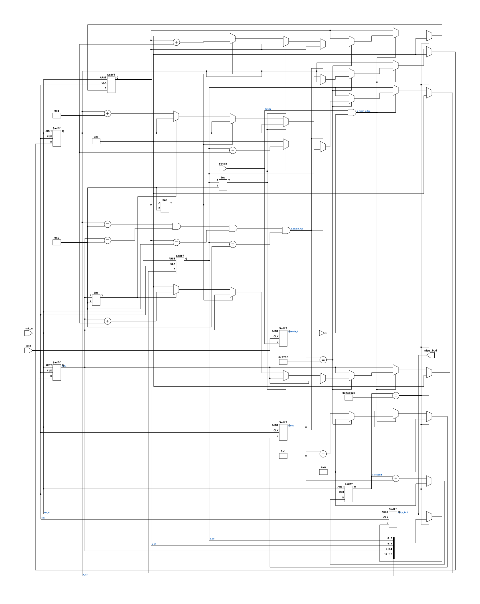

# mips_counter

Source: `Verilog/Terminals/rtl/mips_counter.v`

<!-- Generated by Verilog/tests/module_doc.py from the //! comments in the source. Do not edit by hand - edit the RTL comments and regenerate. -->

<!-- HIERARCHY-NAV:BEGIN - written by Verilog/tests/gen_hierarchy.py, do not edit -->

**Where it sits** (Nexys): [nd120_nexys4ddr_top](../../../fpga/nexys4ddr/doc/nd120_nexys4ddr_top.md) > **mips_counter**
- instance path: `MIPS`

**Used in:** [emu](../../../fpga/mister/doc/emu.md) (MiSTer), [nd120_mega65_machine](../../../fpga/mega65/rtl/doc/nd120_mega65_machine.md) (MEGA65 R6, MEGA65 R3), [nd120_nexys4ddr_top](../../../fpga/nexys4ddr/doc/nd120_nexys4ddr_top.md) (Nexys)

**Contains:** no other modules.

[Module hierarchy](../../../HIERARCHY.md) - [All modules](../../../MODULES.md)

<!-- HIERARCHY-NAV:END -->



<!-- SCHEMATIC:BEGIN - written by Verilog/tests/gen_schematics.py, do not edit -->

## Schematic

Drawn from the Verilog: the yosys netlist of the Nexys 4 DDR build, instance `MIPS`. Sub-modules are boxes (click the picture to open it full size; there every sub-module box links to its page, and every wire shows its Verilog name).

[](mips_counter.svg)

<!-- SCHEMATIC:END -->

## Parameters

| Parameter | Default |
|---|---|
| `CLOCK_HZ` | `16666667` |
| `SUB_MAX` | `10000      //! fetches per 0.01-MIPS step` |

## Ports

| Direction | Width | Name | Description |
|---|---|---|---|
| input | `1` | `clk` | CPU clock - the domain FETCH lives in |
| input | `1` | `rst_n` *(active low)* | Active-low reset, from the board's power-on reset (same net as ND120_CORE.sys_rst_n) |
| input | `1` | `fetch` | board FETCH, high for the whole fetch cycle |
| output | `[15:0]` | `mips_bcd` |  |

## Verilog source

[`Verilog/Terminals/rtl/mips_counter.v`](https://github.com/RetroCoreLabs/nd-120/blob/main/Verilog/Terminals/rtl/mips_counter.v) on GitHub.

<details markdown="1">
<summary>Show the Verilog of mips_counter (116 lines)</summary>

```verilog
//============================================================================
//! MIPS counter for the operator panel - macro instructions per second.
//!
//! Part of the board-independent terminal core (Verilog/Terminals/).
//!
//! Counts rising edges of the board's FETCH signal (ND3202D DEBUG_FETCH, the
//! "Instruction fetch cycle" net - Ronny, 29-AUG-2026: "you can probably count
//! when there is a FETCH signal") over a one-second window and publishes the
//! result as four BCD digits, XX.XX million instructions per second. Nothing
//! is added inside the gate arrays; the signal already leaves the board.
//!
//! HOW THE DIGITS ARE MADE - no divider anywhere. The displayed value is
//! fetches-per-second / 10^4 (0.01 MIPS resolution), so a sub-counter counts
//! fetches 0..SUB_MAX-1 and every rollover bumps a 4-digit BCD chain by one.
//! At the end of each second the chain is latched into `mips_bcd` and both
//! counters clear. The chain saturates at 99.99 - the field is sized for the
//! 45 MHz Nexys (Ronny, 29-AUG-2026: "the nexyst are doing 45 so be aware of
//! that for assigning space"), which can at most approach ~45 MIPS; two
//! integer digits hold anything this machine will ever do.
//!
//! SUB_MAX and CLOCK_HZ are parameters so the testbench can scale the whole
//! thing down and check real digit values in a short run.
//!
//! Written 30-AUG-2026.
//============================================================================

`default_nettype none

module mips_counter #(
    parameter integer CLOCK_HZ = 16666667,  //! CPU clock frequency
    parameter integer SUB_MAX  = 10000      //! fetches per 0.01-MIPS step
) (
    input wire clk,     //! CPU clock - the domain FETCH lives in
    input wire rst_n,   //! Active-low reset, from the board's power-on reset (same net as ND120_CORE.sys_rst_n)
    input wire fetch,   //! board FETCH, high for the whole fetch cycle

    //! {d3,d2,d1,d0} BCD: d3 d2 are the integer digits, d1 d0 the fraction.
    //! Updated once per second; a slow-changing word, safe to 2-flop sync
    //! into the video domain exactly like the ACTLV word.
    output reg [15:0] mips_bcd
);

  //! One count per fetch CYCLE, not per clock the signal is high: the fetch
  //! spans several CPU clocks, so only the rising edge counts.
  reg s_fetch_d;
  always @(posedge clk or negedge rst_n) begin
    if (!rst_n) s_fetch_d <= 1'b0;
    else        s_fetch_d <= fetch;
  end
  wire s_fetch_edge = fetch & ~s_fetch_d;

  //! ceil(log2) by hand - $clog2 of a parameter expression trips the older
  //! iverilog the unit tests run under, and 32 bits of sub-counter cost
  //! nothing next to a video framebuffer.
  reg [31:0] s_sub;       //! 0..SUB_MAX-1 fetches inside one 0.01-MIPS step
  reg [31:0] s_second;    //! 0..CLOCK_HZ-1 clocks inside the window
  reg [3:0]  s_d0, s_d1, s_d2, s_d3;   //! the BCD chain being built

  wire s_chain_full = (s_d3 == 4'd9) && (s_d2 == 4'd9) &&
                      (s_d1 == 4'd9) && (s_d0 == 4'd9);

  always @(posedge clk or negedge rst_n) begin
    if (!rst_n) begin
      s_sub    <= 32'd0;
      s_second <= 32'd0;
      s_d0     <= 4'd0;
      s_d1     <= 4'd0;
      s_d2     <= 4'd0;
      s_d3     <= 4'd0;
      mips_bcd <= 16'd0;
    end else begin
      // -- the fetch side -------------------------------------------------
      if (s_fetch_edge) begin
        if (s_sub == SUB_MAX - 1) begin
          s_sub <= 32'd0;
          // bump the BCD chain by one, saturating at 9999
          if (!s_chain_full) begin
            if (s_d0 != 4'd9)      s_d0 <= s_d0 + 4'd1;
            else begin
              s_d0 <= 4'd0;
              if (s_d1 != 4'd9)    s_d1 <= s_d1 + 4'd1;
              else begin
                s_d1 <= 4'd0;
                if (s_d2 != 4'd9)  s_d2 <= s_d2 + 4'd1;
                else begin
                  s_d2 <= 4'd0;
                  s_d3 <= s_d3 + 4'd1;
                end
              end
            end
          end
        end else begin
          s_sub <= s_sub + 32'd1;
        end
      end

      // -- the one-second window ------------------------------------------
      if (s_second == CLOCK_HZ - 1) begin
        s_second <= 32'd0;
        mips_bcd <= {s_d3, s_d2, s_d1, s_d0};
        // A fetch edge on the very boundary clock lands in the NEW window's
        // sub-counter; at 0.01-MIPS resolution one fetch is noise either way.
        s_d0     <= 4'd0;
        s_d1     <= 4'd0;
        s_d2     <= 4'd0;
        s_d3     <= 4'd0;
        s_sub    <= 32'd0;
      end else begin
        s_second <= s_second + 32'd1;
      end
    end
  end

endmodule

`default_nettype wire
```

</details>
