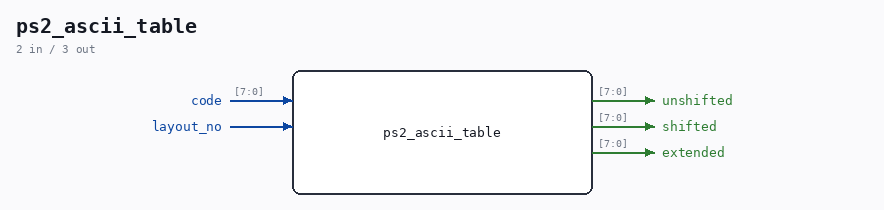

# ps2_ascii_table

Source: `Verilog/Terminals/rtl/ps2_ascii_table.v`

> Generated by `Verilog/tests/module_doc.py` from the `//!`
> comments in the source. Do not edit by hand - edit the RTL comments and regenerate.

<!-- HIERARCHY-NAV:BEGIN - written by Verilog/tests/gen_hierarchy.py, do not edit -->

**Hierarchy:** not instantiated by any of the 9 build tops (elaborated by yosys).

[Module hierarchy](../../../HIERARCHY.md) - [All modules](../../../MODULES.md)

<!-- HIERARCHY-NAV:END -->

## Ports

| Direction | Width | Name | Description |
|---|---|---|---|
| input | `[7:0]` | `code` |  |
| input | `1` | `layout_no` |  |
| output | `[7:0]` | `unshifted` |  |
| output | `[7:0]` | `shifted` |  |
| output | `[7:0]` | `extended` |  |
