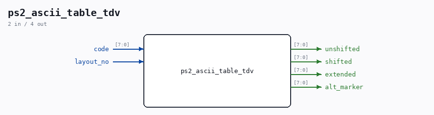

# ps2_ascii_table_tdv

Source: `Verilog/Terminals/rtl/ps2_ascii_table_tdv.v`

> Generated by `Verilog/tests/module_doc.py` from the `//!`
> comments in the source. Do not edit by hand - edit the RTL comments and regenerate.

## Ports

| Direction | Width | Name | Description |
|---|---|---|---|
| input | `[7:0]` | `code` |  |
| input | `1` | `layout_no` |  |
| output | `[7:0]` | `unshifted` |  |
| output | `[7:0]` | `shifted` |  |
| output | `[7:0]` | `extended` |  |
| output | `[7:0]` | `alt_marker` |  |
