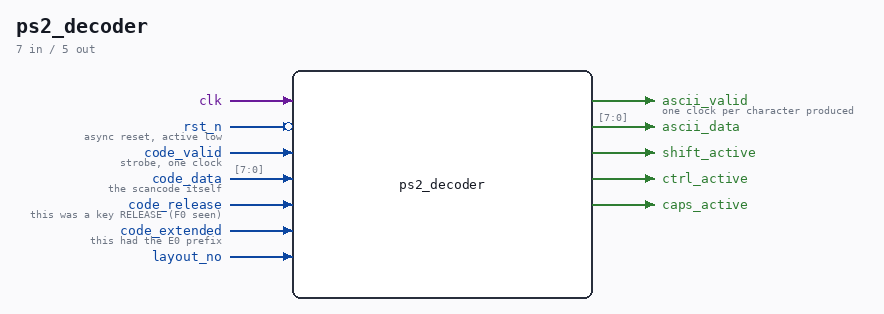

# ps2_decoder

Source: `Verilog/Terminals/rtl/ps2_decoder.v`

> Generated by `Verilog/tests/module_doc.py` from the `//!`
> comments in the source. Do not edit by hand - edit the RTL comments and regenerate.

## Ports

| Direction | Width | Name | Description |
|---|---|---|---|
| input | `1` | `clk` |  |
| input | `1` | `rst_n` *(active low)* | async reset, active low |
| input | `1` | `code_valid` | strobe, one clock |
| input | `[7:0]` | `code_data` | the scancode itself |
| input | `1` | `code_release` | this was a key RELEASE (F0 seen) |
| input | `1` | `code_extended` | this had the E0 prefix |
| input | `1` | `layout_no` |  |
| output | `1` | `ascii_valid` | one clock per character produced |
| output | `[7:0]` | `ascii_data` |  |
| output | `1` | `shift_active` |  |
| output | `1` | `ctrl_active` |  |
| output | `1` | `caps_active` |  |
