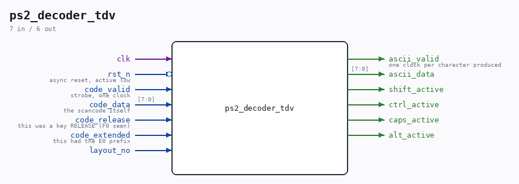

# ps2_decoder_tdv

Source: `Verilog/Terminals/rtl/ps2_decoder_tdv.v`

<!-- Generated by Verilog/tests/module_doc.py from the //! comments in the source. Do not edit by hand - edit the RTL comments and regenerate. -->

<!-- HIERARCHY-NAV:BEGIN - written by Verilog/tests/gen_hierarchy.py, do not edit -->

**Where it sits** (Nexys): [nd120_nexys4ddr_top](../../../fpga/nexys4ddr/doc/nd120_nexys4ddr_top.md) > [ps2_keyboard_tdv](ps2_keyboard_tdv.md) > **ps2_decoder_tdv**
- instance path: `KEYBOARD.DECODER`

**Used in:** [nd120_console_mega65](../../../fpga/mega65/rtl/doc/nd120_console_mega65.md) (MEGA65 R6, MEGA65 R3), [nd120_console_mister](../../../fpga/mister/rtl/doc/nd120_console_mister.md) (MiSTer), [ps2_keyboard_tdv](ps2_keyboard_tdv.md) (Nexys)

**Contains:** [ps2_ascii_table_tdv](ps2_ascii_table_tdv.md)

[Module hierarchy](../../../HIERARCHY.md) - [All modules](../../../MODULES.md)

<!-- HIERARCHY-NAV:END -->

## Ports

| Direction | Width | Name | Description |
|---|---|---|---|
| input | `1` | `clk` |  |
| input | `1` | `rst_n` *(active low)* | async reset, active low |
| input | `1` | `code_valid` | strobe, one clock |
| input | `[7:0]` | `code_data` | the scancode itself |
| input | `1` | `code_release` | this was a key RELEASE (F0 seen) |
| input | `1` | `code_extended` | this had the E0 prefix |
| input | `1` | `layout_no` |  |
| output | `1` | `ascii_valid` | one clock per character produced |
| output | `[7:0]` | `ascii_data` |  |
| output | `1` | `shift_active` |  |
| output | `1` | `ctrl_active` |  |
| output | `1` | `caps_active` |  |
| output | `1` | `alt_active` |  |
