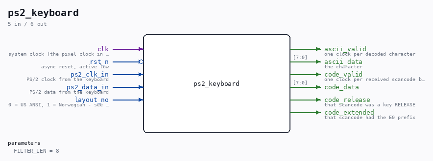

# ps2_keyboard

Source: `Verilog/Terminals/rtl/ps2_keyboard.v`

> Generated by `Verilog/tests/module_doc.py` from the `//!`
> comments in the source. Do not edit by hand - edit the RTL comments and regenerate.

<!-- HIERARCHY-NAV:BEGIN - written by Verilog/tests/gen_hierarchy.py, do not edit -->

**Hierarchy:** not instantiated by any of the 9 build tops (elaborated by yosys).

[Module hierarchy](../../../HIERARCHY.md) - [All modules](../../../MODULES.md)

<!-- HIERARCHY-NAV:END -->

## Parameters

| Parameter | Default |
|---|---|
| `FILTER_LEN` | `8` |

## Ports

| Direction | Width | Name | Description |
|---|---|---|---|
| input | `1` | `clk` | system clock (the pixel clock in our builds) |
| input | `1` | `rst_n` *(active low)* | async reset, active low |
| input | `1` | `ps2_clk_in` | PS/2 clock from the keyboard |
| input | `1` | `ps2_data_in` | PS/2 data from the keyboard |
| input | `1` | `layout_no` | 0 = US ANSI, 1 = Norwegian - see ps2_decoder.v |
| output | `1` | `ascii_valid` | one clock per decoded character |
| output | `[7:0]` | `ascii_data` | the character |
| output | `1` | `code_valid` | one clock per received scancode byte |
| output | `[7:0]` | `code_data` |  |
| output | `1` | `code_release` | that scancode was a key RELEASE |
| output | `1` | `code_extended` | that scancode had the E0 prefix |
