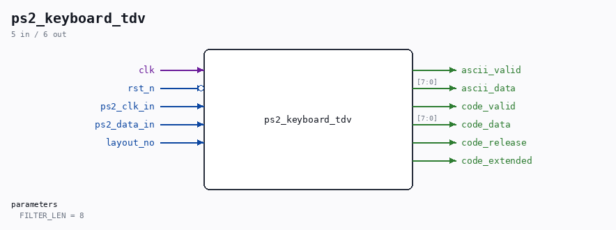

# ps2_keyboard_tdv

Source: `Verilog/Terminals/rtl/ps2_keyboard_tdv.v`

> Generated by `Verilog/tests/module_doc.py` from the `//!`
> comments in the source. Do not edit by hand - edit the RTL comments and regenerate.

## Parameters

| Parameter | Default |
|---|---|
| `FILTER_LEN` | `8` |

## Ports

| Direction | Width | Name | Description |
|---|---|---|---|
| input | `1` | `clk` |  |
| input | `1` | `rst_n` *(active low)* |  |
| input | `1` | `ps2_clk_in` |  |
| input | `1` | `ps2_data_in` |  |
| input | `1` | `layout_no` |  |
| output | `1` | `ascii_valid` |  |
| output | `[7:0]` | `ascii_data` |  |
| output | `1` | `code_valid` |  |
| output | `[7:0]` | `code_data` |  |
| output | `1` | `code_release` |  |
| output | `1` | `code_extended` |  |
