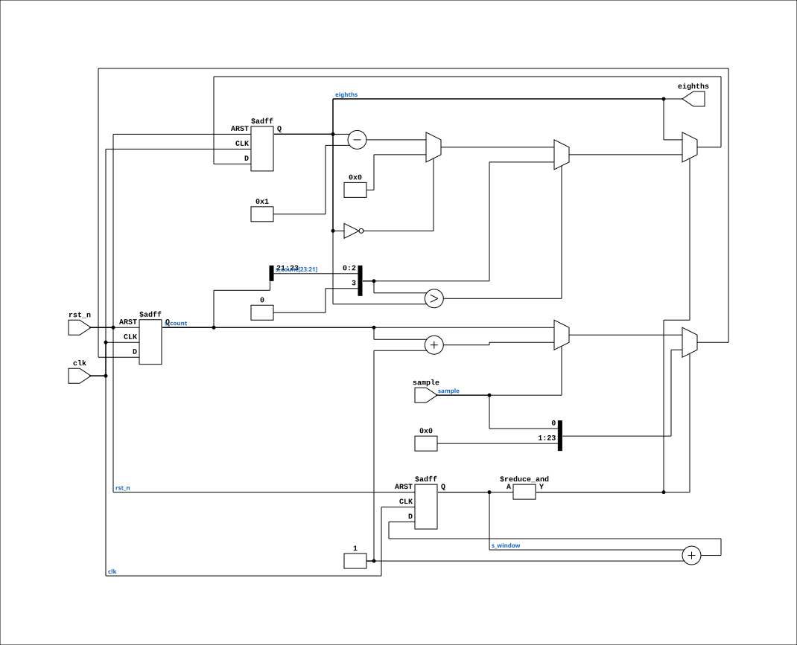

# rate_meter

Source: `Verilog/Terminals/rtl/rate_meter.v`

<!-- Generated by Verilog/tests/module_doc.py from the //! comments in the source. Do not edit by hand - edit the RTL comments and regenerate. -->

<!-- HIERARCHY-NAV:BEGIN - written by Verilog/tests/gen_hierarchy.py, do not edit -->

**Where it sits** (Nexys): [nd120_nexys4ddr_top](../../../fpga/nexys4ddr/doc/nd120_nexys4ddr_top.md) > [terminal_top](terminal_top.md) > **rate_meter**
- instance path: `TERMINAL.g_panel.UTIL_METER`

**Used in:** [terminal_top](terminal_top.md) (Nexys, MiSTer, MEGA65 R6, MEGA65 R3)

**Contains:** no other modules.

[Module hierarchy](../../../HIERARCHY.md) - [All modules](../../../MODULES.md)

<!-- HIERARCHY-NAV:END -->


<!-- SCHEMATIC:BEGIN - written by Verilog/tests/gen_schematics.py, do not edit -->

## Schematic

Drawn from the Verilog: the yosys netlist of the Nexys 4 DDR build, instance `TERMINAL.g_panel.UTIL_METER`. Sub-modules are boxes (click the picture to open it full size; there every sub-module box links to its page, and every wire shows its Verilog name).

[](rate_meter.svg)

<!-- SCHEMATIC:END -->

## Parameters

| Parameter | Default |
|---|---|
| `WINDOW_BITS` | `22` |
| `PEAK_HOLD` | `0` |

## Ports

| Direction | Width | Name | Description |
|---|---|---|---|
| input | `1` | `clk` | pixel clock (from nd120_console_mega65.clk and others) |
| input | `1` | `rst_n` *(active low)* | async reset, active low (from nd120_console_mega65.rst_n and others) |
| input | `1` | `sample` | counted while high |
| output | `[3:0]` | `eighths` | 0..8 |

## Verilog source

[`Verilog/Terminals/rtl/rate_meter.v`](https://github.com/RetroCoreLabs/nd-120/blob/main/Verilog/Terminals/rtl/rate_meter.v) on GitHub.

<details markdown="1">
<summary>Show the Verilog of rate_meter (73 lines)</summary>

```verilog
//============================================================================
//! What fraction of the time was this signal high? Answer in eighths.
//!
//! Part of the board-independent terminal core (Verilog/Terminals/).
//!
//! Feeds the operator panel's UTILIZATION and CACHE HIT RATE bargraphs. The
//! real panel showed both as growing bars, and both are rates, not levels - the
//! machine gives us a single-cycle boolean (LEV0 is high while running at level
//! 0; HIT is high on a cache hit) and the bar is how often it was true.
//!
//! Counts high cycles over a window of 2^WINDOW_BITS clocks, then reports the
//! top three bits of that ratio, so the output is 0..8 eighths - exactly the
//! nine bargraph glyphs font/make_font.py synthesises.
//!
//! The result is held while the next window accumulates, so the bar never shows
//! a partial count. Without that it would flicker toward zero at the start of
//! every window, which reads as a machine going idle when it is not.
//!
//! Written 28-AUG-2026.
//============================================================================

`default_nettype none

module rate_meter #(
    //! 2^22 clocks is ~105 ms at 40 MHz - about ten updates a second, which is
    //! fast enough to look live and slow enough to read.
    parameter integer WINDOW_BITS = 22,

    //! 1 = the bar RISES at once and FALLS one eighth per window. Without it a
    //! machine that pauses drops the bar straight to zero and the display flicks
    //! between full and empty, which reads as noise. A real bargraph has lag.
    parameter integer PEAK_HOLD = 0
) (
    input wire clk,      //! pixel clock (from nd120_console_mega65.clk and others)
    input wire rst_n,    //! async reset, active low (from nd120_console_mega65.rst_n and others)

    input wire sample,   //! counted while high

    output reg [3:0] eighths  //! 0..8
);

  reg [WINDOW_BITS-1:0] s_window;
  reg [WINDOW_BITS-1:0] s_count;

  //! This window's answer, before the peak hold decides what to show.
  wire [3:0] s_new = {1'b0, s_count[WINDOW_BITS-1:WINDOW_BITS-3]};

  always @(posedge clk or negedge rst_n) begin
    if (!rst_n) begin
      s_window <= {WINDOW_BITS{1'b0}};
      s_count  <= {WINDOW_BITS{1'b0}};
      eighths  <= 4'd0;
    end else begin
      s_window <= s_window + 1'b1;

      if (&s_window) begin
        // End of the window: publish, then start again. The ratio's top three
        // bits ARE the eighths - no divide, which is the reason the window is a
        // power of two.
        eighths <= (PEAK_HOLD == 0)      ? s_new
                 : (s_new > eighths)     ? s_new
                 : (eighths == 4'd0)     ? 4'd0
                                         : eighths - 4'd1;
        s_count <= {{(WINDOW_BITS-1){1'b0}}, sample};
      end else if (sample) begin
        s_count <= s_count + 1'b1;
      end
    end
  end

endmodule

`default_nettype wire
```

</details>
