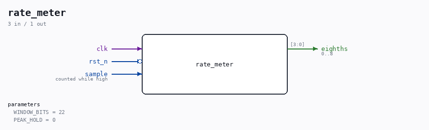

# rate_meter

Source: `Verilog/Terminals/rtl/rate_meter.v`

> Generated by `Verilog/tests/module_doc.py` from the `//!`
> comments in the source. Do not edit by hand - edit the RTL comments and regenerate.

## Parameters

| Parameter | Default |
|---|---|
| `WINDOW_BITS` | `22` |
| `PEAK_HOLD` | `0` |

## Ports

| Direction | Width | Name | Description |
|---|---|---|---|
| input | `1` | `clk` |  |
| input | `1` | `rst_n` *(active low)* |  |
| input | `1` | `sample` | counted while high |
| output | `[3:0]` | `eighths` | 0..8 |
