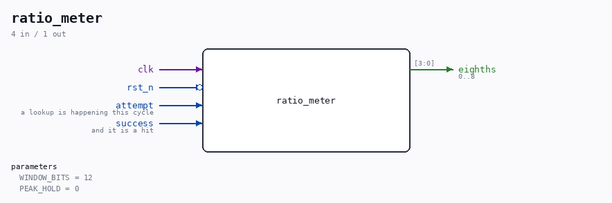
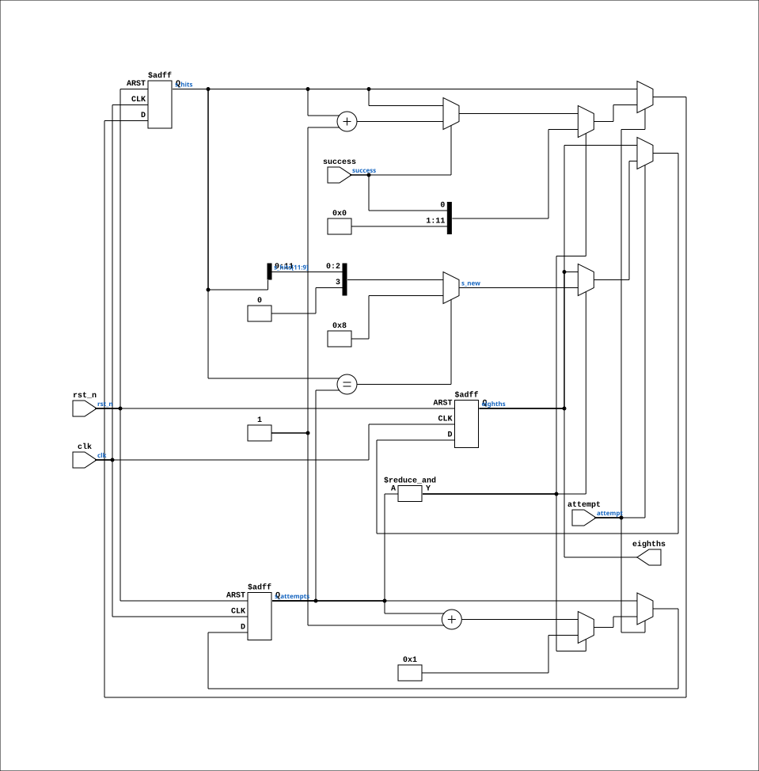

# ratio_meter

Source: `Verilog/Terminals/rtl/ratio_meter.v`

<!-- Generated by Verilog/tests/module_doc.py from the //! comments in the source. Do not edit by hand - edit the RTL comments and regenerate. -->

<!-- HIERARCHY-NAV:BEGIN - written by Verilog/tests/gen_hierarchy.py, do not edit -->

**Hierarchy:** not instantiated by any of the 9 build tops (elaborated by yosys).

[Module hierarchy](../../../HIERARCHY.md) - [All modules](../../../MODULES.md)

<!-- HIERARCHY-NAV:END -->



<!-- SCHEMATIC:BEGIN - written by Verilog/tests/gen_schematics.py, do not edit -->

## Schematic

Drawn from the Verilog: no build top uses this module, so it was elaborated from its own file with no defines and default parameters. Sub-modules are boxes (click the picture to open it full size; there every sub-module box links to its page, and every wire shows its Verilog name).

[](ratio_meter.svg)

<!-- SCHEMATIC:END -->

## Parameters

| Parameter | Default |
|---|---|
| `WINDOW_BITS` | `12` |
| `PEAK_HOLD` | `0` |

## Ports

| Direction | Width | Name | Description |
|---|---|---|---|
| input | `1` | `clk` |  |
| input | `1` | `rst_n` *(active low)* |  |
| input | `1` | `attempt` | a lookup is happening this cycle |
| input | `1` | `success` | and it is a hit |
| output | `[3:0]` | `eighths` | 0..8 |

## Verilog source

[`Verilog/Terminals/rtl/ratio_meter.v`](https://github.com/RetroCoreLabs/nd-120/blob/main/Verilog/Terminals/rtl/ratio_meter.v) on GitHub.

<details markdown="1">
<summary>Show the Verilog of ratio_meter (81 lines)</summary>

```verilog
//============================================================================
//! What fraction of ATTEMPTS succeeded? Answer in eighths.
//!
//! Part of the board-independent terminal core (Verilog/Terminals/).
//!
//! Exists because rate_meter answers the wrong question for a cache. It reports
//! what fraction of CLOCK CYCLES a signal was high, which is right for
//! UTILIZATION - "how much of the time was the machine not idle" - and wrong
//! for CACHE HIT RATE, which the ND-100 Reference Manual describes as a hit
//! rate: hits divided by LOOKUPS.
//!
//! Lookups are a small fraction of clock cycles, so measuring hits per cycle
//! produced a bar that sat empty no matter what the machine did. It was not
//! broken wiring; it was the wrong quantity, and it read as "nothing is shown".
//!
//! HOW THE TWO INPUTS ARE MEANT. `attempt` is high while a lookup is happening
//! (on the ND-120 that is LAPA_n asserted - the page address being latched);
//! `success` is the cache comparator, HIT. Both are counted in CYCLES rather
//! than edges, deliberately: an assertion may last more than one clock, and
//! counting cycles needs no assumption about exactly when within the lookup
//! HIT becomes valid. Getting that assumption wrong would produce a plausible
//! number that is quietly false, which is worse than an empty bar.
//!
//! Written 28-AUG-2026.
//============================================================================

`default_nettype none

module ratio_meter #(
    //! Counted in ATTEMPTS, not clocks, so the window is self-scaling: a busy
    //! machine updates the bar often, an idle one rarely. 2^12 lookups is a
    //! few times a second under load.
    parameter integer WINDOW_BITS = 12,

    //! 1 = rise at once, fall one eighth per window - same reasoning as
    //! rate_meter's.
    parameter integer PEAK_HOLD = 0
) (
    input wire clk,
    input wire rst_n,

    input wire attempt,   //! a lookup is happening this cycle
    input wire success,   //! and it is a hit

    output reg [3:0] eighths  //! 0..8
);

  reg [WINDOW_BITS-1:0] s_attempts;
  reg [WINDOW_BITS-1:0] s_hits;

  //! This window's answer. All-hits is special-cased: the top three bits of a
  //! full counter are 111, which would report 7/8 for a cache that never missed.
  wire [3:0] s_new = (s_hits == s_attempts) ? 4'd8
                   : {1'b0, s_hits[WINDOW_BITS-1:WINDOW_BITS-3]};

  always @(posedge clk or negedge rst_n) begin
    if (!rst_n) begin
      s_attempts <= {WINDOW_BITS{1'b0}};
      s_hits     <= {WINDOW_BITS{1'b0}};
      eighths    <= 4'd0;
    end else if (attempt) begin
      if (&s_attempts) begin
        //! End of the window. All-hits has to be special-cased: the top three
        //! bits of a full counter are 111, which would report 7/8 for a cache
        //! that never missed once.
        eighths    <= (PEAK_HOLD == 0)  ? s_new
                    : (s_new > eighths) ? s_new
                    : (eighths == 4'd0) ? 4'd0
                                        : eighths - 4'd1;
        s_attempts <= {{(WINDOW_BITS-1){1'b0}}, 1'b1};
        s_hits     <= {{(WINDOW_BITS-1){1'b0}}, success};
      end else begin
        s_attempts <= s_attempts + 1'b1;
        if (success) s_hits <= s_hits + 1'b1;
      end
    end
  end

endmodule

`default_nettype wire
```

</details>
