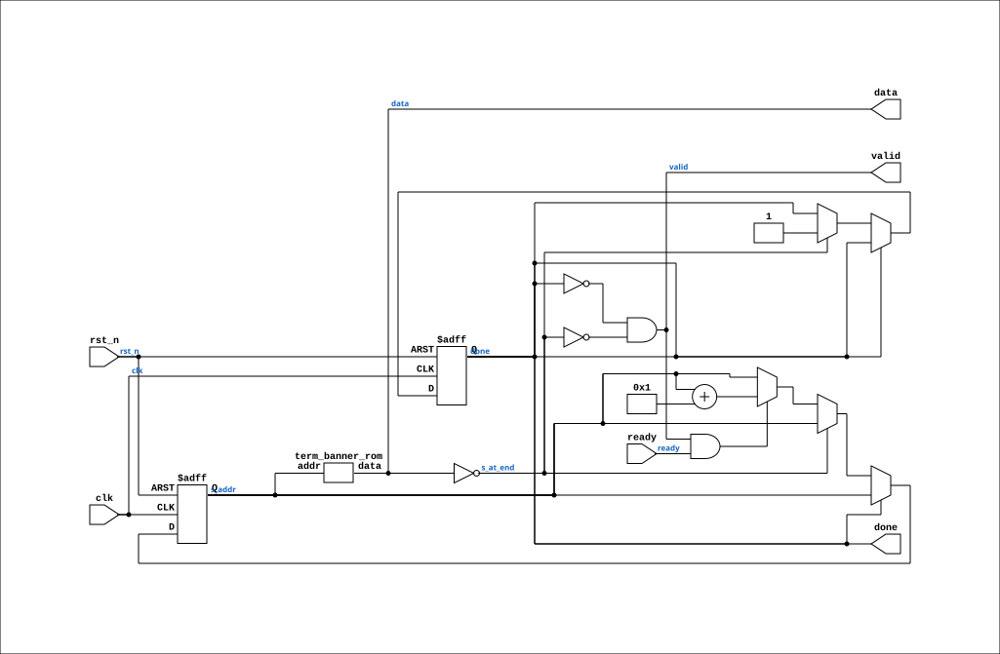

# term_banner

Source: `Verilog/Terminals/rtl/term_banner.v`

<!-- Generated by Verilog/tests/module_doc.py from the //! comments in the source. Do not edit by hand - edit the RTL comments and regenerate. -->

<!-- HIERARCHY-NAV:BEGIN - written by Verilog/tests/gen_hierarchy.py, do not edit -->

**Where it sits** (Nexys): [nd120_nexys4ddr_top](../../../fpga/nexys4ddr/doc/nd120_nexys4ddr_top.md) > [term_console_feed](term_console_feed.md) > **term_banner**
- instance path: `FEED.BANNER`

**Used in:** [term_console_feed](term_console_feed.md) (Nexys, MiSTer, MEGA65 R6, MEGA65 R3)

**Contains:** [term_banner_rom](term_banner_rom.md) (only on Nexys, MEGA65 R6, MEGA65 R3), [term_banner_rom](term_banner_rom.md) (only on MiSTer)

[Module hierarchy](../../../HIERARCHY.md) - [All modules](../../../MODULES.md)

<!-- HIERARCHY-NAV:END -->


<!-- SCHEMATIC:BEGIN - written by Verilog/tests/gen_schematics.py, do not edit -->

## Schematic

Drawn from the Verilog: the yosys netlist of the Nexys 4 DDR build, instance `FEED.BANNER`. Sub-modules are boxes (click the picture to open it full size; there every sub-module box links to its page, and every wire shows its Verilog name).

[](term_banner.svg)

<!-- SCHEMATIC:END -->

## Ports

| Direction | Width | Name | Description |
|---|---|---|---|
| input | `1` | `clk` |  |
| input | `1` | `rst_n` *(active low)* | async reset, active low |
| output | `1` | `valid` |  |
| output | `[7:0]` | `data` |  |
| input | `1` | `ready` | low while the previous byte is in flight (from terminal_top.byte_ready) |
| output | `1` | `done` | high once the whole message has been accepted |

## Verilog source

[`Verilog/Terminals/rtl/term_banner.v`](https://github.com/RetroCoreLabs/nd-120/blob/main/Verilog/Terminals/rtl/term_banner.v) on GitHub.

<details markdown="1">
<summary>Show the Verilog of term_banner (89 lines)</summary>

```verilog
//============================================================================
//! Power-on message sender - walks term_banner_rom into the terminal.
//!
//! Part of the board-independent terminal core (Verilog/Terminals/).
//!
//! WHY A BANNER IS WORTH REAL GATES. It turns one useless symptom into two
//! useful ones. Without it a board that shows nothing could be a dead pixel
//! clock, a bad sync, an empty font ROM, a stuck character RAM, a keyboard
//! that never decodes, or a console seam that never delivers a byte. With it:
//!
//!   text appears           -> clock, sync, font, character RAM, scroll and
//!                             the whole write path are all working, and the
//!                             fault is downstream of them
//!   text appears, typing
//!   does nothing           -> the keyboard half alone
//!   nothing at all         -> the video half alone
//!
//! On a board on the desk that saves an hour. On a board belonging to a friend
//! in another country - which is how the MEGA65 will be tested, see
//! fpga/mega65/docs/00-plan.md - it is the difference between one round trip
//! and three, where each round trip is days.
//!
//! It sends ONCE per reset and then gets out of the way for good: `done` goes
//! high and `valid` never rises again, so the machine's own output cannot
//! collide with it.
//!
//! Written 28-AUG-2026.
//============================================================================

`default_nettype none

module term_banner (
    input wire clk,
    input wire rst_n,  //! async reset, active low

    //! Into the terminal's byte port. Same valid/ready contract.
    output wire       valid,
    output wire [7:0] data,
    input  wire       ready,  //! low while the previous byte is in flight (from terminal_top.byte_ready)

    output reg done  //! high once the whole message has been accepted
);

  reg [8:0] s_addr;

  wire [7:0] s_rom_data;

  term_banner_rom ROM (
      .addr(s_addr),
      .data(s_rom_data)
  );

  assign data = s_rom_data;

  //! The ROM returns 0x00 for every address past the end and the generator
  //! refuses to emit a NUL inside the message, so this is the terminator. No
  //! length constant exists anywhere in the design, and therefore none can go
  //! stale when the text is edited.
  wire s_at_end = (s_rom_data == 8'h00);

  //! COMBINATIONAL, deliberately. A registered `valid` is wrong here and the
  //! first version of this module had the bug: when the address steps onto the
  //! terminator the ROM immediately presents 0x00, but a registered valid is
  //! still high from the previous cycle - so if `ready` happened to be high
  //! that cycle the terminal would accept the NUL and print a stray glyph
  //! after the message. Deriving valid from the data the ROM is presenting
  //! RIGHT NOW means a terminator is never offered in the first place.
  assign valid = !done && !s_at_end;

  always @(posedge clk or negedge rst_n) begin
    if (!rst_n) begin
      s_addr <= 9'd0;
      done   <= 1'b0;
    end else if (!done) begin
      if (s_at_end) begin
        done <= 1'b1;   // reached the terminator: never speak again
      end else if (valid && ready) begin
        // Advance only when the terminal actually took the byte. `ready` is
        // low while the previous character is still crossing into the pixel
        // domain, and a clear-screen holds it low for a whole 1920-clock
        // sweep - so this handshake is not decorative.
        s_addr <= s_addr + 9'd1;
      end
    end
  end

endmodule

`default_nettype wire
```

</details>
