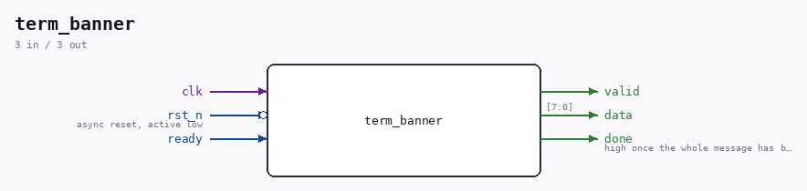

# term_banner

Source: `Verilog/Terminals/rtl/term_banner.v`

> Generated by `Verilog/tests/module_doc.py` from the `//!`
> comments in the source. Do not edit by hand - edit the RTL comments and regenerate.

## Ports

| Direction | Width | Name | Description |
|---|---|---|---|
| input | `1` | `clk` |  |
| input | `1` | `rst_n` *(active low)* | async reset, active low |
| output | `1` | `valid` |  |
| output | `[7:0]` | `data` |  |
| input | `1` | `ready` |  |
| output | `1` | `done` | high once the whole message has been accepted |
